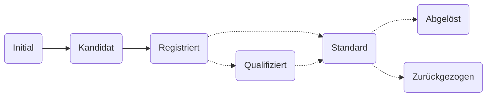

Ein klar definierter Arbeitsablauf regelt, wie Metadaten auf der I14Y-Interoperabilitätsplattform publiziert werden. Abhängig davon, ob die Metadaten öffentlich oder ausschliesslich innerhalb der Organisation publiziert werden, ist der Arbeitsablauf zwei- beziehungsweise dreistufig. Der Workflow dient insbesondere der Qualitätssicherung. In einer ersten Stufe werden die Metadaten erfasst. In einer zweiten Stufe werden sie von _Local Data Stewards_ geprüft und freigeschaltet. In einer dritten Stufe werden sie, sofern gewünscht und sinnvoll, in Zusammenarbeit mit der Interoperabilitätsstelle geprüft, gegebenenfalls als standardkonform markiert und schliesslich öffentlich freigegeben.

Neu erfasste Metadaten erhalten vorerst den Status _Initial_. Sobald die Erfassungsarbeiten abgeschlossen sind, wird der Status _Kandidat_ vorgeschlagen. Diese Statusänderung muss von einer Person aus der eigenen Organisation, die über _Local Data Steward_-Rechte verfügt, bestätigt werden. Sind alle Kontrollen erfolgreich, kann der Eintrag auf _Registriert_ umgestellt werden. Um die Metadaten stabil und persistent zu halten, können Einträge in diesem Status nicht mehr modifiziert werden. Soll ein Konzept weiter verändert werden, muss eine neue Version angelegt werden. 

Bei einigen Datensammlungen, -diensten und -konzepten, die nicht standardisiert sind und nur intern genutzt werden, endet die Erfassung damit.

In einem zweiten Schritt können die _Local Data Stewards_ prüfen, ob das Datenangebot standardkonform ist. Angebote, die einem von einem Gremium wie [eCH](/handbook/de/7_glossar/#ech) oder [ISO](/handbook/de/7_glossar/#internationale-organisation-für-normung-iso) verabschiedeten Standard entsprechen, erhalten den Status _Standard_. Solche, die dereinst zum Standard werden könnten, werden als _Qualifiziert_ gekennzeichnet; im direkten Austausch mit der Interoperabilitätsstelle sowie in Fachgruppen wird daraufhin das weitere Vorgehen festgelegt. Datenangebote, die auf einem überholten oder abgeschafften Standard aufbauen, werden mit dem Status _Abgelöst_ beziehungsweise _Zurückgezogen_ gekennzeichnet. Solange die Daten ausschliesslich für die Nutzerinnen und Nutzer der eigenen Organisation sichtbar sind, können diese Einstufungen von den _Local Data Stewards_ ohne Rücksprache mit der Interoperabilitätsstelle gemacht werden. Soll ein als "Standard" markierter Eintrag öffentlich publiziert werden, muss die Interoperabilitätsstelle beigezogen werden. 

Weitere Informationen zur Statusverwaltung und zu den Zuständigkeiten sind in der folgenden Tabelle zusammengestellt. Das bei der I14Y-Interoperabilitätsplattform verwendete Statuskonzept entspricht dem [ISO-Standard 11179](https://www.iso.org/standard/78914.html).  

| Status DE | Status EN | Beschreibung | Wer vergibt den Status? |
| --- | ---- | ---- | ---- |
| Initial | _Initial_ | Neu erfasste Metadaten erhalten vorerst den Status _Initial_. Damit ist für die Nutzerinnen und Nutzer der eigenen Organisation sichtbar, dass die Arbeiten an diesen Metadaten noch nicht abgeschlossen sind. | _Data Producer_ |
| Kandidat | _Candidate_ | Mit dem Status _Kandidat_ werden Einträge gekennzeichnet, die vollständig erfasst sind. Der Status wird von jenen Personen vorgeschlagen, die die Daten erfassen. Vergeben wird er von den Datenverwalterinnen und -verwaltern. | _Local Data Steward_ | 
| Registriert | _Recorded_ | Metadaten mit dem Status _Registriert_ sind fertig erfasst und geprüft. Der Status wird von jenen Personen vorgeschlagen, die die Metadaten erfasst haben. Die Änderung wird von der lokalen Datenverwaltungsstelle bestätigt. Dies ist der letzte Status für nicht standardisierte Datenelemente. | _Local Data Steward_ |
| Qualifiziert | _Qualified_ | Angebote, die dereinst zu einem Standard werden könnten, werden als _Qualifiziert_ gekennzeichnet. | _Local Data Steward_ bzw. Interoperabilitätsstelle |
| Standard | _Standard_ | Dieser Status wird vergeben, wenn das Angebot einem von einem Fachgremium wie eCH oder ISO verabschiedeten Standard entspricht. | _Local Data Steward_ bzw. Interoperabilitätsstelle |
| Empfohlener Standard | _Preferred Standard_ | In Einzelfällen kann es zu einem Thema mehrere Standards geben. Als _empfohlener Standard_ werden jene Konzepte gekennzeichnet, welche in der öffentlichen Verwaltung genutzt werden müssen, sofern keine wichtigen Punkte dagegen sprechen. Die Definition eines empfohlenen Standards obliegt dem _Swiss Data Steward_. | _Swiss Data Steward_ |
| Abgelöst | _Superseded_ | Basiert das Angebot auf einem Standard, der mittlerweile durch einen anderen abgelöst worden ist, wird der Status auf _Abgelöst_ gesetzt. | _Local Datasteward_ bzw. Interoperabilitätsstelle |
| Zurückgezogen | _Retired_ | In Einzelfällen kommt es vor, dass die Normierungsorganisation einen Standard widerruft. In einem solchen Fall wird der Status des betreffenden Angebots auf _Zurückgezogen_ gesetzt. | _Local Data Steward_ bzw. Interoperabilitätsstelle |

## Publikationskanal

Auf der I14Y-Interoperabilitätsplattform existieren zwei Publikationskanäle: Metadaten können innerhalb der eigenen Organisation zugänglich gemacht werden -- etwa, um die eigenen Datenbestände zu inventarisieren. Oder sie können öffentlich publiziert werden. Zu Beginn sind die erfassten Metadaten stets ausschliesslich innerhalb der Organisation verfügbar. Sollen sie für die Allgemeinheit sichbar gemacht werden, wird der Publikationskanal auf _I14Y_ umgestellt. Dies ist anzustreben bei harmonisierten und standardisierten Datenstrukturen und -konzepten. Denn diese eignen sich für die Weiterverwendung.

In der Regel wird die öffentliche Publikation durch eine Person mit der Rolle _Local Data Steward_ vorgeschlagen. Die Interoperabilitätsstelle, das I14Y-Team, prüft daraufhin die Metadaten. Es schaltet den Eintrag am gemeinsam definierten Publikationstermin frei. 

Abhängig vom Status im Publikations-Workflow sowie von der eigenen Rolle können die erfassten Metadaten nicht abgeändert werden. So können etwa als "Registriert" gekennzeichnete Einträge nicht mehr bearbeitet werden, ohne dass der Status zurückgestellt wird. In diesem Fall wird normalerweise eine neue Version angelegt.