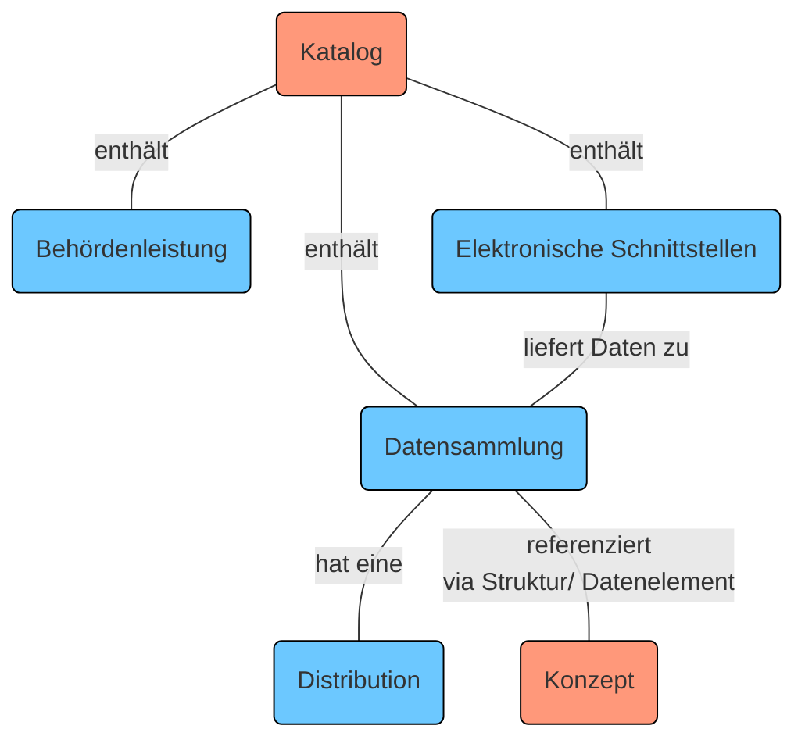
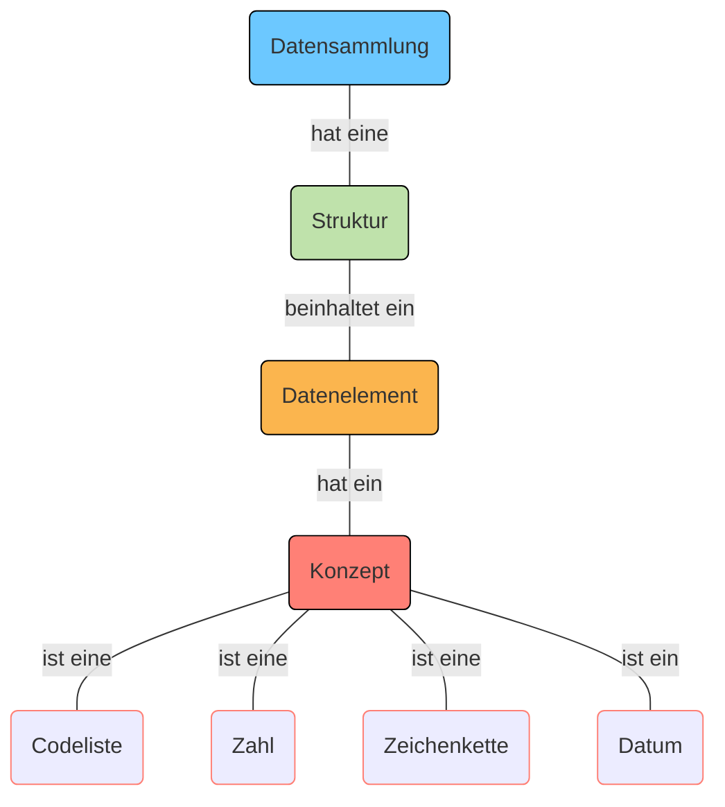
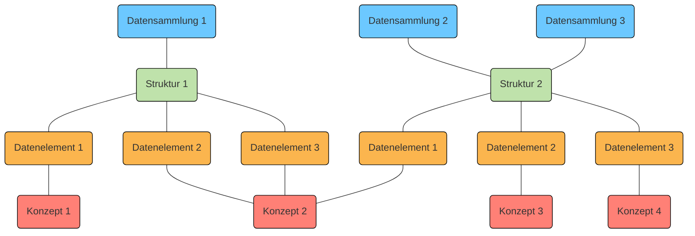
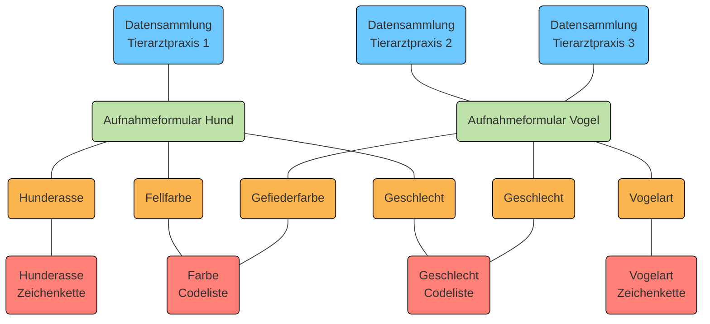

 
Auf der I14Y-Interoperabilitätsplattform können sowohl Datensammlungen, elektronische Schnittstellen (APIs) und Datenelemente als auch Behördenleistungen beschrieben werden. Dabei gibt es zwei Einstiegspunkte: Im Katalog-Teil werden Datensammlungen, elektronische Schnittstellen (APIs) und Behördenleistungen verwaltet. Unter "Konzepte" sind die Beschreibungen einzelner Konzepte zu finden. 

Die Grafik bietet eine vereinfachte Darstellung der einzelnen Teile der I14Y-Plattform. Eine ausführliche Zusammenstellung ist im [Informationsmodell der I14Y-IOP](/handbook/img/i14y_informationsmodell.png) zu finden.

Um den unterschiedlichen Angeboten gerecht zu werden, bedient sich die Plattform verschiedener Informationsmodelle. So wird bei Datensammlungen und APIs etwa das _Data Catalog Vocabulary (DCAT)_ mit dem Schweizer Applikationsprofil eingesetzt. Im Bereich der Behördenleistungen kommt das _Core Public Service Vocabulary (CPSV)_ zum Einsatz. 

## Datensammlung

Eine Datensammlung ist eine Gruppe inhaltlich zusammenhängender Datenelemente in einer einheitlichen Struktur. Sie kann in unterschiedlichsten Formen und Formaten vorliegen: etwa als CSV-Datei, als Datenbank oder gespeichert in einem verteilten System wie einer Blockchain. 

Die Datensammlung kann in mehreren Formaten exportiert werden, also sogenannte _Distributionen_ enthalten. Die Distributionen müssen nicht zwingend die vollen Daten beinhalten. Die Datensammlung kann zudem die Grundlage für eine elektronische Schnittstelle (API) bilden, über die sich gezielt Einzelinformationen abfragen lassen.

Datensammlungen lassen sich auf der I14Y-Interoperabilitätsplattform detailliert beschreiben: Zusätzlich zum Katalogeintrag, der die grundlegenden Informationen wie den Titel, die Beschreibung und die herausgebende Organisation beinhaltet, können auch Informationen zur Struktur erfasst werden. Eine Struktur beinhaltet in der Regel mehrere Datenelemente. Und jedes Datenelement hat ein Konzept, das die Art des Inhalts beschreibt. Als Konzept wird also die kleinste Einheit einer Datensammlung bezeichnet, oft auch (definierte) Variable oder Attribut genannt. 

Es ist möglich, dass mehrere Datensammlungen dieselbe Struktur haben. Die einzelnen Konzepte wiederum sind oftmals in unterschiedlichen Strukturen eingebunden. 

Am Beispiel: In der Datensammlung einer Tierklinik sind Informationen zu Hunden enthalten: der Name, das Geburtsdatum, die Rasse, die Nummer des Hundechips sowie der Name und die Adresse der Hundehalterin beziehungsweise des -halters. Bei jeder dieser Angaben handelt es sich um ein Datenelement mit einem Konzept. Der Typ des Konzepts Hundename ist eine Zeichenkette, jener beim Geburtsdatum ist ein Datum und jener bei der Rasse eine Codeliste. Diese Konzepte können auch in anderen Datensammlungen gebraucht werden: thematisch eng verwandten wie der Kundendatenbank einer Tierärztin oder -- etwa im Fall des Geburtsdatums oder der Adresse -- auch bei komplett anderen Datensammlungen. 

Datensammlungen werden bei der I14Y-Interoperabilitätsplattform mit dem [Datenkatalog-Vokabular (DCAT)](/handbook/de/7_glossar) beschrieben. DCAT ist ein standardisiertes Modell zur Beschreibung von Datenkatalogen, das vom Internet-Standardisierungsgremium [W3C](https://www.w3.org/) gepflegt wird. Auf der Plattform wird weitgehend das Applikationsprofil für die Schweiz verwendet ([DCAT-AP CH 2](https://www.dcat-ap.ch/)). DCAT gibt vor, welche Informationen zwingend erfasst werden müssen. Zudem schlägt das Vokabular weitere Möglichkeiten zur Beschreibung der Datensammlung vor.     

Um Informationen zu einer Datensammlung auf der I14Y-Interoperabilitätsplattform speichern zu können, müssen die Minimalanforderungen erfüllt sein, die der DCAT-Standard vorgibt. Die I14Y-IOP bietet einige zusätzliche Felder an, die über den aktuellen DCAT-Standard hinausgehen. Welche Felder beim Erfassen von Datensammlungen mit welchen Informationen befüllt werden, wird im Kapitel [Publikation](/handbook/de/4_publikation/1_katalog/1_datensammlung) aufgeführt. 

### Struktur

Die Struktur beschreibt, wie die Inhalte einer Datensammlung organisiert sind. Jede Struktur besteht aus mindestens einem Datenelement ([siehe unten](#datenelement)). Die einzelnen Strukturen können in mehreren Datensammlungen verwendet werden. Beispielsweise wird bei einer wiederkehrenden Publikation eines Registers (Versionierung) in der Regel die identische Struktur verwendet. 

Zur Beschreibung der Struktur wird bei der I14Y-IOP weitgehend der DCAT-Standard mit dem Schweizer Applikationsprofil eingesetzt. 

### Datenelement

Das Datenelement ist die kleineste Beschreibungseinheit einer Datensammlung. Oft wird das Datenelement auch als Attribut bezeichnet, als (definierte) Variable oder "Spalte". Das Datenelement enthält die einzelnen Werte, etwa die AHV-Nummern, die Anzahl leerstehender Wohnungen oder Messwerte zur Wassertemperatur. Jedes Datenelement referenziert ein Konzept. 

### Konzept

Das Konzept beschreibt die im Datenelement enthaltenen Informationen eindeutig und vollständig. Bei einem Konzept kann es sich um eine Zahl, eine Zeichenkette, ein Datum oder um eine Codeliste mit vordefinierten Werten handeln. 

Zur Beschreibung der Konzepte wird bei der I14Y-Interoperabilitätsplattform der Standard [ISO 11179-1:2023](https://www.iso.org/standard/78914.html) verwendet. Erfasst wird der Typ des Konzepts. Abhängig davon sind weitere Angaben wie etwa die Länge oder die möglichen Minimal- und Maximalwerte nötig. Eine Schritt-für-Schritt-Anleitung zur Erfassung eines Konzepts ist im Kapitel [Publikation](/handbook/de/4_publikation/2_konzepte) zu finden. 

## Elektronische Schnittstelle (API)

Eine elektronische Schnittstelle -- auf Englisch _Application Programm Interface (API)_ -- erlaubt es Maschinen unter anderem, gezielt einzelne Informationen aus einer Datensammlung anzufordern. Dank APIs können isolierte Systeme Informationen in einer effizienten und standardisierten Weise austauschen. Damit die Entwicklerinnen und Entwickler ihre Software so programmieren können, dass sie Informationen von Fremdsystemen bezieht, müssen sie diese Schnittstellen kennen. Die I14Y-IOP bietet die Möglichkeit, die Schnittstellen an einem zentralen Ort zu beschreiben. 

Auf der I14Y-IOP muss zusätzlich etwa zum Titel und der Beschreibung ein sogenannter Endpunkt, von wo Daten bezogen werden können, oder ein Link zur Dokumentation angegeben werden. Wenn möglich wird auch auf die Datensammlung verwiesen, die der API zu Grunde liegt.

Auch APIs werden auf der I14Y-Interoperabilitätsplattform weitgehend mittels des Datenkatalog-Vokabulars DCAT beschrieben. Einige Felder, die im Standard optional sind, müssen zwingend befüllt werden. So empfiehlt der DCAT-Standard lediglich, dass beim Katalogisieren einer API eine Beschreibung erfasst wird. Auf der I14Y-IOP hingegen ist diese Angabe obligatorisch. Alle Felder, die der Standard vorgibt, sind auch auf der Plattform zwingend auszufüllen. 

Eine Schritt-für-Schritt-Anleitung dazu, wie elektronische Schnittstellen erfasst werden, ist im Kapitel 
[Publikation](/handbook/de/4_publikation/1_katalog/5_api) zu finden. 

## Elektronische Behördenleistung

Auf der I14Y-Interoperabilitätsplattform können ausserdem elektronische Behördenleistungen beschrieben werden. So lässt sich dokumentieren, welche Web- oder Mobilapplikationen bestimmte Aufgaben vereinfachen. Erfasst werden zudem Angaben dazu, wie auf die betreffende App zugegriffen werden kann und welche Organisation sie verantwortet. Dank des zentralen Verzeichnisses sollen die elektronischen Behördenleistungen einfacher auffindbar werden. 

Um Behördenleistungen zu beschreiben, wird das _Core Public Service Vocabulary_ verwendet, das die Europäische Union definiert hat. Der Aufbau und das gesamte Vokabular sind auf der Interoperabilitätsplattform [Joinup](https://joinup.ec.europa.eu/collection/semantic-interoperability-community-semic/solution/core-public-service-vocabulary/releases) der Europäischen Kommission dokumentiert. Das wiederverwendbare und ausbaufähige Vokabular gibt bestimmte Felder vor, die zwingend ausgefüllt werden müssen. Jeder Behördenleistung können Kanäle zugeordnet werden -- eine Internet-Adresse etwa oder eine Telefonnummer.

Wie bei der Erfassung einer Behördenleistung auf der I14Y-Interoperabilitätsplattform vorzugehen ist, wird im Kapitel [Publikation](/handbook/de/4_publikation/1_katalog/3_publicservice/) detailliert beschrieben.
