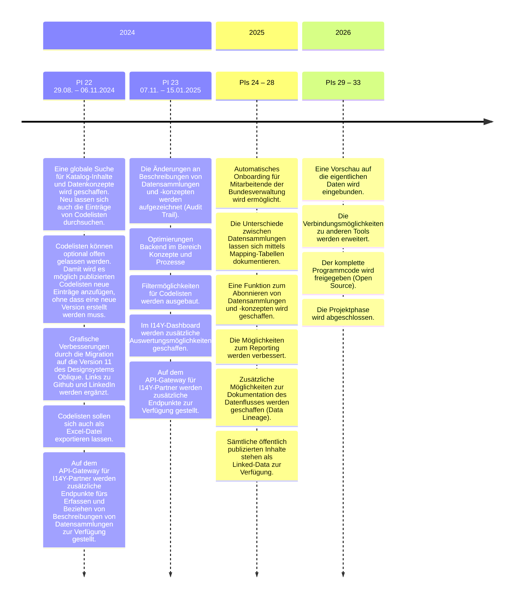

Die I14Y wird im Auftrag des Bundes von der Interoperabilitätsstelle in Zusammenarbeit mit dem Bundesamt für Informatik entwickelt. Die Projektphase läuft bis Ende 2026. Anschliessend übernimmt das Bundesamt für Statistik den Betrieb der I14Y als Daueraufgabe. 

Während der Projektphase, also bis Ende 2026, wird der Funktionsumfang der I14Y laufend erweitert. Wünsche für neue Funktionen können bei der Interoperabilitätsstelle eingereicht werden. Die Interoperabilitätsstelle erarbeitet die Detail-Spezifikation. Sie priorisiert sie in Zusammenarbeit mit dem Steuerungsausschuss sowie dem Ausschuss Nationale Datenbewirtschaftung (NaDB). Und sie koordiniert die Entwicklungs- und Implementierungsarbeiten. 


Sollten Sie eine Verbesserungsmöglichkeit oder einen Fehler auf der I14Y-Interoperabilitätsplattform entdecken, ist die Interoperabilitätsstelle dankbar um einen Hinweis. Sie erreichen das Team per [E-Mail](mailto:i14y@bfs.admin.ch). Bitte beschreiben Sie die gewünschte Funktion möglichst genau. In einer späteren Phase werden weitere Kanäle für Rückmeldungen angeboten. 



Die I14Y wird in einem so genannten Agile Release Train (ART) entwickelt. Entsprechend werden die Funktionen laufend spezifiziert, entwickelt und implementiert. Welche Funktionen für welchem Abschnitt der Entwicklung vorgesehen sind, ist in der untenstehenden Roadmap dokumentiert; für Detailangaben zu einzelnen Funktionalitäten kontaktieren Sie die Interoperabilitätsstelle. Die Schwerpunkte können sich ändern -- etwa wenn andere Anforderungen hoch priorisiert werden. Die Roadmap wird jeweils vor dem Beginn einer neuen Entwicklungsperiode (*Program Increment*, kurz PI) aktualisiert. 

### Open Source
Der Programmcode der I14Y-Interoperabilitätsplattform soll unter einer [freien Lizenz](https://www.gnu.org/licenses) Lizenz veröffentlichst werden. Die Interoperabilitätsstelle publiziert den Quellcode bis spätestens Ende der Projektphase, also Ende des Jahres 2026. Dies geschieht im Einklang mit dem zukünftigen Bundesgesetz über den Einsatz elektronischer Mittel zur Erfüllung von Behördenaufgaben ([EMBAG](https://www.fedlex.admin.ch/eli/fga/2023/787/de#art_9)). Laut Artikel 9 sollen die Bundesbehörden ihre Quellcodes -- sofern möglich -- frei zur Verfügung stellen. 



Die diesem Gesetz unterstehenden Bundesbehörden legen, wenn es möglich und sinnvoll ist und die Rechte Dritter gewahrt werden, den Quellcode von Software offen, die sie zur Erfüllung ihrer Aufgaben entwickeln oder entwickeln lassen. Sie erlauben jeder Person, die Software zu nutzen, weiterzuentwickeln und weiterzugeben, und erheben keine Lizenzgebühren.



Die I14Y-IOP publiziert Quellcodes und Skripte unter dem Namen i14y-ch auf der [Plattform Github](https://github.com/i14y-ch). Bereits verfügbar ist dieses Handbuch sowie Prototypen, die an den GovTech-Hackathon 2023 und 2024 entwickelt wurden. Auf der Plattform sollen auch Beispielskripte zum Datenbezug veröffentlicht werden. 