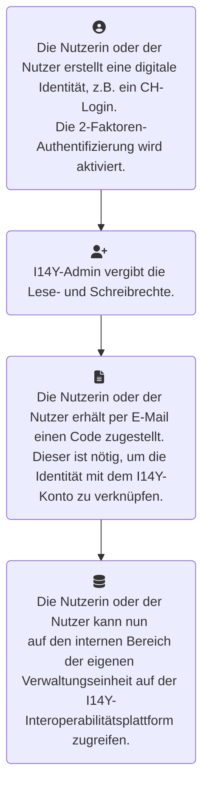

[Send Feature Request](mailto:bornthis@gmail.com?subject=Feature%20Request&body=Userstory%3A%20As%20a%20user...%0ARequest%20sent%20by%3A)

Manchmal läuft nicht alles nach Plan. Sollten Probleme auftreten, wenn Sie mit die Interoperabilitätsplattform I14Y nutzen, gehen Sie wie folgt vor: Konsultieren Sie zuerst das Handbuch. Es dokumentiert die Funktionen der Plattform. Und es beinhaltet Antworten auf die meisten gängigen Fragen. Falls Informationen fehlen, ist die Interoperabilitätsstelle dankbar um einen Hinweis. Sie können Texte auch selber erfassen und zur Publikation einreichen. 

__Support Stufe 1:__ Kann das Problem mithilfe des Handbuchs nicht gelöst werden, wenden Sie sich an den Support Ihrer Organisation. In der Regel stellen die I14Y-Partnerorganisationen eine eigene Supportorganisation. Diese kann einfachere Probleme lösen. Falls Sie einer Organisation mit eigenem I14Y-Support angehören, müssen Probleme dieser gemeldet werden.

__Support Stufe 2:__ Zweite Anlaufstelle ist die Interoperabilitätsstelle. Sie ist an den Arbeitstagen per . Das genaue Vorgehen zur Kontaktaufnahme ist im Handbuch der I14Y dokumentiert. Anfragen, die nicht zeitkritisch sind, werden nach bestem Bemühen bearbeitet (*best effort*). Zeitkritische Anfragen werden unter dem Punkt «Prozess bei gravierenden technischen Störungen» geregelt.

Das Bundesamt für Statistik stellt die I14Y-Interoperabilitätsplattform als _Software as a Service_ im Rahmen der ihr zur Verfügung stehenden organisatorischen, finanziellen, personellen und technischen Ressourcen zur Verfügung.  

Die Interoperabilitätsstelle stellt ein Online-Handbuch zur Plattform zur Verfügung. Dieses kann unter Mithilfe der Nutzerinnen und Nutzern weiter ausgebaut werden. Das Handbuch dokumentiert die Funktionen der Plattform und beantwortet die wichtigsten Fragen. Bei Problemen ist zuerst das Handbuch zu konsultieren. Der weitere Support wird auf mehreren Ebenen organisiert.
Stufe 1 – Fachsupport I14Y-Partner:  
Stufe 2 – Fachsupport Interoperabilitätsstelle:  
Stufe 3 – Technischer Support BIT: Anfragen und Probleme technischer Art, die nicht durch die Interoperabilitätsstelle beantwortet oder gelöst werden können, werden an das Bundesamt für Informatik (BIT) gesendet. Diese Meldungen müssen von der Interoperabilitätsstelle gemacht werden. Letztere koordiniert die nötigen Arbeiten zur Wiederherstellung des ordentlichen Betriebs.
1.1.1	Prozess bei gravierenden technischen Störungen
Als gravierende technische Störung wird ein Vorfall bezeichnet, durch den die normale Arbeit auf der Plattform über eine unzumutbar lange Zeitperiode stark eingeschränkt oder verunmöglicht wird. 
Scheint eine gravierende technische Störung vorzuliegen, melden sich die betroffenen Benutzerinnen und Benutzer beim technischen Support ihrer Organisation. Falls es sich gemäss dessen Einschätzung um eine gravierende Störung handelt, wird das Problem der Interoperabilitätsstelle gemeldet. 
Die Interoperabilitätsstelle prüft, ob es sich um eine gravierende technische Störung handelt. Stuft sie den Vorfall als gravierend ein, liefert sie innert eines Arbeitstages eine erste Einschätzung zum Problem. Sie zeigt zudem auf, wie die Störung behoben werden soll. Die Interoperabilitätsstelle stellt eine angemessene Kommunikation mit den Leitungen der von der Störung betroffenen Organisationen sicher, sofern die grundlegenden IT-Systeme funktionieren. Dazu wird die von der Organisation gemeldete E-Mail-Adresse genutzt.

Im Fall eines technischen Problems ist zuerst dieses Handbuch zu konsultieren. Der weitere Support wird auf drei Ebenen organisiert.

__Stufe 1 – Fachsupport I14Y-Partner:__ Erste Anlaufstelle bei Fragen oder Problemen mit der Plattform, die von einer Nutzerin oder einem Nutzer nicht selbständig gelöst werden können, ist die vom I14Y-Partner gemeldete, fürs Angebot innerhalb der Organisation verantwortliche Person oder die von dieser mit dem Support betraute Person oder Stelle. 

__Stufe 2 – Fachsupport Interoperabilitätsstelle:__ Kann das Problem auf Stufe 1 Zweite Anlaufstelle ist die Interoperabilitätsstelle. Sie ist an den Arbeitstagen von 9 bis 12 sowie von 13 bis 16 Uhr per [E-Mail](mailto:i14y@bfs.admin.ch) erreichbar. 

Vorerst läuft der Support-Prozess über E-Mail. In einer späteren Phase soll ein Ticketing-System implementiert werden. 

Die öffentlich publizierten elektronischen Schnittstellen können frei genutzt werden. Die Interoperabilitätsstelle empfiehlt aber, dass sich die nutzenden Organisationen mit einer E-Mail-Adresse registrieren. Schreiben Sie dazu eine E-Mail an die Interoperabilitätsstelle, in der Sie Ihre Organisation und eine E-Mail-Adresse erwähnen. Wenn möglich, nutzen Sie statt der persönlichen E-Mail-Adresse jene der Stelle. 

