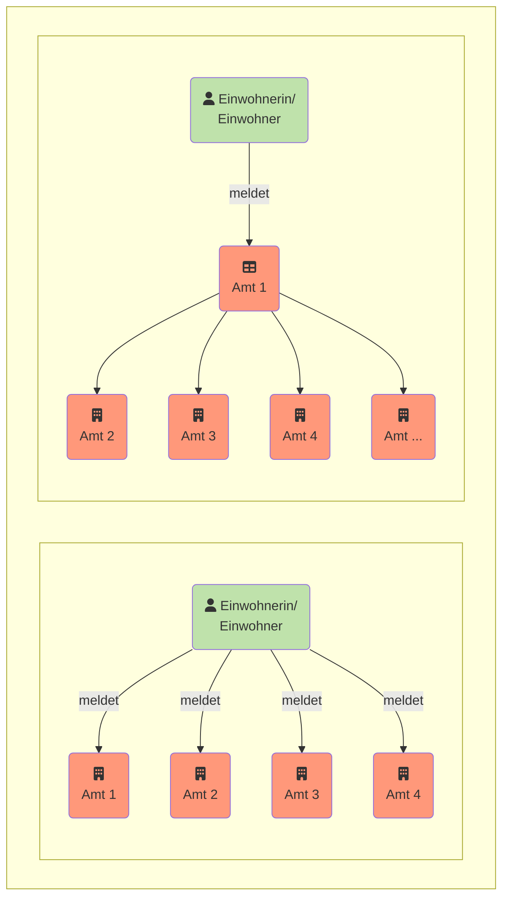

Welche Daten sind verfügbar? Und wie lassen sie sich abrufen? Die I14Y-Interoperabilitätsplattform -- kurz I14Y-IOP -- ist das zentrale Verzeichnis der Daten, elektronischen Schnittstellen und Behördenleistungen der öffentlichen Verwaltungen in der Schweiz. Die Plattform macht Daten auffindbar. Und sie zeigt auf, wie darauf zugegriffen werden kann.  

Die I14Y-IOP dokumentiert, ob die betreffenden Daten frei oder eingeschränkt verfügbar sind, ob sie einem Standard entsprechen, wer die Sammlung verantwortet, wie regelmässig die Daten aktualisiert werden und wie ihre Qualität einzuschätzen ist. Die Plattform hilft also den Kontext einer Datensammlung zu verstehen. Auf der I14Y-IOP sind ausschliesslich Metadaten zu finden; die eigentlichen Daten verbleiben bei den zuständigen Stellen. Die I14Y-IOP fördert den effizienten Datenaustausch innerhalb der öffentlichen Verwaltungen wie auch zwischen den Behörden, den Unternehmen sowie den Bürgerinnen und Bürgern. 

Behörden und staatsnahe Unternehmen können die Plattform als Werkzeug nutzen, um ein Inventar ihrer Datensammlungen zu erstellen. Gleichzeitig dient die I14Y-IOP als Hilfsmittel, um die Daten zu harmonisieren, sodass diese mehrfach genutzt werden können. Damit können redundante Datenerhebungen vermieden werden -- wie es der Bund mit dem _Once-Only-Prinzip_ vorsieht. 



Bislang mussten Bürgerinnen und Bürger sowie Unternehmen ihre Informationen oftmals mehrfach dem Staat melden. Mit dem [Programm Nationale Datenbewirtschaftung](https://www.bfs.admin.ch/bfs/de/home/nadb/nadb.html) hat es sich der Bund zum Ziel gesetzt diese Doppelspurigkeiten zu vermeiden. Dadurch werden die Bürgerinnen und Bürger sowie die Unternehmen entlastet. Und der Staat kann seine Leistungen effizienter erbringen. 

Damit das _Once-Only-Prinzip_ Realität wird, müssen die verschiedenen Verwaltungseinheiten Daten direkt austauschen können. Voraussetzung dafür ist, dass eine rechtliche Grundlage besteht und dass ein Austausch insbesondere aus der Perspektive des Datenschutzes zulässig ist. Zudem muss geklärt werden, ob und wie lange Daten für eine mögliche Mehrfachnutzung auf Vorrat gespeichert werden dürfen. Einzelne Kantone haben die Mehrfachnutzung von Daten bereits gesetzlich festgeschrieben.  



Eine Mehrfachnutzung von Verwaltungsdaten ist dann möglich, wenn bekannt ist, wer über welche Datensammlungen verfügt. Zudem müssen die Daten harmonisiert sein: Alle Ämter sollten mit denselben Kategorien und Codelisten arbeiten -- also etwa dieselben Listen mit Gemeindenamen oder Berufsbezeichnungen verwenden. Eine gute Zusammenarbeit ist unabdingbar für eine erfolgreiche Harmonisierung: Es muss definiert werden, welche Organisation etwa eine Codeliste verantwortet. Alle anderen pflegen die entsprechende Liste nicht selber, sondern übernehmen sie von der zuständigen Stelle. 

Genau dies ist mit der I14Y-Interoperabilitätsplattform möglich: Zusätzlich zu den beschreibenden Metadaten beinhaltet die Plattform strukturelle Metadaten. Diese beschreiben die einzelnen Elemente einer Datensammlung. Jedes Element basiert auf einem eindeutig definierten Konzept, zum Beispiel einer Codeliste. Die Konzepte brauchen nur einmalig von der zuständigen Stelle erfasst zu werden. Andere Organisationen verwenden sie zur Beschreibung ihrer strukturellen Metadaten wieder. 

Die einzelnen Behörden profitieren somit von der Arbeit der jeweils anderen. Möglich wird auch etwa, dass ein privates Umfrageinstitut dieselben Kategorien oder Ausprägungen verwendet, die eine staatliche Stelle einsetzt. Dadurch werden nachträgliche Harmonisierungsarbeiten überflüssig. Und in vielen Fällen wird die Datenqualität besser. 

Auf diese Weise hilft die I14Y-Interoperabilitätsplattform dabei, das Schweizerische Datenökosystem semantisch zu harmonisieren. Die Metadaten -- insbesondere die Codelisten -- lassen sich automatisiert über elektronische Schnittstellen (APIs) abrufen. Dies ermöglicht es, die Plattform an beliebige Systeme und Applikationen anzubinden. 



Unnötig viel tippen -- das läuft vielen Informatikern zuwider. Deshalb lieben sie Abkürzungen. Insbesondere für lange und komplizierte Ausdrücke, bei denen man sich gerne vertippt. Wie etwa bei _interoperability_. In der Softwareentwicklung wird dieses englische Wort deshalb oftmals mit _I14Y_ abgekürzt. Dabei beschreibt die Zahl 14, die auf den Anfangsbuchstaben folgt, die Anzahl ausgelassener Zeichen. Angehängt wird lediglich noch der letzte Buchstabe. Weitere Beispiele für so genannte Numeronyme: a11y (_accessibility_), i18n (_internationalization_) und o11y (_observability_).



Auf der I14Y-Interoperabilitätsplattform wird zudem ein Verzeichnis von elektronischen Behördenleistungen wie Webapplikationen und Apps aufgebaut. Dieses gibt einen Überblick über das Angebot der öffentlichen Verwaltung. Und es erleichtert den Dialog zwischen den Betreiberinnen und Betreibern der jeweiligen Dienstleistung sowie den Nutzerinnen und Nutzern.

<!--  -->

Entwickelt und betrieben wird die Plattform von der Interoperabilitätsstelle (IOS) in der Abteilung Interoperabilität und Register (IOR) des [Bundesamts für Statistik](https://www.bfs.admin.ch). Gesetzlich geregelt wird der Betrieb der Plattform im Bundesgesetz über den Einsatz elektronischer Mittel zur Erfüllung von Behördenaufgaben (EMBAG).



1. Das Bundesamt für Statistik betreibt im Internet eine öffentliche Plattform, auf der insbesondere folgende Informationen direkt oder über Referenzierung in elektronischer Form leicht zugänglich sind:

    a. die Metadaten von strukturierten elektronischen Datenbeständen der Bundesverwaltung einschliesslich der Metadaten von Open Government Data nach Artikel 10;

    b. ein Verzeichnis der Schnittstellen nach Artikel 13 sowie der zu deren Nutzung notwendigen Informationen, sofern die Informationssicherheit nicht gefährdet ist;

    c. eine Übersicht über die elektronisch verfügbaren Leistungen der Behörden.

2. Der Bundesrat regelt, welche Metadaten zu veröffentlichen sind. Er kann das Bundesamt für Statistik ermächtigen, im Einvernehmen mit der Bundeskanzlei die Form der Metadaten zu regeln.

 3. Die Kantone können ihre Metadaten, Schnittstellen und Anwendungen unter den Voraussetzungen von Artikel 11 Absätze 3 und 4 auf der Plattform zugänglich machen.



Die I14Y-Interoperabilitätsplattform steht seit Sommer 2021 zur Verfügung und wird kontinuierlich weiterentwickelt. Sie richtet sich in erster Linie an Bund, Kantone und Gemeinden sowie an die Forschung. Da Verwaltung und Unternehmen eng zusammenarbeiten, steht sie auch Unternehmen offen. Öffentlich publizierte Inhalte können auch von Unternehmen und den Bürgerinnen und Bürgern eingesehen und genutzt werden.



Möchten Sie über neue Funktionen und Angebote auf der I14Y-Interoperabilitätsplattform informiert werden? Dann abonnieren Sie das Newsmail. Drei bis viermal pro Jahr erhalten Sie per E-Mail eine Zusammenstellung der neusten Entwicklungen bei der I14Y-IOP. Um das Newsmail kostenlos zu abonnieren, besuchen Sie den [Abodienst des Bundesamts für Statistik](https://www.bfs.admin.ch/bfs/de/home/dienstleistungen/kontakt/newsmail-abonnement.html) und wählen Sie "I14Y-Interoperabilitätsplattform" aus. 



## Zum Handbuch

Dieses Handbuch erläutert die wichtigsten Funktionen der I14Y-Interoperabilitätsplattform. Es beinhaltet zahlreiche Schritt-für-Schritt-Anleitungen. Zusätzlich bietet es Angaben zu technischen Details sowie Hintergrundinformationen zur Harmonisierung und Standardisierung von Daten.

In einem ersten Kapitel werden die [Rollen und Prozesse](/handbook/de/2_rollen_prozesse) in der Datenbewirtschaftung beleuchtet. Unter [Metadaten abrufen](/handbook/de/3_metadaten_abrufen) werden Wege zum Bezug von Informationen von der I14Y-Interoperabilitätsplattform aufgezeigt. Im darauf folgenden Kapitel [Matdaten publizeren](/handbook/de/4_publikation) wird erläutert, wie Beschreibungen von Datensammlungen, elektronischen Schnittstellen und Datenelementen auf der Plattform veröffentlicht werden. Zudem wird gezeigt, wie das Verzeichnis der Behördenleistungen befüllt wird. 

<!--Später ergänzen: Nebst den schriftlichen Anleitungen enthält dieses Handbuch auch einige Videotutorials.--> 
Das Handbuch enthält zudem ein [Glossar](/handbook/de/7_glossar) mit Fachbegriffen, eine [Liste mit Weblinks](/handbook/de/6_anhang/weblinks), eine Übersicht über die [Partnerorganisationen](/handbook/de/8_partner) sowie ein [Log](/handbook/de/6_anhang/changelog) mit den wichtigsten Änderungen, die an der Plattform vorgenommen wurden.

Die Funktionalitäten der I14Y-Interoperabilitätsplattform werden laufend ausgebaut. Auch dieses Handbuch wird regelmässig überarbeitet. Haben Sie Anregungen, wie es verbessert werden könnte? Oder möchten Sie die Erfahrungen, die Sie mit dem Handbuch oder der Plattform gemacht haben, mit uns teilen? [Schreiben Sie uns](mailto:i14y@bfs.admin.ch). Dieses Handbuch wird auf der [Codeverwaltungsplattform Github](https://github.com/I14Y-ch/handbook/) gepflegt. Gerne können Sie dort einen Pull-Request mit Ihren Änderungswünschen einreichen.



Das I14Y-Handbuch ist in einer Auszeichnungssprache -- englisch: _Markup Language_ -- verfasst. Die Software [Hugo](https://gohugo.io) wandelt die Textdaten in eine Website um. Die Inhalte dieses Handbuchs werden auf der Codeverwaltungsplattform GitHub gepflegt. Dort lassen sich Änderungsvorschläge erfassen und einreichen. Das funktioniert mit dem normalen Git-Workflow. Oder aber: direkt im Webbrowser.  

1. Erstellen Sie ein Konto auf der Codeverwaltungsplattform Github. Loggen Sie sich ein. 
2. Öffnen Sie das [Repository mit dem Handbuch](https://github.com/I14Y-ch/handbook/). Die Textinhalte befinden sich im Verzeichnis _content_, unterteilt nach Sprache, Kapitel und Unterkapitel. Dateien mit der Endung _.md_ enthalten die eigentlichen Textinhalte sowie die Grafiken. Suchen Sie den anzupassenden Textteil. Lassen Sie sich den Rohtext anzeigen. 
3. Klicken Sie zum Bearbeiten auf das Bleistiftsymbol oben rechts. Nehmen Sie die nötigen Änderungen vor. Beachten Sie dabei die [Markup-Syntax-Regeln](https://www.markdownguide.org/basic-syntax/).
4. Beschreiben Sie im Formular unter dem Text die Änderung kurz. Reichen Sie den Vorschlag anschliessend mit einem Klick auf den Knopf ein. Ihr Vorschlag wird zeitnah vom I14Y-Team geprüft und allenfalls ins Handbuch integriert.


