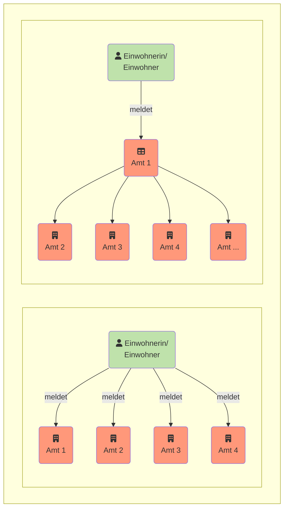

Welche Daten sind verfügbar? Und wie lassen sie sich abrufen? Die I14Y-Interoperabilitätsplattform -- kurz I14Y-IOP -- ist das zentrale Verzeichnis der Daten, elektronischen Schnittstellen und Behördenleistungen der öffentlichen Verwaltungen in der Schweiz. Die Plattform macht Daten auffindbar. Und sie zeigt auf, wie darauf zugegriffen werden kann.  

Die I14Y-IOP dokumentiert, ob die betreffenden Daten frei oder eingeschränkt verfügbar sind, ob sie einem Standard entsprechen, wer die Sammlung verantwortet, wie regelmässig die Daten aktualisiert werden und wie ihre Qualität einzuschätzen ist. Die Plattform hilft also den Kontext einer Datensammlung zu verstehen. Auf der I14Y-IOP sind ausschliesslich Metadaten zu finden; die eigentlichen Daten verbleiben bei den zuständigen Stellen. Die I14Y-IOP fördert den effizienten Datenaustausch innerhalb der öffentlichen Verwaltungen wie auch zwischen den Behörden, den Unternehmen sowie den Bürgerinnen und Bürgern. 

Behörden und staatsnahe Unternehmen können die Plattform als Werkzeug nutzen, um ein Inventar ihrer Datensammlungen zu erstellen. Gleichzeitig dient die I14Y-IOP als Hilfsmittel, um die Daten zu harmonisieren, sodass diese mehrfach genutzt werden können. Damit können redundante Datenerhebungen vermieden werden -- wie es der Bund mit dem _Once-Only-Prinzip_ vorsieht. 



Bislang mussten Bürgerinnen und Bürger sowie Unternehmen ihre Informationen oftmals mehrfach dem Staat melden. Mit dem [Programm Nationale Datenbewirtschaftung](https://www.bfs.admin.ch/bfs/de/home/nadb/nadb.html) hat es sich der Bund zum Ziel gesetzt diese Doppelspurigkeiten zu vermeiden. Dadurch werden die Bürgerinnen und Bürger sowie die Unternehmen entlastet. Und der Staat kann seine Leistungen effizienter erbringen. 

Damit das _Once-Only-Prinzip_ Realität wird, müssen die verschiedenen Verwaltungseinheiten Daten direkt austauschen können. Voraussetzung dafür ist, dass eine rechtliche Grundlage besteht und dass ein Austausch insbesondere aus der Perspektive des Datenschutzes zulässig ist. Zudem muss geklärt werden, ob und wie lange Daten für eine mögliche Mehrfachnutzung auf Vorrat gespeichert werden dürfen. Einzelne Kantone haben die Mehrfachnutzung von Daten bereits gesetzlich festgeschrieben.  

