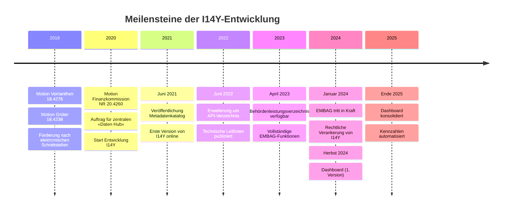

Die Interoperabilitätsplattform I14Y ist das Ergebnis verschiedener politischer Initiativen und rechtlicher Grundlagen, die den digitalen Wandel in der Schweizer Verwaltung fördern sollen.

## Politische Grundlagen

Der Aufbau von I14Y wurde durch mehrere parlamentarische Vorstösse angestossen:

**Motion Vonlanthen (18.4276)** und **Motion Grüter (18.4238)** vom 13. Dezember 2018 forderten die Einführung elektronischer Schnittstellen in der Bundesverwaltung, um den Informationsaustausch zu erleichtern. Diese Motionen sind der Bundeskanzlei zugewiesen.

Die **Motion Finanzkommission NR 20.4260** vom 6. Oktober 2020 beauftragte den Bundesrat, einen zentralen, standardisierten Zugang zu digitalen Daten und Prozessen der Bundesverwaltung zu schaffen – einen sogenannten «Daten Hub». Dieser soll über interoperable, maschinenlesbare Echtzeit-Schnittstellen auf Basis offener Standards funktionieren und durch klare Governance-Strukturen begleitet werden.

## Rechtliche Verankerung

Mit dem **Bundesgesetz über den Einsatz elektronischer Mittel zur Erfüllung von Behördenaufgaben (EMBAG)**, das am 1. Januar 2024 in Kraft trat, wurde der elektronische Datenaustausch rechtlich verankert. Das EMBAG legt fest, dass Bundesbehörden ihre Daten untereinander sowie mit Kantonen, Gemeinden und Privaten über elektronische Schnittstellen (APIs) austauschen können.

Das EMBAG definiert drei zentrale Funktionen von I14Y (Art. 14):

- **Metadatenkatalog**: Beschreibung der strukturierten Datenbestände der Bundesverwaltung
- **API-Verzeichnis**: Verzeichnis der elektronischen Schnittstellen
- **Behördenleistungsverzeichnis**: Übersicht der elektronisch verfügbaren Leistungen der Behörden

## Programm Nationale Datenbewirtschaftung

Die Mehrfachnutzung von Verwaltungsdaten verringert die administrative Belastung für Bürgerinnen, Bürger und Behörden. Um dies zu erreichen, müssen Datensätze aller föderalen Ebenen miteinander kompatibel und öffentlich auffindbar sein. Das [Programm Nationale Datenbewirtschaftung (NaDB)](https://www.bfs.admin.ch/bfs/de/home/nadb/nadb.html) unterstützt diesen Harmonisierungsprozess dauerhaft.

## Entwicklung der Plattform

Das Bundesamt für Statistik (BFS) veröffentlichte am 30. Juni 2021 die erste Version der Interoperabilitätsplattform I14Y. In Zusammenarbeit mit Partnerorganisationen wird sie seither kontinuierlich weiterentwickelt:

- **Juni 2021**: Start mit dem Metadatenkatalog
- **Juni 2022**: Ergänzung um das API-Verzeichnis
- **April 2023**: Integration des Behördenleistungsverzeichnisses
- **Herbst 2024**: Einführung des Dashboards zur automatisierten Erfolgsmessung
- **Ende 2025**: Konsolidierung des Dashboards mit erweiterten Kennzahlen

Verwaltungsstellen aller föderalen Ebenen können ihre Angaben im Sinne des EMBAG erfassen und auf [www.i14y.admin.ch](https://www.i14y.admin.ch) öffentlich zugänglich machen.

## Technische Standards

Die Handhabung elektronischer Schnittstellen wird durch folgende Dokumente geregelt:

- Strategische Leitlinie API-First
- API-Architektur Bund
- API REST Guidelines
- API Technical Guidelines

Mit diesen Elementen ist der Rahmen für einen zentralen, standardisierten Zugang zu digitalen Daten und Prozessen der Bundesverwaltung geschaffen. Die laufende Dokumentation auf I14Y durch die verschiedenen Verwaltungsstellen erfüllt den Auftrag der Motion Finanzkommission NR 20.4260.
