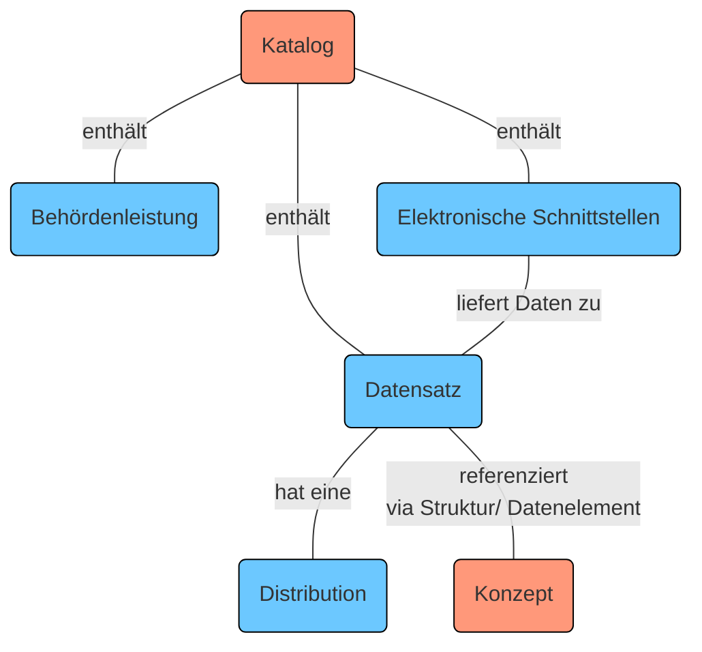
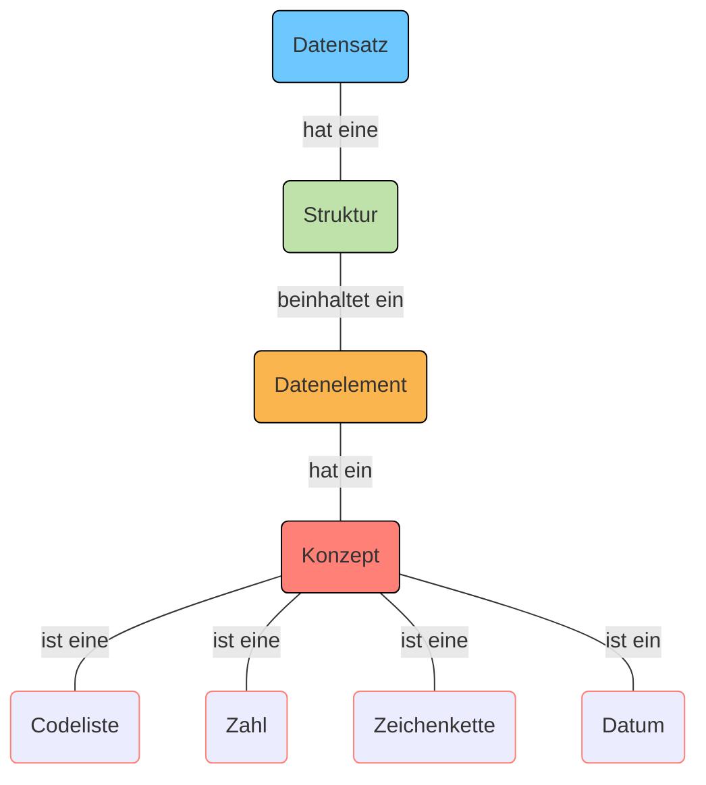
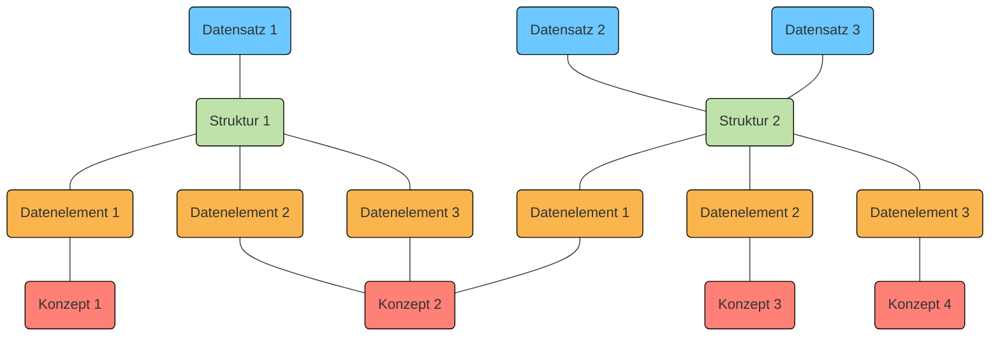
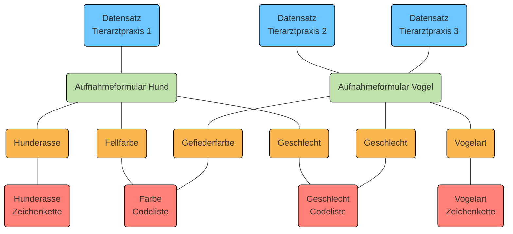
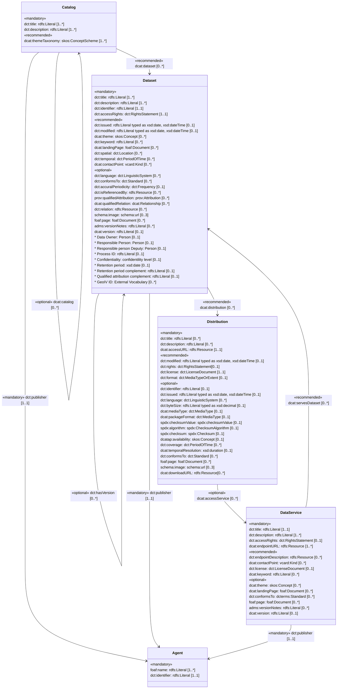

 
Auf der Interoperabilitätsplattform I14Y können sowohl Datensätze, elektronische Schnittstellen (APIs) und Datenelemente als auch Behördenleistungen beschrieben werden. Dabei gibt es zwei Einstiegspunkte: Im Katalog-Teil werden Datensätze, elektronische Schnittstellen (APIs) und Behördenleistungen verwaltet. Unter "Konzepte" sind die Beschreibungen einzelner Konzepte zu finden. 

Die Grafik bietet eine vereinfachte Darstellung der einzelnen Teile der I14Y-Plattform. Eine ausführliche Zusammenstellung ist im [Informationsmodell I14Y](/handbook/img/i14y_informationsmodell.png) zu finden.

Um den unterschiedlichen Angeboten gerecht zu werden, bedient sich die Plattform verschiedener Informationsmodelle. So wird bei Datensätzen und APIs etwa das _Data Catalog Vocabulary (DCAT)_ mit dem Schweizer Applikationsprofil eingesetzt. Im Bereich der Behördenleistungen kommt das _Core Public Service Vocabulary (CPSV)_ zum Einsatz. 

## Datensatz

Ein Datensatz ist eine Gruppe inhaltlich zusammenhängender Datenelemente in einer einheitlichen Struktur. Sie kann in unterschiedlichsten Formen und Formaten vorliegen: etwa als CSV-Datei, als Datenbank oder gespeichert in einem verteilten System wie einer Blockchain. 

Der Datensatz kann in mehreren Formaten exportiert werden, also sogenannte _Distributionen_ enthalten. Die Distributionen müssen nicht zwingend die vollen Daten beinhalten. Der Datensatz kann zudem die Grundlage für eine elektronische Schnittstelle (API) bilden, über die sich gezielt Einzelinformationen abfragen lassen.

Datensätze lassen sich auf der Interoperabilitätsplattform I14Y detailliert beschreiben: Zusätzlich zum Katalogeintrag, der die grundlegenden Informationen wie den Titel, die Beschreibung und die herausgebende Organisation beinhaltet, können auch Informationen zur Struktur erfasst werden. Eine Struktur beinhaltet in der Regel mehrere Datenelemente. Und jedes Datenelement hat ein Konzept, das die Art des Inhalts beschreibt. Als Konzept wird also die kleinste Einheit eines Datensatzes bezeichnet, oft auch (definierte) Variable oder Attribut genannt. 

Es ist möglich, dass mehrere Datensätze dieselbe Struktur haben. Die einzelnen Konzepte wiederum sind oftmals in unterschiedlichen Strukturen eingebunden. 

Am Beispiel: Im Datensatz einer Tierklinik sind Informationen zu Hunden enthalten: der Name, das Geburtsdatum, die Rasse, die Nummer des Hundechips sowie der Name und die Adresse der Hundehalterin beziehungsweise des -halters. Bei jeder dieser Angaben handelt es sich um ein Datenelement mit einem Konzept. Der Typ des Konzepts Hundename ist eine Zeichenkette, jener beim Geburtsdatum ist ein Datum und jener bei der Rasse eine Codeliste. Diese Konzepte können auch in anderen Datensätzen gebraucht werden: thematisch eng verwandten wie der Kundendatenbank einer Tierärztin oder -- etwa im Fall des Geburtsdatums oder der Adresse -- auch bei komplett anderen Datensätzen. 

Datensätze werden bei der Interoperabilitätsplattform I14Y mit dem [Datenkatalog-Vokabular (DCAT)](/handbook/de/glossar) beschrieben. DCAT ist ein standardisiertes Modell zur Beschreibung von Datenkatalogen, das vom Internet-Standardisierungsgremium [W3C](https://www.w3.org/) gepflegt wird. Auf der Plattform wird weitgehend das Applikationsprofil für die Schweiz verwendet ([DCAT-AP CH 2](https://www.dcat-ap.ch/)). DCAT gibt vor, welche Informationen zwingend erfasst werden müssen. Zudem schlägt das Vokabular weitere Möglichkeiten zur Beschreibung des Datensatzes vor.     

Um Informationen zu einem Datensatz auf der Interoperabilitätsplattform I14Y speichern zu können, müssen die Minimalanforderungen erfüllt sein, die der DCAT-Standard vorgibt. I14Y bietet einige zusätzliche Felder an, die über den aktuellen DCAT-Standard hinausgehen. Welche Felder beim Erfassen von Datensätzen mit welchen Informationen befüllt werden, wird im Kapitel [Publikation](/handbook/de/publikation/katalog/datensatz) aufgeführt.

### Struktur

Die Struktur beschreibt, wie die Inhalte eines Datensatzes organisiert sind. Jede Struktur besteht aus mindestens einem Datenelement ([siehe unten](#datenelement)). Die einzelnen Strukturen können in mehreren Datensätzen verwendet werden. Beispielsweise wird bei einer wiederkehrenden Publikation eines Registers (Versionierung) in der Regel die identische Struktur verwendet. 

Zur Beschreibung der Struktur wird bei I14Y weitgehend der DCAT-Standard mit dem Schweizer Applikationsprofil eingesetzt. 

### Datenelement

Das Datenelement ist die kleineste Beschreibungseinheit eines Datensatzes. Oft wird das Datenelement auch als Attribut bezeichnet, als (definierte) Variable oder "Spalte". Das Datenelement enthält die einzelnen Werte, etwa die AHV-Nummern, die Anzahl leerstehender Wohnungen oder Messwerte zur Wassertemperatur. Jedes Datenelement referenziert ein Konzept. 

### Konzept

Das Konzept beschreibt die im Datenelement enthaltenen Informationen eindeutig und vollständig. Bei einem Konzept kann es sich um eine Zahl, eine Zeichenkette, ein Datum oder um eine Codeliste mit vordefinierten Werten handeln. 

Zur Beschreibung der Konzepte wird bei der Interoperabilitätsplattform I14Y der Standard [ISO 11179-1:2023](https://www.iso.org/standard/78914.html) verwendet. Erfasst wird der Typ des Konzepts. Abhängig davon sind weitere Angaben wie etwa die Länge oder die möglichen Minimal- und Maximalwerte nötig. Eine Schritt-für-Schritt-Anleitung zur Erfassung eines Konzepts ist im Kapitel [Publikation](/handbook/de/publikation/konzepte) zu finden. 

## Elektronische Schnittstelle (API)

Eine elektronische Schnittstelle -- auf Englisch _Application Programming Interface (API)_ -- erlaubt es Maschinen unter anderem, gezielt einzelne Informationen aus einem Datensatz anzufordern. Dank APIs können isolierte Systeme Informationen in einer effizienten und standardisierten Weise austauschen. Damit die Entwicklerinnen und Entwickler ihre Software so programmieren können, dass sie Informationen von Fremdsystemen bezieht, müssen sie diese Schnittstellen kennen. I14Y bietet die Möglichkeit, die Schnittstellen an einem zentralen Ort zu beschreiben. 

Auf I14Y muss zusätzlich zum Titel und der Beschreibung ein sogenannter Endpunkt, von wo Daten bezogen werden können, oder ein Link zur Dokumentation angegeben werden. Wenn möglich wird auch auf den Datensatz verwiesen, der der API zu Grunde liegt.

Hinterlegt werden Informationen wie der Titel und die Beschreibung, Angaben zur Zugänglichkeit der Schnittstelle sowie ein Verweis auf die technische Dokumentation (z.B. eine OpenAPI/Swagger-Spezifikation). Erfasst wird die Schnittstelle als Ganzes; die detaillierte Dokumentation einzelner Endpunkte und Operationen wird durch die verantwortliche Organisation selbst bereitgestellt. Für eine gute Nutzbarkeit sind zudem Kontaktangaben für Support und Rückfragen sowie (falls die Schnittstelle nicht öffentlich zugänglich ist) Hinweise zu Nutzungsbedingungen hilfreich.

Schnittstellen sollten spätestens zum Zeitpunkt der Inbetriebnahme dokumentiert sein und bei Änderungen (z.B. neue Versionen oder geänderte Zugangskanäle) zeitnah aktualisiert werden. Wie bei anderen Kataloginhalten empfiehlt sich mindestens eine jährliche Überprüfung.

Auch APIs werden auf der Interoperabilitätsplattform I14Y weitgehend mittels des Datenkatalog-Vokabulars DCAT beschrieben. Einige Felder, die im Standard optional sind, müssen zwingend befüllt werden. So empfiehlt der DCAT-Standard lediglich, dass beim Katalogisieren einer API eine Beschreibung erfasst wird. Auf I14Y hingegen ist diese Angabe obligatorisch. Alle Felder, die der Standard vorgibt, sind auch auf der Plattform zwingend auszufüllen. 

Eine Schritt-für-Schritt-Anleitung dazu, wie elektronische Schnittstellen erfasst werden, ist im Kapitel 
[Publikation](/handbook/de/publikation/katalog/api) zu finden. 

Das untenstehende Diagramm zeigt die Beziehungen zwischen den verschiedenen Klassen, die in I14Y basierend auf dem DCAT-Standard (Katalog, Datensatz, Datenservice, Distribution) verwendet werden. Es bietet auch einen Überblick über alle Eigenschaften, die mit jeder dieser Klassen verbunden sind. Eigenschaften, die mit einem Sternchen (*) gekennzeichnet sind, wurden speziell für I14Y entwickelt. Weitere Informationen zu diesen Eigenschaften finden Sie [hier](https://i14y-ch.github.io/handbook/de/anhang/eingabefelder/).

## Elektronische Behördenleistung

Auf der Interoperabilitätsplattform I14Y können ausserdem elektronische Behördenleistungen beschrieben werden. So lässt sich dokumentieren, welche Web- oder Mobilapplikationen bestimmte Aufgaben vereinfachen. Erfasst werden zudem Angaben dazu, wie auf den betreffenden Service zugegriffen werden kann und welche Organisation ihn verantwortet. Dank des zentralen Verzeichnisses sollen die elektronischen Behördenleistungen einfacher auffindbar werden.

Behördenleistungen sind eine Abfolge von Aktivitäten, die von öffentlichen Verwaltungseinheiten, Einrichtungen des öffentlichen Rechts oder von Privaten mit öffentlichem Auftrag erbracht werden. Sie ergeben sich aus einem öffentlichen Auftrag und richten sich an natürliche Personen, Unternehmen oder an andere öffentliche Verwaltungseinheiten. Eine Behördenleistung ist das Ergebnis von Prozessen. Zentral ist dabei die Interaktion zwischen einer Person oder einem Unternehmen und einer Behörde, die in der Regel mit einer Anmeldung oder Identifikation beginnt.

Auf I14Y werden die eigentlichen Leistungen erfasst und nicht Portale als Ganzes. Wenn mehrere Leistungen auf einem Portal einen engen thematischen Zusammenhang aufweisen, können sie als eine Behördenleistung dokumentiert werden, sofern sie unter einem einheitlichen Kanal erreichbar sind.

Nicht als Behördenleistung erfasst werden reine Informationsleistungen, die unentgeltlich und in der Regel ohne Identifikation bereitgestellt werden. Diese sind auf I14Y über Datensätze und Distributionen abgedeckt.

Um Behördenleistungen zu beschreiben, wird das _Core Public Service Vocabulary_ verwendet, das die Europäische Union definiert hat. Der Aufbau und das gesamte Vokabular sind auf der Interoperabilitätsplattform [Joinup](https://joinup.ec.europa.eu/collection/semantic-interoperability-community-semic/solution/core-public-service-vocabulary/releases) der Europäischen Kommission dokumentiert. Das wiederverwendbare und ausbaufähige Vokabular gibt bestimmte Felder vor, die zwingend ausgefüllt werden müssen. Jeder Behördenleistung können Kanäle zugeordnet werden -- eine Internet-Adresse etwa oder eine Telefonnummer.

Darüber hinaus bietet I14Y die Möglichkeit die Leistungen einer bestimmten Lebenslage (Life Event) oder einer bestimmten Geschäftssituation (Business Event) zuzuordnen. Dadurch wird sichergestellt, dass die Leistungen von den Interessentinnen und Interessenten einfach gefunden werden. 

Wie bei der Erfassung einer Behördenleistung auf der Interoperabilitätsplattform I14Y vorzugehen ist, wird im Kapitel [Publikation](/handbook/de/publikation/katalog/publicservice/) detailliert beschrieben.
