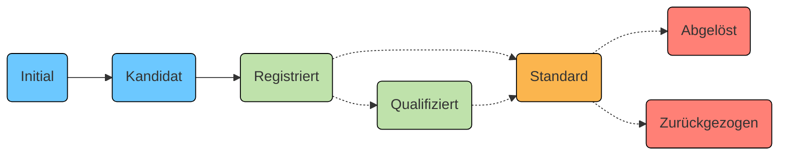

Ein klar definierter Arbeitsablauf regelt, wie Metadaten auf der Interoperabilitätsplattform I14Y publiziert werden. Abhängig davon, ob die Metadaten ausschliesslich innerhalb der Organisation oder öffentlich publiziert werden, vielleicht sogar als Standard, ist der Arbeitsablauf ein-, zwei- beziehungsweise dreistufig. Dieser _Workflow_ dient insbesondere der Qualitätssicherung.

In einer ersten Stufe werden die Metadaten erfasst. In einer zweiten Stufe werden sie von _Local Data Stewards_ validiert, also geprüft und öffentlich freigegeben. In einer dritten Stufe werden sie, sofern gewünscht und sinnvoll, in Zusammenarbeit mit der Interoperabilitätsstelle geprüft, gegebenenfalls als standardkonform markiert.

Neu erfasste Metadaten erhalten vorerst den Status _Initial_. Sobald die Erfassungsarbeiten abgeschlossen sind, wird der Status _Kandidat_ gesetzt. Diese Statusänderung muss von einer Person aus der eigenen Organisation, die mindestens über _Submitter_-Rechte verfügt, bestätigt werden. Sind alle Kontrollen erfolgreich, kann der Eintrag von einer Person in der Rolle _Local Data Steward_ auf _Registriert_ umgestellt werden. _Local Data Stewards_ dürfen den Eintrag auch öffentlich publizieren. Um die Metadaten stabil und persistent zu halten, können _Submitter_ Einträge in diesem Status nicht mehr modifizieren. Soll ein registriertes und/ oder publiziertes Konzept weiter verändert werden, soll normalerweise eine neue Version angelegt werden. 

Bei einigen Datensätzen, -diensten und -konzepten, die nicht standardisiert sind, endet die Erfassung damit.

In einem dritten Schritt können die _Local Data Stewards_ prüfen, ob das Datenangebot standardkonform ist. Angebote, die einem von einem Gremium wie [eCH](/handbook/de/glossar/#ech) oder [ISO](/handbook/de/glossar/#internationale-organisation-für-normung-iso) verabschiedeten Standard entsprechen, erhalten den Status _Standard_. Solche, die dereinst zum Standard werden könnten, werden als _Qualifiziert_ gekennzeichnet; im direkten Austausch mit der Interoperabilitätsstelle sowie in Fachgruppen wird daraufhin das weitere Vorgehen festgelegt. Datenangebote, die auf einem überholten oder abgeschafften Standard aufbauen, werden mit dem Status _Abgelöst_ beziehungsweise _Zurückgezogen_ gekennzeichnet. Solange die Daten nicht als "Standard" oder "Empfohlener Standard" markiert sind, können diese Einstufungen von den _Local Data Stewards_ ohne Rücksprache mit der Interoperabilitätsstelle gemacht werden. Soll ein Eintrag als "Standard" markiert sein, muss die Interoperabilitätsstelle beigezogen werden. 

Weitere Informationen zur Statusverwaltung und zu den Zuständigkeiten sind in der folgenden Tabelle zusammengestellt. Das bei der Interoperabilitätsplattform I14Y verwendete Statuskonzept ist inspirirt von dem [ISO-Standard 11179](https://www.iso.org/standard/78914.html).  

| Status DE | Status EN | Beschreibung | Wer vergibt den Status? |
| --- | ---- | ---- | ---- |
| Initial | _Initial_ | Neu erfasste Metadaten erhalten vorerst den Status _Initial_. Damit ist für die Nutzerinnen und Nutzer der eigenen Organisation sichtbar, dass die Arbeiten an diesen Metadaten noch nicht abgeschlossen sind. | _Submitter_, _Local Data Steward_ oder _InteroperabilityService_ |
| Kandidat | _Candidate_ | Mit dem Status _Kandidat_ werden Einträge gekennzeichnet, die vollständig erfasst sind. Der Status wird von jenen Personen gesetzt, die die Daten erfassen. | _Submitter_, _Local Data Steward_ oder _InteroperabilityService_ |
| Registriert | _Recorded_ | Metadaten mit dem Status _Registriert_ sind fertig erfasst und geprüft. Der Status wird von jenen Personen vorgeschlagen, die die Metadaten erfasst haben. Die Änderung wird von der _Local Data Steward_ bestätigt. Dies ist der letzte Status für nicht standardisierte Datenelemente. | _Local Data Steward_ oder _InteroperabilityService_ |
| Qualifiziert | _Qualified_ | Angebote, die dereinst zu einem Standard werden könnten, werden als _Qualifiziert_ gekennzeichnet. | _Local Data Steward_ oder _InteroperabilityService_ |
| Standard | _Standard_ | Dieser Status wird vergeben, wenn das Angebot einem von einem Fachgremium wie eCH oder ISO verabschiedeten Standard entspricht. | _InteroperabilityService_ |
| Empfohlener Standard | _Preferred Standard_ | In Einzelfällen kann es zu einem Thema mehrere Standards geben. Als _empfohlener Standard_ werden jene Konzepte gekennzeichnet, welche in der öffentlichen Verwaltung genutzt werden müssen, sofern keine wichtigen Punkte dagegen sprechen. Die Definition eines empfohlenen Standards obliegt dem _Swiss Data Steward_. | _InteroperabilityService_ |
| Abgelöst | _Superseded_ | Basiert das Angebot auf einem Standard, der mittlerweile durch einen anderen abgelöst worden ist, wird der Status auf _Abgelöst_ gesetzt. | _Submitter_, _Local Data Steward_ oder _InteroperabilityService_ |
| Zurückgezogen | _Retired_ | In Einzelfällen kommt es vor, dass die Normierungsorganisation einen Standard widerruft. In einem solchen Fall wird der Status des betreffenden Angebots auf _Zurückgezogen_ gesetzt. | _Submitter_, _Local Data Steward_ oder _InteroperabilityService_ |
{.workflow}

Beim Versuch einen Status festzulegen, der mit der eigenen Rolle nicht festgelegt werden kann, speichert das System einen Status-Vorschlag. Dieser muss von einer Person in einer Rolle mit weitergehenden Rechten bestätigt werden.

__Beispiel:__ Als _Submitter_ bin ich der Meinung, dass mein Datensatz mit dem Status "Kandidat" für den Status "Registriert" und für die Veröffentlichung bereit ist. Daher setze ich diesen Status. Die Statusänderung und die Veröffentlichung erfolgen nicht automatisch. Ein _Local Data Steward_ meiner Organisation muss die Anfrage bearbeiten und genehmigen, damit die Statusänderung und die Veröffentlichung wirksam werden.

## Statusübergangsmatrix

Die detaillierte Statusübergangsmatrix für alle technischen Rollen ist unten aufgeführt.

__Submitter__

RegistrationStatus:

| Current status \\ New status | Incomplete | Candidate | Recorded | Qualified | Standard | Preferred Standard | Superseded | Retired |
| ---------------------------- | ---------- | --------- | -------- | --------- | -------- | ------------------ | ---------- | ------- |
| Incomplete                   |            | x         |          |           |          |                    | x          | x       |
| Candidate                    | x          |           |          |           |          |                    | x          | x       |
| Recorded                     |            |           |          |           |          |                    | x          | x       |
| Qualified                    |            |           |          |           |          |                    | x          | x       |
| Standard                     |            |           |          |           |          |                    |            |         |
| Preferred Standard           |            |           |          |           |          |                    |            |         |
| Superseded                   |            |           |          |           |          |                    |            | x       |
| Retired                      |            |           |          |           |          |                    | x          |         |

PublicationLevel:

| Current level \\ New level | Internal | Public |
| -------------------------- | -------- | ------ |
| Internal                   |          |        |
| Public                     |          |        |

__Local Data Steward__

RegistrationStatus:

| Current status \\ New status | Incomplete | Candidate | Recorded | Qualified | Standard | Preferred Standard | Superseded | Retired |
| ---------------------------- | ---------- | --------- | -------- | --------- | -------- | ------------------ | ---------- | ------- |
| Incomplete                   |            | x         | x        | x         |          |                    | x          | x       |
| Candidate                    | x          |           | x        | x         |          |                    | x          | x       |
| Recorded                     | x          | x         |          | x         |          |                    | x          | x       |
| Qualified                    | x          | x         | x        |           |          |                    | x          | x       |
| Standard                     |            |           |          |           |          |                    |            |         |
| Preferred Standard           |            |           |          |           |          |                    |            |         |
| Superseded                   |            |           |          |           |          |                    |            | x       |
| Retired                      |            |           |          |           |          |                    | x          |         |

PublicationLevel:

| Current level \\ New level | Internal | Public |
| -------------------------- | -------- | ------ |
| Internal                   |          | x      |
| Public                     | x        |        |

__InteroperabilityService__

RegistrationStatus:

| Current status \\ New status | Incomplete | Candidate | Recorded | Qualified | Standard | Preferred Standard | Superseded | Retired |
| ---------------------------- | ---------- | --------- | -------- | --------- | -------- | ------------------ | ---------- | ------- |
| Incomplete                   |            | x         | x        | x         | x        | x                  | x          | x       |
| Candidate                    | x          |           | x        | x         | x        | x                  | x          | x       |
| Recorded                     | x          | x         |          | x         | x        | x                  | x          | x       |
| Qualified                    | x          | x         | x        |           | x        | x                  | x          | x       |
| Standard                     | x          | x         | x        | x         |          | x                  | x          | x       |
| Preferred Standard           | x          | x         | x        | x         | x        |                    | x          | x       |
| Superseded                   | x          | x         | x        | x         | x        | x                  |            | x       |
| Retired                      | x          | x         | x        | x         | x        | x                  | x          |         |

PublicationLevel:

| Current level \\ New level | Internal | Public |
| -------------------------- | -------- | ------ |
| Internal                   |          | x      |
| Public                     | x        |        |

## Publikationskanal

Auf der Interoperabilitätsplattform I14Y existieren zwei Publikationskanäle: Metadaten können innerhalb der eigenen Organisation zugänglich gemacht werden -- etwa, um die eigenen Datenbestände zu inventarisieren. Oder sie können öffentlich publiziert werden. Zu Beginn sind die erfassten Metadaten stets ausschliesslich innerhalb der Organisation verfügbar. Sollen sie für die Allgemeinheit sichbar gemacht werden, wird der Publikationskanal auf _Public_ umgestellt. Dies ist anzustreben bei harmonisierten und standardisierten Datenstrukturen und -konzepten. Denn diese eignen sich für die Weiterverwendung.

In der Regel wird die öffentliche Publikation durch eine Person mit der Rolle _Local Data Steward_ kontrolliert und durchgeführt. Die Interoperabilitätsstelle, das I14Y-Team, prüft daraufhin die Metadaten, wenn der Registrierungsstatus auf „Standard“ oder höher gesetzt wird.

## Bearbeitungsrechte

Abhängig vom Status im Registrations- und Publikations-Workflow sowie von der eigenen Rolle können die erfassten Metadaten nicht abgeändert werden. So können etwa als "Registriert" gekennzeichnete oder publizierte Einträge nicht mehr bearbeitet werden von der Rolle _Submitter_. In diesem Fall wird normalerweise eine neue Version angelegt.


Auf der Interoperabilitätsplattform I14Y werden ausschliesslich Metadaten gespeichert. Die eigentlichen Daten verbleiben bei jener Stelle, die die Datensätze verwaltet. Diese ist damit zuständig für die Sicherheit der Daten. 

Die Interoperabilitätsplattform I14Y wird vom Bundesamt für Informatik im Auftrag der Interoperabilitätsstelle technisch betrieben. Die Bundesvorgaben zur Informatiksicherheit werden umgesetzt. Eine Schutzbedarfsanalyse wurde anfangs Februar 2021 abgeschlossen. Die Server, auf denen die Plattform läuft, werden vom Bundesamt für Informatik betrieben. Sie befinden sich in der Schweiz. Extern betrieben werden einzig dieses Handbuch sowie der Chatbot. 


