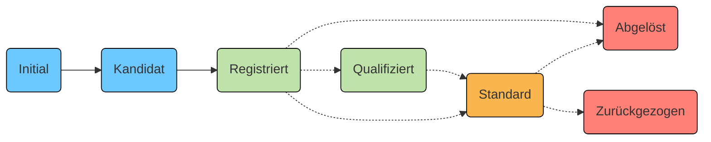

In diesem Abschnitt wird der Arbeitsablauf für die Erfassung und Publikation von Metadaten auf der Interoperabilitätsplattform I14Y erklärt. Im Zentrum steht der Status eines Eintrags. Der Status ist wichtig für die internen Arbeiten (_Initial_, _Kandidat_, _Registriert_) und für die öffentliche Einordnung publizierter Einträge (_Registriert_, _Qualifiziert_, _Standard_, _Abgelöst_, _Zurückgezogen_). Er zeigt, wie weit ein Eintrag fachlich gereift ist und welche Bedeutung er hat.

Der Arbeitsablauf ist je nach Fall ein-, zwei- oder dreistufig. Zuerst werden Metadaten erfasst. Danach prüfen _Local Data Stewards_ den Eintrag und geben ihn frei. In einem dritten Schritt kann zusätzlich geprüft werden, ob ein Eintrag standardkonform ist.

Beispiel: Wird ein Konzept von einem Fachgremium wie eCH standardisiert und auf I14Y als _Standard_ gekennzeichnet, dient es Verwaltungsstellen als verbindliche Orientierung. Wenn eine Stelle den betreffenden Sachverhalt in einem Datensatz abbildet, soll sie diesen Standard in der Regel verwenden.

Der Status setzt zudem Gouvernanz-Regeln durch: Ab dem Status _Registriert_ können Personen mit der Rolle _Submitter_ den Eintrag nicht mehr direkt ändern. Sie können nur noch einen Vorschlag für eine Statusänderung machen, der von einer Person mit der Rolle _Local Data Steward_ bestätigt werden muss.

```mermaid
flowchart LR
    A(Initial)
    B(Kandidat)
    C(Registriert)
    D(Qualifiziert)
    E(Standard)
    F(Abgelöst)
    G(Zurückgezogen)

    A-->B
    B-->C
    C-.->D
    C-.->E
    D-.->E
    E-.->F
    E-.->G
    C-.->F

    style A fill:#6CC8FF
    style A stroke:black

    style B fill:#6CC8FF
    style B stroke:black

    style C fill:#Bfe2ab
    style C stroke:black

    style D fill:#Bfe2ab
    style D stroke:black

    style E fill:#Fbb54e
    style E stroke:black

    style F fill:#Ff8076
    style F stroke:black

    style G fill:#Ff8076
    style G stroke:black
```

Neu erfasste Metadaten erhalten zuerst den Status _Initial_. Ist die Erfassung abgeschlossen, folgt der Status _Kandidat_. Diese Änderung muss von einer Person aus der eigenen Organisation mit mindestens _Submitter_-Rechten bestätigt werden. Sind alle Kontrollen erfolgreich, kann eine Person mit der Rolle _Local Data Steward_ den Eintrag auf _Registriert_ setzen. _Local Data Stewards_ dürfen den Eintrag auch öffentlich publizieren. Ab _Registriert_ können _Submitter_ den Eintrag nicht mehr direkt bearbeiten. Für grössere Änderungen wird in der Regel eine neue Version erstellt.

Für nicht standardisierte Datensätze, -dienste und -konzepte endet der Prozess häufig bei _Registriert_. Manchmal wird im Laufe der Zeit eine neue Version erstellt. In diesem Fall kann der Status der ursprünglichen Version auf _Abgelöst_ gestellt wird.  

In einem dritten Schritt prüfen _Local Data Stewards_, ob ein Angebot standardkonform ist. Entspricht es einem Standard eines Gremiums wie [eCH](/handbook/de/glossar/#ech) oder [ISO](/handbook/de/glossar/#internationale-organisation-für-normung-iso), erhält es den Status _Standard_. Angebote mit Potenzial zum Standard werden als _Qualifiziert_ markiert. Das weitere Vorgehen wird dann mit dem Kompetenzzentrum Datenbewirtschaftung und in Fachgruppen festgelegt. Angebote auf Basis überholter oder aufgehobener Standards erhalten den Status _Abgelöst_ oder _Zurückgezogen_. Solange ein Eintrag nicht als "Standard" oder "Empfohlener Standard" markiert ist, können _Local Data Stewards_ diese Einstufungen ohne Rücksprache vornehmen. Für die Markierung als "Standard" ist der Einbezug des Kompetenzzentrums Datenbewirtschaftung erforderlich.

Weitere Informationen zur Statusverwaltung und zu den Zuständigkeiten stehen in der folgenden Tabelle. Das auf der Interoperabilitätsplattform I14Y verwendete Statuskonzept ist vom [ISO-Standard 11179](https://www.iso.org/standard/78914.html) inspiriert.

| Status DE | Status EN | Beschreibung | Wer vergibt den Status? |
| --- | ---- | ---- | ---- |
| Initial | _Initial_ | Neu erfasste Metadaten erhalten vorerst den Status _Initial_. Damit ist für die Nutzerinnen und Nutzer der eigenen Organisation sichtbar, dass die Arbeiten an diesen Metadaten noch nicht abgeschlossen sind. | _Submitter_, _Local Data Steward_ oder _InteroperabilityService_ |
| Kandidat | _Candidate_ | Mit dem Status _Kandidat_ werden Einträge gekennzeichnet, die vollständig erfasst sind. Der Status wird von jenen Personen gesetzt, die die Daten erfassen. | _Submitter_, _Local Data Steward_ oder _InteroperabilityService_ |
| Registriert | _Recorded_ | Metadaten mit dem Status _Registriert_ sind fertig erfasst und geprüft. Der Status wird von jenen Personen vorgeschlagen, die die Metadaten erfasst haben. Die Änderung wird von der _Local Data Steward_ bestätigt. Dies ist der letzte Status für nicht standardisierte Datenelemente. | _Local Data Steward_ oder _InteroperabilityService_ |
| Qualifiziert | _Qualified_ | Angebote, die dereinst zu einem Standard werden könnten, werden als _Qualifiziert_ gekennzeichnet. | _Local Data Steward_ oder _InteroperabilityService_ |
| Standard | _Standard_ | Dieser Status wird vergeben, wenn das Angebot einem von einem Fachgremium wie eCH oder ISO verabschiedeten Standard entspricht. Dieser Status kann technisch nur durch das BFS vergeben werden. | _InteroperabilityService_ |
| Empfohlener Standard | _Preferred Standard_ | In Einzelfällen kann es zu einem Thema mehrere Standards geben. Als _empfohlener Standard_ werden jene Konzepte gekennzeichnet, welche in der öffentlichen Verwaltung genutzt werden müssen, sofern keine wichtigen Punkte dagegen sprechen. In der Regel ist ein übergeordnetes Gremium wie das Data Board Bund (DBB) für die Auswahl des empfohlenen Standards verantwortlich. | _InteroperabilityService_ |
| Abgelöst | _Superseded_ | Basiert das Angebot auf einem Standard, der mittlerweile durch einen anderen abgelöst worden ist, wird der Status auf _Abgelöst_ gesetzt. Der Status kann zudem nach einer Versionierung verwendet werden, um die ursprüngliche Version als überholt zu kennzeichnen – auch wenn der Eintrag nie den Status _Standard_ erhalten hat. Damit wird vermieden, dass Anwender:innen versehentlich eine veraltete Version verwenden, und es bleibt klar erkennbar, welche Version gültig ist. | _Submitter_, _Local Data Steward_ oder _InteroperabilityService_ |
| Zurückgezogen | _Retired_ | In Einzelfällen kommt es vor, dass die Normierungsorganisation einen Standard widerruft. In einem solchen Fall wird der Status des betreffenden Angebots auf _Zurückgezogen_ gesetzt. | _Submitter_, _Local Data Steward_ oder _InteroperabilityService_ |
{.workflow}

Wenn jemand einen Status setzt, der mit der eigenen Rolle nicht direkt gesetzt werden darf, speichert das System einen Statusvorschlag. Dieser muss von einer Person mit weitergehenden Rechten bestätigt werden.

__Beispiel:__ Eine Person mit der Rolle _Submitter_ hält einen Datensatz im Status "Kandidat" für bereit zur Registrierung und Veröffentlichung. Sie beantragt deshalb den Status "Registriert". Die Änderung und die Veröffentlichung erfolgen nicht automatisch. Eine Person mit der Rolle _Local Data Steward_ muss den Antrag prüfen und freigeben.

## Statusübergangsmatrix

Die folgende Statusübergangsmatrix zeigt die erlaubten Wechsel für alle technischen Rollen.

__Submitter__

RegistrationStatus:

| Current status \\ New status | Incomplete | Candidate | Recorded | Qualified | Standard | Preferred Standard | Superseded | Retired |
| ---------------------------- | ---------- | --------- | -------- | --------- | -------- | ------------------ | ---------- | ------- |
| Incomplete                   |            | x         |          |           |          |                    | x          | x       |
| Candidate                    | x          |           |          |           |          |                    | x          | x       |
| Recorded                     |            |           |          |           |          |                    | x          | x       |
| Qualified                    |            |           |          |           |          |                    | x          | x       |
| Standard                     |            |           |          |           |          |                    |            |         |
| Preferred Standard           |            |           |          |           |          |                    |            |         |
| Superseded                   |            |           |          |           |          |                    |            | x       |
| Retired                      |            |           |          |           |          |                    | x          |         |
{.status-matrix}

PublicationLevel:

| Current level \\ New level | Internal | Public |
| -------------------------- | -------- | ------ |
| Internal                   |          |        |
| Public                     |          |        |
{.publication-matrix}

__Local Data Steward__

RegistrationStatus:

| Current status \\ New status | Incomplete | Candidate | Recorded | Qualified | Standard | Preferred Standard | Superseded | Retired |
| ---------------------------- | ---------- | --------- | -------- | --------- | -------- | ------------------ | ---------- | ------- |
| Incomplete                   |            | x         | x        | x         |          |                    | x          | x       |
| Candidate                    | x          |           | x        | x         |          |                    | x          | x       |
| Recorded                     | x          | x         |          | x         |          |                    | x          | x       |
| Qualified                    | x          | x         | x        |           |          |                    | x          | x       |
| Standard                     |            |           |          |           |          |                    |            |         |
| Preferred Standard           |            |           |          |           |          |                    |            |         |
| Superseded                   |            |           |          |           |          |                    |            | x       |
| Retired                      |            |           |          |           |          |                    | x          |         |
{.status-matrix}

PublicationLevel:

| Current level \\ New level | Internal | Public |
| -------------------------- | -------- | ------ |
| Internal                   |          | x      |
| Public                     | x        |        |
{.publication-matrix}

__InteroperabilityService__

RegistrationStatus:

| Current status \\ New status | Incomplete | Candidate | Recorded | Qualified | Standard | Preferred Standard | Superseded | Retired |
| ---------------------------- | ---------- | --------- | -------- | --------- | -------- | ------------------ | ---------- | ------- |
| Incomplete                   |            | x         | x        | x         | x        | x                  | x          | x       |
| Candidate                    | x          |           | x        | x         | x        | x                  | x          | x       |
| Recorded                     | x          | x         |          | x         | x        | x                  | x          | x       |
| Qualified                    | x          | x         | x        |           | x        | x                  | x          | x       |
| Standard                     | x          | x         | x        | x         |          | x                  | x          | x       |
| Preferred Standard           | x          | x         | x        | x         | x        |                    | x          | x       |
| Superseded                   | x          | x         | x        | x         | x        | x                  |            | x       |
| Retired                      | x          | x         | x        | x         | x        | x                  | x          |         |
{.status-matrix}

PublicationLevel:

| Current level \\ New level | Internal | Public |
| -------------------------- | -------- | ------ |
| Internal                   |          | x      |
| Public                     | x        |        |
{.publication-matrix}

## Publikationskanal

Auf der Interoperabilitätsplattform I14Y gibt es zwei Publikationskanäle: Metadaten sind entweder nur innerhalb der eigenen Organisation sichtbar oder öffentlich. Zu Beginn sind neu erfasste Metadaten immer nur intern verfügbar. Sollen sie für die Allgemeinheit sichtbar werden, wird der Publikationskanal auf _Public_ gestellt. Das ist insbesondere bei harmonisierten und standardisierten Datenstrukturen und -konzepten sinnvoll, weil diese gut weiterverwendet werden können.

In der Regel wird die öffentliche Publikation von einer Person mit der Rolle _Local Data Steward_ geprüft und freigegeben. Setzt diese Person den Registrierungsstatus auf „Standard“ oder höher, prüft das Kompetenzzentrum Datenbewirtschaftung (KDB, I14Y-Team) die Metadaten zusätzlich.

## Bearbeitungsrechte

Ob Metadaten bearbeitet werden können, hängt vom Registrierungsstatus, vom Publikationskanal und von der eigenen Rolle ab. Einträge mit dem Status "Registriert" oder öffentliche Einträge können von Personen mit der Rolle _Submitter_ nicht mehr direkt bearbeitet werden. Ist eine grundlegende Änderung nötig, wird normalerweise eine neue Version erstellt.

Bei Konzepten ist keine Bearbeitung mehr möglich, wenn die Option „Gesperrt“ aktiv ist. Falls trotzdem eine Anpassung nötig ist, wenden Sie sich bitte an eine Administratorin oder einen Administrator.

Die folgende Liste zeigt nach Rollen, bei welchen Status eine Bearbeitung der Metadaten möglich ist.

__Submitter__

| Current status \\ New status | Incomplete | Candidate | Recorded | Qualified | Standard | Preferred Standard | Superseded | Retired |
| ---------------------------- | ---------- | --------- | -------- | --------- | -------- | ------------------ | ---------- | ------- |
| Internal                     | x          | x         |          |           |          |                    |            |         |
| Public                       |  x          |   x        |          |           |          |                    |            |         |
{.publication-matrix}

__Local Data Steward__

| Current status \\ New status | Incomplete | Candidate | Recorded | Qualified | Standard | Preferred Standard | Superseded | Retired |
| ---------------------------- | ---------- | --------- | -------- | --------- | -------- | ------------------ | ---------- | ------- |
| Internal                     | x          | x         | x        | x         | x        | x                  | x          | x       |
| Public                       | x          | x         | x        | x         | x        | x                  | x          | x       |
{.publication-matrix}

__InteroperabilityService__

| Current status \\ New status | Incomplete | Candidate | Recorded | Qualified | Standard | Preferred Standard | Superseded | Retired |
| ---------------------------- | ---------- | --------- | -------- | --------- | -------- | ------------------ | ---------- | ------- |
| Internal                     | x          | x         | x        | x         | x        | x                  | x          | x       |
| Public                       | x          | x         | x        | x         | x        | x                  | x          | x       |
{.publication-matrix}


Auf der Interoperabilitätsplattform I14Y werden ausschliesslich Metadaten gespeichert. Die eigentlichen Daten bleiben bei der Stelle, die die Datensätze verwaltet. Diese Stelle ist für die Datensicherheit verantwortlich.

Die Interoperabilitätsplattform I14Y läuft auf einer Public-Cloud-Instanz, die über das Bundesamt für Informatik beschafft wurde. Die Bundesvorgaben zur Informatiksicherheit werden eingehalten. Eine Schutzbedarfsanalyse liegt vor, und das Informationssicherheits- und Datenschutzkonzept wird demnächst abgeschlossen. Auf externer Infrastruktur werden derzeit das Handbuch, das Dashboard und die Applikationen der Toolbox betrieben.

 