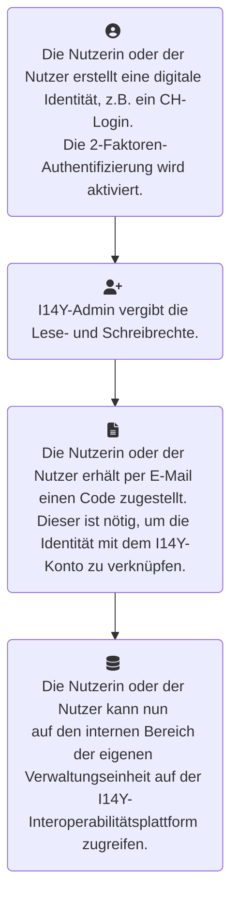

Wer auf der I14Y-Interoperabilitätsplattform Daten erfassen will, benötigt ein Nutzungskonto. Genauso wie jene Personen, die (noch) nicht öffentlich publizierte Informationen der eigenen Organisation einsehen wollen. Der Zugriff wird mit dem _Enterprise Identity and Access Management (EIAM)_ gesteuert. Dieser Dienst wird vom Bundesamt für Informatik für die Eidgenossenschaft betrieben.  

Um auf den internen Bereich der I14Y-Interoperabilitätsplattform zugreifen zu können, ist ein Konto bei einem Anbieter einer digitalen Identifikationslösung nötig. Die Mitarbeitenden der Bundesverwaltung nutzen ihr [Fedlogin](https://www.eiam.swiss). Daneben stehen diverse andere Möglichkeiten zur Auswahl, etwa das CH-Login, die elektronischen Identitäten von Switch oder jene von Kantonen wie Bern, Schaffhausen, Zug und Genf. Weitere Details sind in der [Tabelle Identifikationsmöglichkeiten](/handbook/de/anhang/eiam) im Anhang zu finden. 

Gehen Sie folgendermassen vor:

1. Klicken Sie auf der I14Y-Interoperabilitätsplattform oben rechts auf das Einwählsymbol. Wählen Sie den passenden Anbieter zur Identifikation aus. Loggen Sie sich beim Anbieter der digitalen Identität ein oder erstellen Sie ein neues Konto. Achtung: Mitarbeitende der Bundesverwaltung müssen das Fedlogin statt dem CH-Login verwenden, da es ansonsten zu Konflikten kommen kann. Sollte der Prozess plötzlich abbrechen, müssen allenfalls die _Cookies_ gelöscht werden. Den entsprechenden Dialog erreichen Sie, wenn Sie im Webbrowser die Tastenkombination Ctrl-Shift-Löschen drücken. 

2. In einem zweiten Schritt müssen die Berechtigungen auf der I14Y-Interoperabilitätsplattform vergeben werden. Grössere Organisationen verwalten die Nutzungskontos selber ([siehe unten](#kontenverwaltung-in-grösseren-organisationen)). Bitte kontaktieren Sie also die Kontenverwalterin oder den Kontoverwalter Ihrer Organisation. Falls Sie keine organisationsinterne Standardlösung wie das Fedlogin nutzen: Teilen Sie insbesondere mit, welche E-Mail-Adresse Sie beim Erstellen eines Logins (siehe Schritt 1) verwendet haben. Sobald die Lese- bzw. Schreibrechte vergeben sind, erhalten Sie eine E-Mail. Diese enthält einen Weblink sowie einen Code. Besuchen Sie die angegebene Webseite und tragen Sie dort den zugestellten Code ein. Damit wird die digitale Identität mit der I14Y-Plattform verknüpft.  

Diese Einrichtungsschritte sind einmalig nötig. Falls Sie später die Angaben zum eigenen Konto anpassen möchten, besuchen Sie den [Kontoverwaltungsbereich von EIAM](https://www.myaccount.eiam.admin.ch). 


Die I14Y-Interoperabilitätsplattform wird von der Eidgenossenschaft im Rahmen des Programms Nationale Datenbewirtschaftung entwickelt und betrieben. Finanziert werden die Aufbauarbeiten wie auch der Betrieb vom Bund. Mittelfristig kann das Portal kostenlos genutzt werden -- auch von Inhaltsanbieterinnen und -anbietern aus Kantons- und Gemeindeverwaltungen sowie von staatsnahen Unternehmen. Über die längerfristige Finanzierung wird in einer späteren Phase entschieden. 



## Kontenverwaltung in grösseren Organisationen 

Grössere Organisationen sind selber für die Verwaltung der Konten zuständig. Sie stellen insbesondere die nötigen personellen Ressourcen zur Verfügung. Je nach Situation können die Arbeitsschritte zum Eröffnen eines Kontos variieren.

Die Lese- und Schreibrechte werden in der Regel über das [Portal zum Delegierten Management](https://www.portal.eiam.admin.ch/) vergeben. Falls Sie für die Verwaltung der Nutzungskontos verantwortlich sind und noch keinen Zugriff auf dieses Portal haben oder falls Sie einen automatisierten Onboarding-Prozess aufsetzen möchten, nehmen Sie mit der [Interoperabilitätsstelle](mailto:i14y@bfs.admin.ch) Kontakt auf. 

1. Um ein einzelnes Nutzungskonto zu eröffnen, besuchen Sie das Portal zum Delegierten Management. Wählen Sie im Reiter "Benutzermanagement" den Punkt "Delegiertes Management" aus. Klicken Sie auf den Pfeil vor "I14Y" und auf den Namen Ihrer Organisation. Ein Klick auf "Weiter" öffnet die Detailansicht mit der Liste der Zugangsberechtigten. Sollte Ihre Organisation noch nicht bestehen, nehmen Sie mit der Interoperabilitätsstelle Kontakt auf.
2. Klicken Sie auf "Neuen Benutzer hinzufügen". Zwingend auszufüllen sind die Felder mit den Namensangaben sowie der E-Mail-Adresse. Achten Sie darauf, dass Sie jene E-Mail-Adresse verwenden, mit der sich die zu erfassende Person beim Identitätsanbieter (wie CH-Login) registriert hat. 
3. Wählen Sie die neu erfasste Person aus. Klicken Sie auf "Weiter". Nun werden Sie dazu aufgefordert, die Zugriffsberechtigungen zu vergeben. Passen Sie zuerst das Profil an: Klicken Sie dazu auf das Bleistiftsymbol links. Ersetzen Sie den Namen durch eine aussagekräftige Beschreibung und ersetzen Sie die Nummer durch die vorne ersichtliche Profil-ID. Unter "Profilbezeichnung" sollte also etwa "LocalDataSteward-1159123" stehen. Tragen Sie im Eingabefeld darunter das Zeichen * ein. Klicken Sie auf "Speichern".
4. Wählen Sie unter "Geschäftsrollen" die passende Rolle aus. In der Regel wird dort "StewardshipOrganizationViewer" (ausschliesslich Lesezugriff), "Submitter" (Rechte zur Erfassung von Metadaten, nicht aber zur Publikation) oder "LocalDatasteward" angewählt. Fügen Sie mit einem Klick auf den Knopf "Berechtigen" die entsprechenden Schreib- und Leserechte dem Profil hinzu. Klicken Sie schliesslich auf "Weiter". __Achtung:__ Jedem Profil sollte nur eine Rolle zugewiesen werden. Es ist aber möglich für ein Konto mehrere Profile zu eröffnen. Klicken Sie dazu auf den entsprechenden Link. In diesem Fall muss die betreffende Person beim Einloggen jeweils auswählen, mit welchem Profil sie sich anmelden möchte.   
5. Beschreiben Sie das neue Konto kurz. Verschicken Sie schliesslich mit einem Klick auf "Benachrichtigungs-E-Mail senden" die Onboarding-Nachricht an die betreffende Person. In der Nachricht wird diese aufgefordert auf einen Link zu klicken und einen mitgeschickten Code in ein Webformular einzutragen. Damit wird der digitalen Identität die nötigen Lese- und Schreibrechte zugewiesen. Auf der Übersicht des Portals zum Delegierten Management sehen Sie jederzeit, welche Personen das so genannte Onboarding erfolgreich abgeschlossen haben.