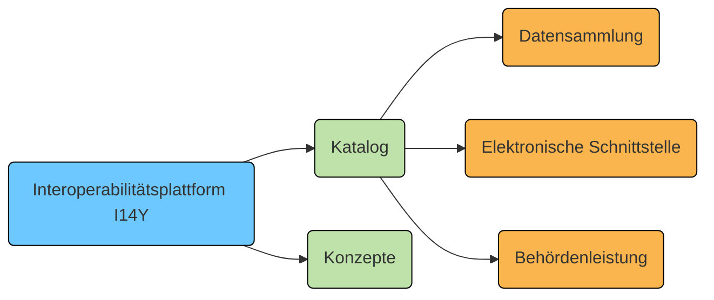

Die Interoperabilitätsplattform I14Y lässt sich vielfältig einsetzen: Im Katalog-Bereich werden Datensammlungen, elektronische Schnittstellen und Behördenleistungen verzeichnet. Und unter "Konzepte" lassen sich einzelne Datenelemente beschreiben. Werden Konzepte öffentlich freigegeben, können sie von anderen Nutzerinnen und Nutzern wiederverwendet werden. 

Abhängig davon, was beschrieben werden soll, müssen andere Aspekte berücksichtigt werden. In diesem Teil des Handbuchs wird gezeigt, wie die verschiedenen Metadaten auf der I14Y-Interperabilitätsplattform erfasst werden.