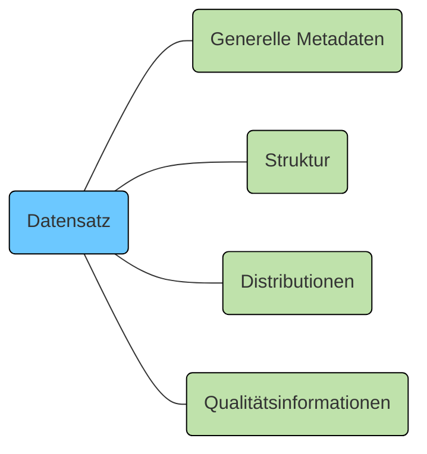

Auf der Interoperabilitätsplattform I14Y können Datensätze beschrieben werden. Unter einem Datensatz ist eine Zusammenstellung von Daten zu verstehen, die von einer einzigen Organisation veröffentlicht oder kuratiert werden und durch eine gemeinsame Idee oder ein gemeinsames Konzept verbunden sind. 

Zusätzlich zu den Kataloginformationen lassen sich auf der Interoperabilitätsplattform I14Y auch strukturelle Metadaten erfassen. Damit kann die "Anatomie des Datensatzes" detailliert beschrieben werden. Jeder Datensatz hat eine Struktur, die aus mindestens einem Datenelement besteht. Die Datenelemente können ein Konzept referenzieren. Es kann sich dabei um eine Zeichenkette, um eine Zahl, um ein Datum oder um eine Codeliste handeln. Detailinformationen zu Datensätzen sind im Abschnitt zum [Informationsmodell](/handbook/de/gouvernanz/informationsmodell) zu finden.

Soll ein Datensatz erfasst werden, sind mindestens die Kataloginformationen zu hinterlegen. Dazu werden die Felder genutzt, wie sie der Austauschstandard DCAT-AP CH vorgibt. Anschliessend besteht die Möglichkeit, die Struktur des Datensatzes zu beschreiben. Unter "Distributionen" lassen sich Links zu den eigentlichen Daten hinterlegen. Zudem können Angaben zur Datenqualität erfasst werden. 

## Welche Datensätze sollen auf I14Y beschrieben werden?
Gemäss EMBAG und DigiV sind auf I14Y insbesondere Metadaten von strukturierten Datenbeständen zu erfassen. Prioritär sind:

- Datensätze mit Relevanz für die verwaltungsinterne oder verwaltungsübergreifende Mehrfachnutzung
- Datensätze mit Bezug zu Open Government Data
- Datensätze, die für elektronische Behördenleistungen oder elektronische Schnittstellen relevant sind
- Datensätze mit standardisierungsrelevanten Nomenklaturen und Konzepten

Nicht im Fokus der Inventarisierung auf I14Y sind unstrukturierte Datenbestände sowie Metadaten, deren Publikation rechtlich unzulässig wäre. Bei Unsicherheiten sind die zuständigen Fach- und Rechtsstellen beizuziehen.

Die Metadaten zu einem Datensatz lassen sich bequem übers Webinterface erfassen. Wechseln Sie dazu in den [Input-Bereich von I14Y](https://input.i14y.admin.ch). Klicken Sie nun auf "Katalog pflegen" und "Erstellen". Wählen Sie aus, dass Sie eine Beschreibung zu einem Datensatz erstellen möchten. 

In einem ersten Schritt werden die grundlegenden Informationen eingetragen. Zwingend auszufüllen sind die mit einem Stern gekennzeichneten Eingabefelder: Um einen Datensatz zu beschreiben, ist ein __Titel__ und eine __Beschreibung__ nötig. Diese Informationen sollten möglichst in allen für Ihre Organisation relevanten Sprachen vorliegen; in einer ersten Phase ist es indes möglich sich auf eine Sprache zu beschränken. Mit einem Klick auf den Knopf "Alle Sprachen ausblenden" lassen sich die zusätzlichen Sprachfelder ausblenden. Sowohl beim Titel als auch bei der Beschreibung ist darauf zu achten, dass die Angaben sowohl für Laien als auch für ein Fachpublikum verständlich sind -- insbesondere, wenn der Eintrag öffentlich publiziert werden soll. 

Zusätzlich zum Titel und der Beschreibung ist ein frei wählbarer, aber eindeutiger und aussagekräftiger __Identifikator__ nötig. Es bewährt sich innerhalb der Organisation Regeln zu definieren. So könnte etwa der Organisationsname und die Abteilung vorangestellt werden, also etwa "uvek_bafu". Um die Kompatibilität auch bei der Weiterverwendung auf externen Systemen sicherzustellen, ist es sinnvoll beim Setzen des Identifikators auf Sonderzeichen wie Umlaute oder Akzente zu verzichten. Wenn verschiedene Datensätze aus dem gleichen Bereich vorliegen, kann entweder mit nachgestellten Nummern oder mit Präzisierungen gearbeitet werden. Leerschläge sind im Identifikator nicht zulässig; verwenden Sie zum Kombinieren mehrerer Ausdrücke stattdessen die Unterstrich- und Bindestrichzeichen oder aber eine Schreibweise mit Binnenmajuskel (CamelCase). 

Im Feld __Herausgeber__ wählen Sie Ihre Organisation aus der Liste aus. Freitext wird in diesem Text nicht akzeptiert. Sollte der richtige Herausgeber nicht eingeblendet werden, nehmen Sie mit dem I14Y-Team [Kontakt auf](mailto:i14y@bfs.admin.ch). Unter __Zugriffsrechte__ wird bestimmt, ob die Daten öffentlich, unter bestimmten Bestimmungen zugänglich oder nicht öffentlich sind. Dabei geht es um die eigentlichen Daten; die Sichtbarkeit des Metadateneintrags wird separat gesteuert (siehe [Workflow](/handbook/de/gouvernanz/arbeitsablauf)).

Damit die Mitarbeitenden der eigenen Organisation bei Fragen zu einem Datensatz die zuständigen Personen einfach kontaktieren können, bietet I14Y drei __Personenfelder__ an. Diese wurden von der Interoperabilitätsstelle eingeführt. Sie sind im Standard DCAT-AP CH nicht vorgesehen. Entsprechend müssen sie nicht zwingend ausgefüllt werden. Die in diesen Feldern hinterlegten Personennamen sind für alle Nutzerinnen und Nutzer sichtbar, die Lese- oder Schreibzugriff auf den organisationsinternen Bereich haben. Wird der Eintrag öffentlich publiziert, können die Namen auch von allen eingeloggten Nutzerinnen und Nutzer eingesehen werden -- allerdings ausschliesslich im internen Bereich, also unter input.i14y.admin.ch.  

Im Freitextfeld __Dateneigner__ können die Namen jener Personen hinterlegt werden, die den Datensatz in Auftrag gegeben haben und die Verantwortung dafür tragen -- also etwa die Leiterin oder der Leiter eines Amts. Im Feld __datenverantwortliche Person__ kann der Name der Person eingetragen werden, die die Daten operativ pflegt. Auch der Name der __Vertretung der datenverantwortlichen Person__ lässt sich hinterlegen. In den letztgenannten beiden Feldern lassen sich alle Personen auswählen, die sich mindestens einmal auf der Interoperabilitätsplattform I14Y eingeloggt haben; ein Onboarding ohne nachträgliches Einloggen genügt nicht. 

Im Feld __Publikationsdatum__ kann vermerkt werden, wann die eigentlichen Daten erstmals publiziert worden sind; in __Änderungsdatum__ wird angegeben, wann letztmals eine Anpassung am Datensatz vorgenommmen wurde. Beschrieben werden die Publikationstermine der eigentlichen Daten und nicht jener der Metadaten. Die Felder müssen nicht zwingend ausgefüllt werden. Andere Felder wie jene zu den __Schlüsselwörtern__ und zur __zeitlichen und räumlichen Abdeckung__ helfen dabei den Datensatz einfach auffindbar zu machen.

Unter __Themen__ wählen Sie einen oder mehrere Punkte aus. Soll der Eintrag auch auf opendata.swiss erscheinen, fügen Sie hier den entsprechenden Katalog an und wählen einen oder mehrere Punkte aus der zusätzlichen Liste aus. Mehr Informationen finden Sie im Abschnitt [Open Government Data erfassen](/handbook/de/publikation/datensatz/ogd/).

Im Feld __Konform zu__ werden Angaben dazu erfasst, welchem Standard der entsprechende Datensatz entspricht. So können etwa Standards von [eCH](https://ech.swiss) verlinkt werden. Angaben zu den Gesetzesgrundlagen werden unter __Verwandte Ressourcen__ hinterlegt -- etwa als Link auf den betreffenden Paragraphen in [Fedlex](https://www.fedlex.admin.ch/). 


Die Bundeskanzlei publiziert auf der Plattform [Fedlex](https://www.fedlex.admin.ch) die systematische Rechtssammlung der Eidgenossenschaft. Suchen Sie das betreffende Gesetz. Mit einem Klick auf das Symbol hinter dem Link-Titel können Sie die Webadresse bequem kopieren. Auch eine direkte Verlinkung zum relevanten Artikel ist möglich. Suchen Sie dazu den Gesetzesartikel, klicken Sie mit der rechten Maustaste darauf und kopieren Sie den Weblink. Nachteil dieser Variante: Die Sprache ist im Link enthalten. 


Es ist empfehlenswert möglichst alle Eingabemöglichkeiten zu nutzen. Die obligatorischen Felder decken die vom DCAT-Standard verlangten Angaben ab. Diese werden durch weitere Felder ergänzt, auch durch plattformspezifische. Detaillierte Informationen zu den einzelnen Feldern enthält die [Übersicht](/handbook/de/anhang/eingabefelder) im Anhang dieses Handbuchs.

Sobald die grundlegenden Metadaten eingetragen sind, wird der Eintrag ein erstes Mal gespeichert. Weitere Angaben können erst nach dieser Sicherung vorgenommen werden, bei der der Eintrag in der Datenbank angelegt wird. Um den Eintrag zu editieren oder zu vervollständigen, wird er nach der Sicherung neu geöffnet; zu finden ist er via die Suchfunktion oder am Ende der Liste. 