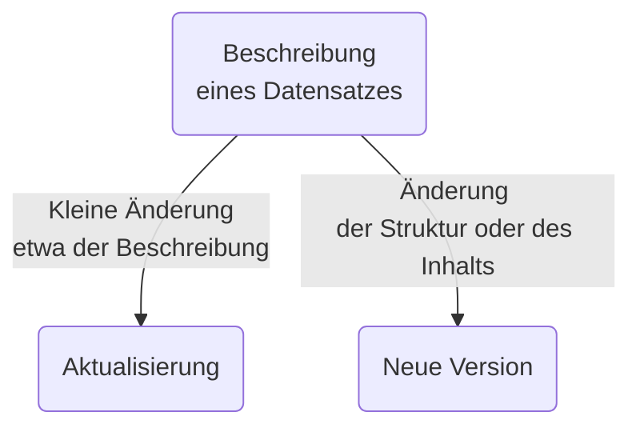

Statt einen bestehenden Eintrag anzupassen, ist es oftmals sinnvoller eine neue Version davon zu erstellen. Diese verweist auf die vorherige Ausgabe des Angebots. So bleiben Änderungen für alle Nutzerinnen und Nutzer transparent. Und sie beeinträchtigen keine laufenden Systeme. Die Nutzerinnen und Nutzer, die etwa eine Codeliste beziehen, haben die Wahl: Sie können die jeweils aktuelle Version anfordern oder sie können die Benutzung einer bestimmten Version festschreiben. 

Um eine neue Version zu generieren, öffnen Sie den bestehenden Eintrag und klicken auf den Knopf "Neue Version erstellen". In der nun eingeblendeten Eingabemaske prüfen Sie alle vorausgefüllten Felder. Passen Sie unter __Versionierung__ unbedingt die Versionsnummer an. Bei einer neuen Auflage erhöhen Sie die Zahl normalerweise um eine volle Versionnummer, also etwa von 1.0.0 auf 2.0.0. Bei kleinen Anpassungen können Sie die Zwischenversionen nutzen (z.B. 1.0.1). Wird eine neue Version erstellt, ist auch ein neuer __Identifikator__ nötig. Fügen Sie dem Identifikator die Versionnummer an. Bei Bedarf können Sie einen __Versionshinweis__ ergänzen. 

Klicken Sie nun auf "Speichern und schliessen". Öffnen Sie den soeben erstellten Eintrag. Die neue Version hat nun den Status _Initial_ und ist lediglich intern publiziert. Nun können alle nötigen Anpassungen vorgenommen werden. Der Eintrag enthält nun einen Hinweis auf die frühere Version. Und der ursprüngliche Eintrag wurde mit dem Link zur neuen Version ergänzt.