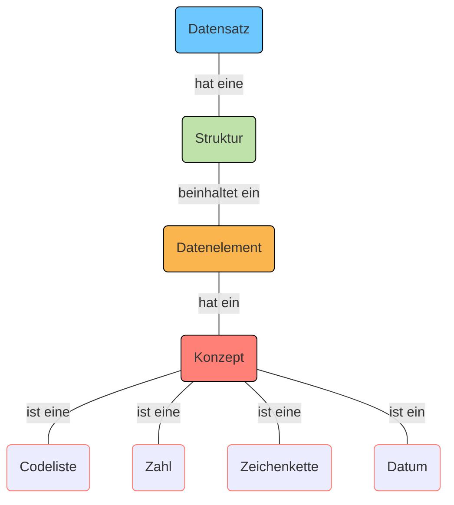
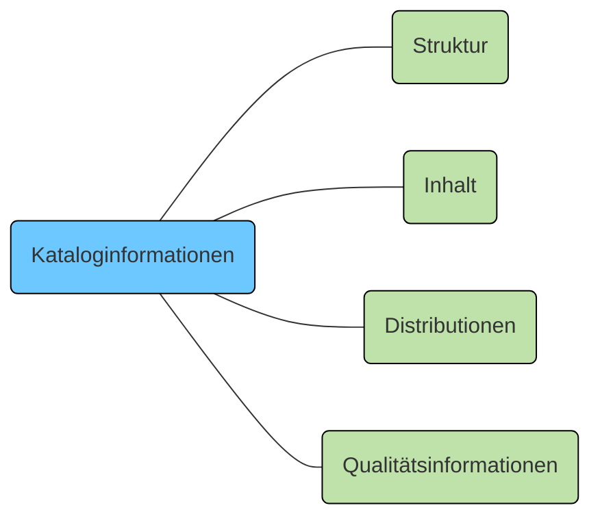

Auf der Interoperabilitätsplattform I14Y können Datensätze beschrieben werden. Unter einem Datensatz ist eine Zusammenstellung von Daten zu verstehen, die von einer einzigen Quelle veröffentlicht oder kuratiert werden und durch eine gemeinsame Idee oder ein gemeinsames Konzept verbunden sind. 

Zusätzlich zu den Kataloginformationen lassen sich auf der Interoperabilitätsplattform I14Y auch strukturelle Metadaten erfassen. Damit kann die "Anatomie des Datensatzes" detailliert beschrieben werden. Jeder Datensatz hat eine Struktur, die aus mindestens einem Datenelement besteht. Jedes dieser Datenelemente referenziert ein Konzept. Es kann sich dabei um eine Zeichenkette, um eine Zahl, um ein Datum oder um eine Codeliste handeln. Detailinformationen zu Datensätzen sind im Abschnitt zum [Informationsmodell](/handbook/de/gouvernanz/informationsmodell) zu finden.

Soll ein Datensatz erfasst werden, sind mindestens die Kataloginformationen zu hinterlegen. Anschliessend besteht die Möglichkeit, die Struktur des Datensatzes  zu beschreiben. Auch Metainformationen zu den einzelnen Datenelementen lassen sich erfassen. Schliesslich werden die eigentlichen Daten verknüpft. Und es können Angaben zur Qualität des Datensatzes gemacht werden. 

Datensätze werden im organisationsinternen Bereich erfasst. Sollen sie öffentlich auf der Interoperabilitätsplattform I14Y publiziert werden, müssen die Daten harmonisiert sein. Zudem bestehen höhere Anforderungen an die Metadaten. So müssen Beschreibungen zu Datensätzen, die öffentlich gelistet werden sollen, etwa zwingend Qualitätsinformationen enthalten. Publizierte Metadaten können nicht mehr einfach angepasst werden. 

Weitere Informationen zum Arbeitsablauf und zum Publikationsworkflow sind im Kapitel [Rollen und Prozesse](/handbook/de/gouvernanz/arbeitsablauf) zu finden. Das I14Y-Team berät Sie gerne bei Ihren Vorhaben zur Datenharmonisierung. 