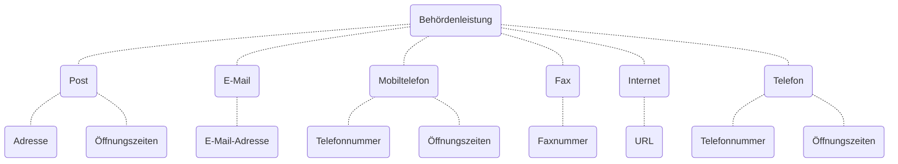

Digitale Angebote wie Apps und Webportale vereinfachen viele Interaktionen zwischen den Behörden sowie den Bürgerinnen und Bürgern beziehungsweise den Unternehmen. Das Verzeichnis der elektronischen Behördenleistungen auf der Interoperabilitätsplattform I14Y hilft dabei diese Angebote einfach auffindbar und sichtbar zu machen. 

Im Folgenden wird erklärt, wie Informationen zu Behördenleistungen erfasst werden können. Die Interoperabilitätsplattform I14Y setzt zum Beschreiben von Behördenleistungen das [_Core Public Service Vocabulary_](https://github.com/SEMICeu/CPSV-AP) der Europäischen Union ein (siehe auch [Informationsmodell](/handbook/de/gouvernanz/informationsmodell)). Die einzelnen Eingabefelder sind im [Anhang](/handbook/de/anhang/eingabefelder) detailliert beschrieben. 


 
Auf der Interoperabilitätsplattform I14Y können obligatorische und freiwillige Tätigkeiten der Behörden verzeichnet werden. Diese müssen von der betreffenden Behörde oder von einer externen Stelle in deren Auftrag erbracht werden. Behördenleistungen werden stets mit öffentlichen Mitteln finanziert. Die entsprechenden Dienstleistungen können zugunsten einer Einzelperson, eines Unternehmens oder einer anderen öffentlichen Stelle erbracht werden. Eine Dienstleistung besteht unabhängig davon, ob sie in Anspruch genommen wird oder nicht.



Um Informationen zu einer Behördenleistung hinzuzufügen, klicken Sie im Bereich "Katalog" auf "Erstellen". Wählen Sie "Neue Behördenleistung erfassen". Füllen Sie nun die einzelnen Felder aus. Nebst einem __Titel__ muss zwingend eine __Beschreibung__ eingetragen werden. Wählen Sie im Feld __Herausgeber__ Ihre Organisation als Betreiberin der Dienstleistung aus. Setzen Sie zudem einen eindeutigen __Identifikator__. Dieser kann frei gewählt werden. Es bewährt sich, wenn dem Ausdruck das Kürzel der Organisation vorangestellt wird. 

Die übrigen Felder müssen nicht zwingend ausgefüllt werden. Nutzen Sie aber die Möglichkeiten zur genauen Beschreibung der betreffenden Dienstleistung. Je mehr Informationen Sie einspeisen, desto besser wird das Angebot gefunden. So können Sie etwa auswählen, in welchen __Sprachen__ die Dienstleistung verfügbar ist, welche __Themen__ und welchen __Sektor__ sie betrifft. Zudem können __Schlüsselwörter__ hinterlegt werden. Nutzen Sie diese Möglichkeit; sie hilft bei der Optimierung für die Suchmaschinen. Unter __Räumliche Abdeckung__ beschreiben Sie in Freitext, in welchem Gebiet die beschriebene Dienstleistung vorrangig angeboten wird. 

Sobald bis zu diesem Punkt alle zur Verfügung stehenden Informationen erfasst sind, klicken Sie auf "Speichern und schliessen". Suchen Sie nun den soeben erstellen Eintrag und öffnen Sie ihn, um die weiteren Felder ausfüllen. 

Einige Behördenleistungen bauen auf einer anderen Behördenleistung auf. So könnte etwa eine mobile App ein Online-Verzeichnis der Verwaltung nutzen. Ist letzteres ein integraler Bestandteil der beschriebenen Behördenleistung -- funktioniert also etwa eine App ohne Zugriff auf ein Online-Verzeichnis nicht -- wird diese im Feld __Benötigt__ eingetragen. Bedingung ist, dass die entsprechende Behördenleistung zuvor erfasst wurde. Andernfalls lässt sich die Information später nachtragen. Im Feld __Ist verbunden mit__ können alle vom zu beschreibenden Angebot mitgenutzten übrigen Behördenleistungen verlinkt werden -- also auch jene, die nicht integraler Bestandteil sind. Im Feld __Ist beschrieben in__ lässt sich die Beschreibungen der Datenquellen für die Behördenleistungen verlinken.

Nun muss der Eintrag ein zweites Mal gespeichert werden, bevor sich weitere Informationen ergänzen lassen. Sobald Sie den Eintrag neu geöffnet haben, wird die Registerkarte __Kanal__ eingeblendet. Hier lassen sich die eigentlichen Kontaktinformationen wie etwa die Betriebszeiten einer Telefon-Hotline, eine E-Mail-Adresse oder eine Webadresse einfügen. Setzen Sie einen eindeutigen __Identifikator__, etwa denselben wie für die Behördenleistung selber, ergänzt durch das Suffix "_kanal" und den Typ des Kanals.

Abhängig vom Typ des Kanals müssen andere Felder ausgefüllt werden. Websites werden etwa als Typ "Internet" erfasst. Dort sollte die URL (inklusive der Protokollinformationen wie _https://_) zum betreffenden Angebot hinterlegt werden. Im Fall einer mobilen Applikation wird der Weblink zu einer Landing-Page oder zu einem App-Store angegeben. 

Bei einigen Typen sind Angaben zu den __Öffnungszeiten__ möglich, beziehungsweise im Fall von Telefonnummern zu den Betriebszeiten. Bitte erfassen diese Angaben im vorgeschlagenen Format. Damit wird sichergestellt, dass die Einträge auch bei automatisierten Abfragen lesbar sind. Verwendet wird eine Syntax analog zum untenstehenden Beispiel. Wählen Sie für die Bezeichnungen der Tage die englischen Abkürzungen (Mo, Tu, We, Th, Fr, Sa, Su). Das Format entspricht jenem, das in der Geodatenbank [OpenStreetMap](https://wiki.openstreetmap.org/wiki/Key:opening_hours) verwendet wird. Beispiel:

`Mo-Fr 08:00-12:00,13:00-17:30; Sa 08:00-12:00`

Zudem lässt sich bei jedem Kanal im Feld __Gehört zu__ die organisatorische Zuteilung definieren. Diese Angabe ist insbesondere dann relevant, wenn eine beschriebene Behördenleistung über einen Kanal verfügt, der von einer anderen Organisation betrieben wird. Bitte nehmen Sie [Kontakt mit dem I14Y-Team](mailto:i14y@bfs.admin.ch) auf, falls die gewünschte Organisation in der vorgefertigten Liste noch nicht hinterlegt ist.