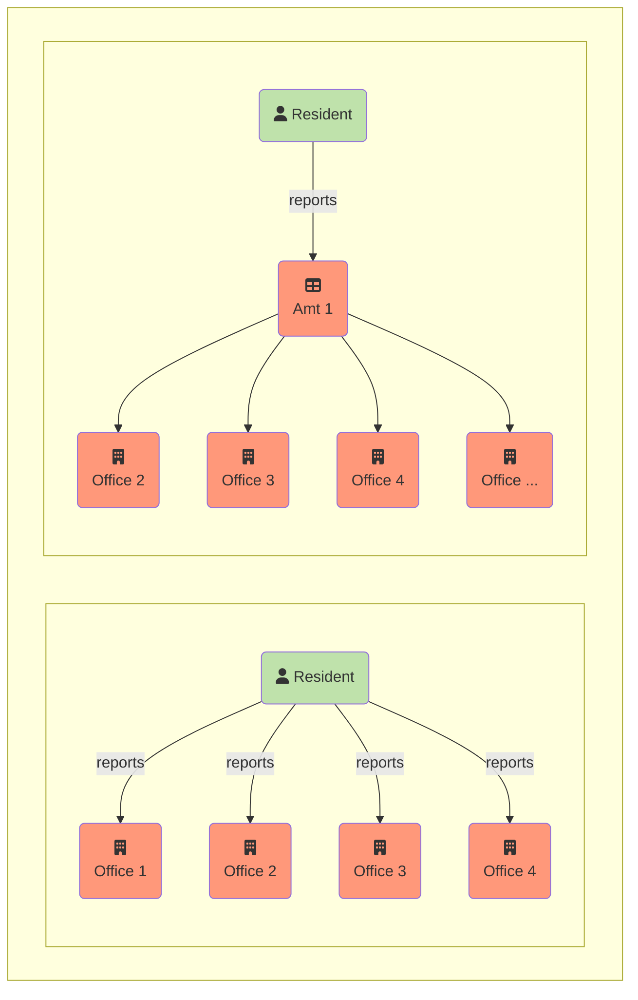

{}
Translation is in progress: Thank you for your interest in the English version of the I14Y manual. The first chapters have been translated. The other parts are still in translation. Please check back later. Alternatively, read the [manual in German](https://handbook.i14y.admin.ch), ask our [experimental text robot](https://www.i14y.admin.ch/de/labs/chatbot) in English or [contact the I14Y team](mailto:i14y@bfs.admin.ch).
{}

What data is available? And how can they be retrieved? The I14Y interoperability platform -- I14Y-IOP for short -- is the central directory of data, electronic interfaces and government services of public administration offices in Switzerland. The platform makes it possible to find data and it shows how they can be obtained.

The I14Y-IOP documents whether the data in question are freely available or restricted, whether they conform to a standard or not, who is responsible, how often the data are updated and how their quality is to be assessed. The platform thus helps in understanding the context of a data set. Only metadata can be found on the I14Y-IOP; the actual data remain with the responsible agencies. I14Y-IOP promotes the efficient exchange of data within public administrations as well as between authorities, companies and citizens.

Public authorities and government-related companies can use the platform to create an inventory of their data sets. At the same time, the I14Y-IOP serves to harmonise the data so that they can be used multiple times. In this way, redundant data sets can be avoided -- as envisaged by the Confederation with the _once-only principle_.



Until now, citizens and companies have often had to submit the same information to various administrative bodies.
With the [National Data Management Programme](https://www.bfs.admin.ch/bfs/en/home/nadb/nadb.html), the Confederation intends to avoid these duplications. This will reduce the burden on citizens and companies, and the state can provide its services more efficiently.

For the _once-only principle_ to become a reality, the various administrative bodies must be able to exchange data directly with each other. This presupposes that a legal basis exists and that the exchange is permissible, particularly from a data protection perspective. In addition, it must be clarified whether or not, and for how long data may be retained for multiple use. In some cantons the multiple use of data has already been established in law.



Multiple use of administrative data is possible if it is known who owns which data sets. In addition, the data must be harmonised. All agencies should work with the same categories and code lists -- for instance, by using the same lists of commune names or occupational titles. Good cooperation is essential for successful harmonisation. For example, it must be agreed which organisation is responsible for which code list. All other organisations should not revise the list themselves but take it on from the responsible organisation.

This is exactly what the I14Y-IOP makes possible: in addition to descriptive metadata, the platform contains structural metadata. These describe the individual elements of a data set. Each element is based on a clearly defined concept, for example a code list. The concepts only need to be registered once by the responsible body. Other organisations adopt them to describe their structural metadata.

In this way, different authorities benefit from each other's work. It also makes it possible, for example, for a private survey institute to use the same categories or expressions that a government agency uses. This eliminates the need for subsequent harmonisation and in many cases improves the quality of the data.

In this way, the I14Y-IOP helps to semantically harmonise the Swiss data ecosystem. The metadata -- especially the code lists -- can be retrieved automatically via electronic interfaces (APIs). This makes it possible to connect the platform to any systems and applications.



Unnecessary typing makes no sense for many IT professionals. That's why they love abbreviations, especially with long and complicated terms that are easy to mistype, such as _interoperability_. In software development, this English word is therefore often abbreviated to _I14Y_. The number 14, which follows the first letter, indicates the number of characters omitted. Only the last letter is added. Further examples of so-called numeronyms are: a11y (_accessibility_), i18n (_internationalization_) and o11y (_observability_).



A directory of e-government services such as web applications and apps will also be available on the I14Y-IOP. This will provide an overview of the services offered by the public administration and facilitates the dialogue between service providers and users.

<!--  -->

The platform is developed and operated by the Interoperability Office (IOS) in the Interoperability and Registers Division (IOR) of the [Federal Statistical Office](https://www.bfs.admin.ch). The operation of the platform is regulated by law in the Federal Act on the Use of Electronic Means to Conduct the Tasks of the Authorities (EMBAG).



1. The Federal Statistical Office shall operate a public platform on the internet whereby the following information is easily accessible in electronic form, either directly or by referencing:

    a. the metadata of the Federal Administration’s structured electronic data files, including the metadata of Open Government Data in accordance with Article 10;

    b. a directory of the interfaces in accordance with Article 13 and the information necessary for their use, provided that information security is not threatened;

    c. an overview of the authorities’ services that are electronically available.

2. The Federal Council shall regulate which metadata are to be published. It may authorise the Federal Statistical Office to regulate the form of the metadata in agreement with the Federal Chancellery.

 3. The cantons may make their metadata, interfaces and applications accessible on the platform under the conditions of Article 11 paragraphs 3 and 4.



The I14Y-IOP has been available since summer 2021 and is being continuously developed. It is primarily intended for the Confederation, the cantons and the communes as well as for the research community. Since the Administration and companies work closely together, it is also open to companies. Publicly published content can also be viewed and used by companies and citizens.



Would you like to be kept up to date about new features and offers on the I14Y interoperability platform? Then subscribe to the newsletter. Three to four times a year you will receive a summary of the latest developments on the I14Y-IOP by email. To subscribe to the newsletter free of charge, visit the [Federal Statistical Office subscription service](https://www.bfs.admin.ch/bfs/en/home/services/contact/newsletter-subscription.html) and select "I14Y interoperability platform".


 

## About this manual

This manual explains the main features of the I14Y interoperability platform. It contains numerous step-by-step instructions. It also provides technical details and background information on data harmonisation and standardisation.

The first chapter highlights the [Roles and Processes](/handbook/de/2_rollen_prozesse) in data management. The chapter [Retrieve Metadata
](/handbook/de/3_metadaten_abrufen) describes how to obtain information from the I14Y interoperability platform. The following chapter [Publishing metadata](/handbook/de/4_publikation) explains how to publish descriptions of data sets, electronic interfaces and data elements on the platform. It also shows how the directory of government services is compiled.

<!--Später ergänzen: Nebst den schriftlichen Anleitungen enthält dieses Handbuch auch einige Videotutorials.--> 
The handbook also contains a [Glossary](/handbook/de/7_glossar) with technical terms, a [list with web links](/handbook/de/6_anhang/weblinks), an overview of the [partner organisations](/handbook/de/8_partner) as well as a [Log](/handbook/de/6_anhang/changelog) of the most important changes that have been made to the platform.

The functionalities of the I14Y-IOP are constantly being developed. This manual is also revised on a regular basis. Do you have any suggestions on how it could be improved? Or would you like to share your experiences with the manual or the platform? [Write to us](mailto:i14y@bfs.admin.ch). This manual is revised on the [Code Management Platform Github](https://github.com/I14Y-ch/handbook/). You are welcome to submit a pull request with your change requests there.



The I14Y manual is written in a markup language. The software [Hugo](https://gohugo.io) converts the text data into a website. The contents of this manual are maintained on the code management platform Github. Suggestions for changes can be documented and submitted there. This can be done using the standard Git workflow, or otherwise directly in your web browser.

1. Create an account on the code management platform Github. Log in.
2. Open the [manual repository](https://github.com/I14Y-ch/handbook/). The text contents are located in the _content_ directory, sorted by language, chapter and subchapter. Files with the extension _.md_ contain the actual text contents and the graphics. Search for the text part to be revised. Display the raw text. 
3. Click on the pencil icon in the top right-hand corner. Make the necessary changes. Pay attention to the [Markup Syntax Rules](https://www.markdownguide.org/basic-syntax/).
4. Briefly describe the modification in the box below and then click on the button to submit. Your suggestion will be reviewed by the I14Y team and, if appropriate, will be incorporated into the manual.


