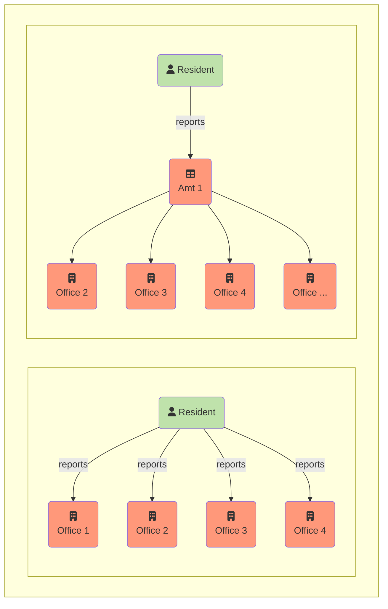

{}
Translation is in progress: Thank you for your interest in the English version of the I14Y manual. The first chapters have been translated. The other parts are still in translation. Please check back later. Alternatively, read the [manual in German](https://handbook.i14y.admin.ch), ask our [experimental text robot](https://www.i14y.admin.ch/de/labs/chatbot) in English or [contact the I14Y team](mailto:i14y@bfs.admin.ch).
{}

What data is available? And how can they be retrieved? The I14Y interoperability platform is the central directory of data, electronic interfaces and government services of public administration offices in Switzerland. The platform makes it possible to find data and it shows how they can be obtained.

I14Y documents whether the data in question are freely available or restricted, whether they conform to a standard or not, who is responsible, how often the data are updated and how their quality is to be assessed. The platform thus helps in understanding the context of a data set. Only metadata can be found on the I14Y; the actual data remain with the responsible agencies. I14Y promotes the efficient exchange of data within public administrations as well as between authorities, companies and citizens.

Public authorities and government-related companies can use the platform to create an inventory of their data sets. At the same time, I14Y serves to harmonise the data so that they can be used multiple times. In this way, redundant data sets can be avoided -- as envisaged by the Confederation with the _once-only principle_.



Until now, citizens and companies have often had to submit the same information to various administrative bodies.
With the [National Data Management Programme](https://www.bfs.admin.ch/bfs/en/home/nadb/nadb.html), the Confederation intends to avoid these duplications. This will reduce the burden on citizens and companies, and the state can provide its services more efficiently.

For the _once-only principle_ to become a reality, the various administrative bodies must be able to exchange data directly with each other. This presupposes that a legal basis exists and that the exchange is permissible, particularly from a data protection perspective. In addition, it must be clarified whether or not, and for how long data may be retained for multiple use. In some cantons the multiple use of data has already been established in law.

