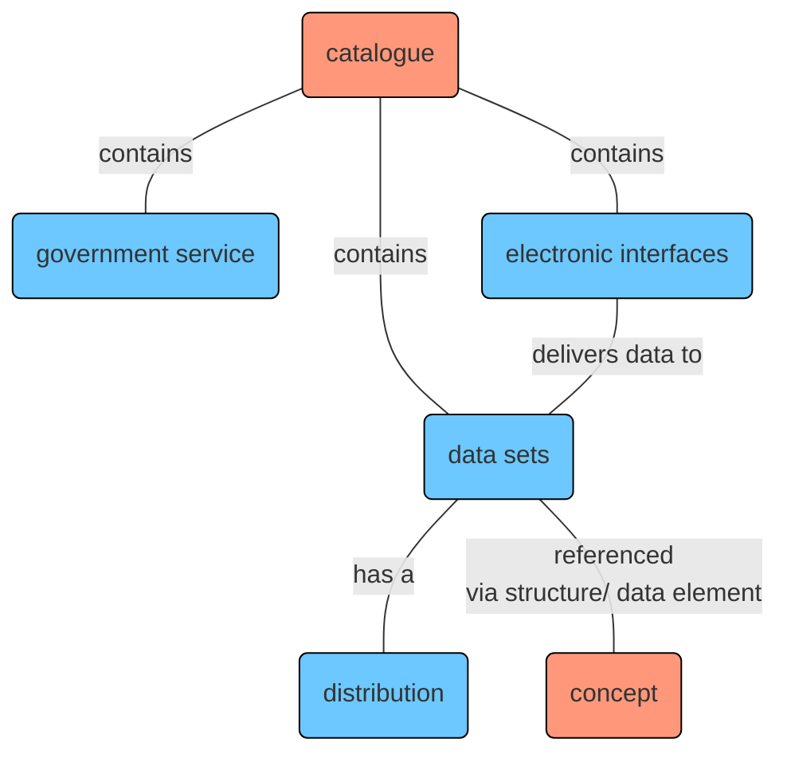
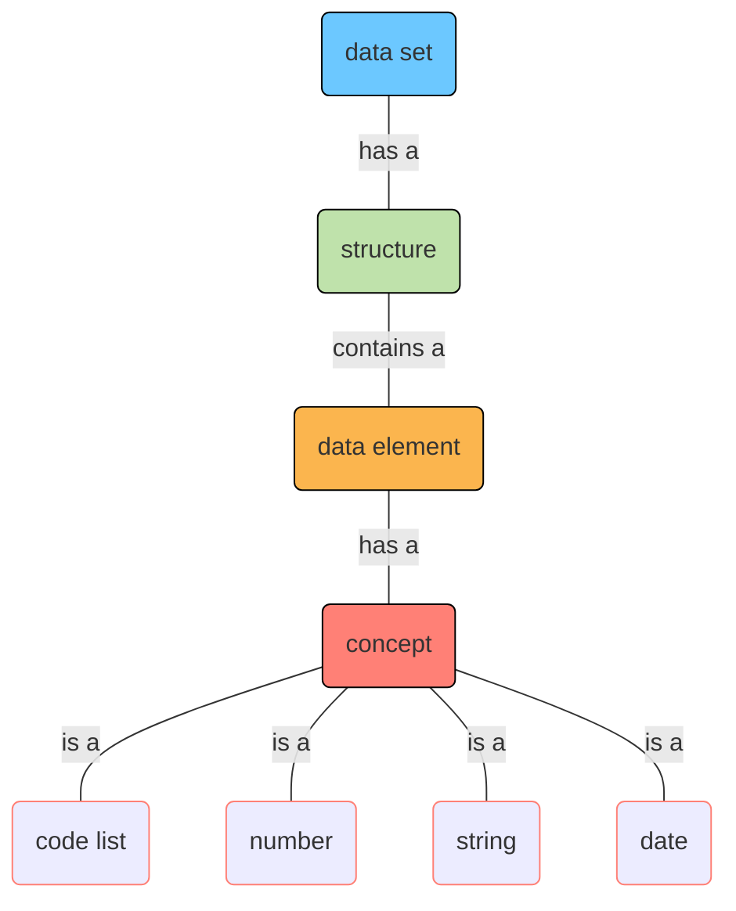
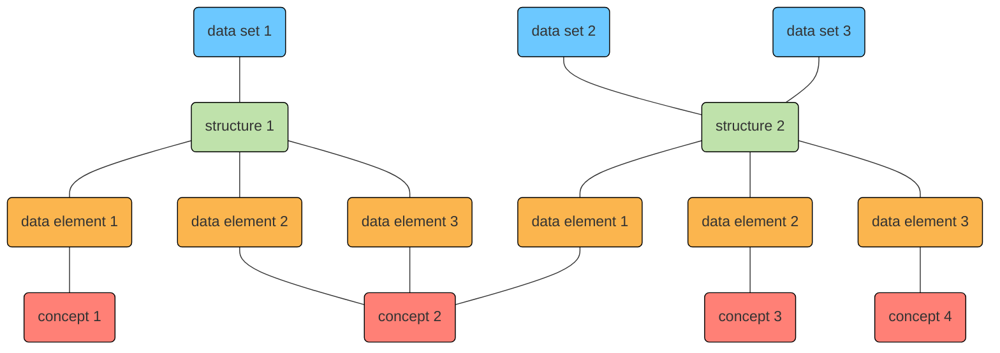
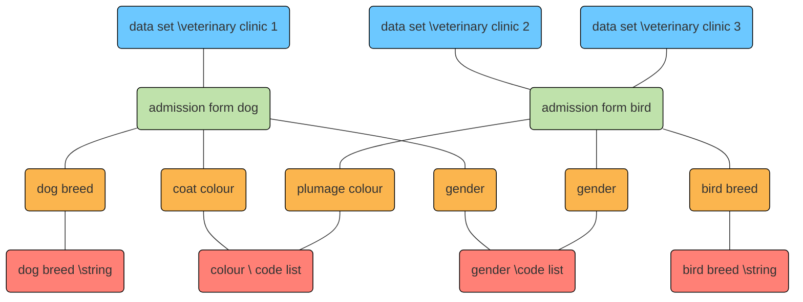

 
On the I14Y Interoperability Platform, data sets, electronic interfaces (APIs) and data elements as well as government services can be described. There are two entry points. In the catalogue part, data sets, electronic interfaces (APIs) and government services are managed. The descriptions of individual concepts can be found under "Concepts".

The diagram provides a simplified representation of the different parts of the I14Y-IOP. A detailed summary can be found in the [Information model on the I14Y-IOP](/handbook/img/i14y_informationsmodell.png).

To do justice to the different offers, the platform uses various information models. For example, the Data Catalogue Vocabulary (DCAT) with the Swiss application profile is used for data sets and APIs. The _Core Public Service Vocabulary (CPSV)_ is used for government services.

## Data set

A data set is a group of data elements with related content in a uniform structure. It can exist in a wide variety of forms and formats: for example, as a CSV file, as a database or stored in a distributed system such as a blockchain.

A data set can be exported in several formats, i.e., contain so-called _distributions_. The distributions do not necessarily have to contain the full data. The data set can also form the basis for an electronic interface (API) through which specific individual information can be queried.

Data sets can be described in detail on the I14Y-IOP: in addition to the catalogue entry, which contains the basic information such as the title, the description and the issuing organisation, information on the structure can also be saved. A structure usually contains several data elements, and each data element has a concept that describes the type of content. A concept is thus the smallest unit of a data set, often also called a (defined) variable or attribute.

It is possible that several data sets have the same structure. The individual concepts, in turn, are often integrated into different structures.

For example: the data set of a veterinary clinic contains information on dogs -- name, date of birth, breed, dog chip number and the name and address of the dog owner. Each of these pieces of information is a data element with a concept. The type of concept for the name of the dog is a string, for the date of birth it is a date and for the breed it is a code list. These concepts can also be used in other data sets: thematically closely related ones such as a veterinarian's client database, or -- in the case of the date of birth -- also in completely different data sets.

Data sets are described in the I14Y-IOP using the [Data Catalogue Vocabulary (DCAT)](/handbook/en/glossar). DCAT is a standardised model for describing data catalogues, maintained by the Internet Standards Board [W3C](https://www.w3.org/). The application profile for Switzerland is largely used on the platform ([DCAT-AP CH 2](https://www.dcat-ap.ch/)). DCAT specifies which information must be saved. In addition, the vocabulary suggests further possibilities for describing the data set.

To store information about a data set on the I14Y-IOP, the minimum requirements set by the DCAT standard must be met. The I14Y-IOP offers some additional fields that go beyond the current DCAT standard. Which fields are filled with which information when entering data sets is listed in the chapter [publication](/handbook/en/publikation/katalog/datensammlung).

### Structure

The structure describes how the contents of a data set are organised. Each structure consists of at least one data element ([see below](#dataelement)). The individual structures can be used in several data sets. For example, the identical structure is usually used in a recurring publication of a register (version).

For the description of the structure, the DCAT standard with the Swiss application profile is largely used for the I14Y-IOP.

### Data element

The data element is the smallest descriptive unit of a data collection. Often the data element is also called an attribute, a (defined) variable or "column". The data element contains the individual values, such as the OASI numbers, the number of vacant flats or measured water temperature values. Each data element references a concept.

### Concept

The concept uniquely and completely describes the information contained in the data element. A concept can be a number, a string, a date or a code list with predefined values.

The standard [ISO 11179-1:2023](https://www.iso.org/standard/78914.html) is used to describe the concepts in the I14Y-IOP. The type of concept is documented. Dependent upon this, further details such as the length or the possible minimum and maximum values are necessary. Step-by-step instructions for documenting a concept can be found in the chapter [publication](/handbook/en/publikation/konzepte).

## Electronic interface (API)

An Application Program Interface (API)_ -- allows machines, among other things, to specifically request individual pieces of information from a set of data. Thanks to APIs, isolated systems can exchange information in an efficient and standardised way. In order for developers to be able to programme their software to obtain information from external systems, they need to know these interfaces. The I14Y-IOP offers the possibility to describe the interfaces in a central location.

On the I14Y-IOP, in addition to the title and description, a so-called endpoint from where data can be obtained or a link to the documentation must be given. If possible, reference is also made to the data set upon which the API is based.

APIs are also thoroughly described on the I14Y-IOP using the data catalogue vocabulary DCAT. It is imperative that some fields that are optional in the standard must be filled in. Thus, the DCAT standard recommends that only a description is documented when an API is catalogued. On the I14Y-IOP this information is mandatory. All fields specified in the standard must also be filled in on the platform.

A step-by-step guide on how to create electronic interfaces is given in the chapter 
[publication](/handbook/de/publikation/katalog/api). 

## E-government service

E-government services can also be described on the I14Y interoperability platform. The web or mobile applications that simplify certain tasks are thus documented. Information is also documented on how the app in question can be accessed and which organisation is responsible for it. Thanks to the central directory, e-government services should be easier to find.

The _Core Public Service Vocabulary_ defined by the European Union is used to describe public services. The structure and the entire vocabulary are available on the European Commission's Interoperability Platform 
[Join up](https://joinup.ec.europa.eu/collection/semantic-interoperability-community-semic/solution/core-public-service-vocabulary/releases). The reusable and expandable vocabulary specifies certain fields that must be filled in. Each government service can be assigned to a channel -- an internet address, for example, or a telephone number.

On the I14Y-IOP, the chapter [publication](/handbook/de/publikation/katalog/3_publicservice/) describes in detail how a government service is documented.