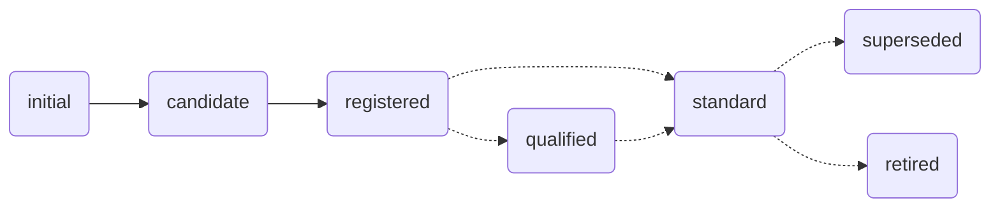

A clearly defined work process governs how metadata is published on the I14Y-IOP. Depending on whether the metadata are published publicly or only within the organisation, the work process has two or three stages. The work process is designed to ensure quality. Firstly, the metadata are saved. Secondly, they are checked and published by_Local Data Stewards_. Thirdly, , if desired and appropriate, they are checked in cooperation with the Interoperability Office, marked as standard-compliant if necessary and finally released to the public.

Newly saved metadata are initially given the status _Initial_. As soon as the documenting work is completed, the status _Candidate_ is proposed. This change of status must be confirmed by a person from the own organisation with _Local Data Steward_-rights. If all checks are successful, the entry can be changed to _Registered_. To keep the metadata stable and consistent, entries with this status cannot be modified. If a concept is to be modified again, a new version must be created.

For data sets, services and concepts that are not standardised and only used internally, the documenting work ends there.

In a second step, the _Local Data Stewards_ check whether the data offer is standard-compliant. Offers that comply with a standard adopted by a board such as [eCH](/handbook/de/glossar/#ech) or [ISO](/handbook/de/glossar/#internationale-organisation-für-normung-iso), receive the status _Standard_. Those ones that could become a standard are marked as _Qualified_; the following procedure is then determined in exchange with the interoperability office and in specialist groups. Data offers based on an obsolete or abolished standard are given the status _Superseded_ or _Retired_. If the data are only visible to the users of one's own organisation, these classifications can be applied by the _Local Data Stewards_ without consulting the Interoperability Office. If an entry marked as "standard" is to be published publicly, the Interoperability Office must be consulted.

Further information on status management and responsibilities is compiled in the following table. The status concept used in the I14Y interoperability platform is in accordance with [ISO standard 11179](https://www.iso.org/standard/78914.html).

| Status DE | Status EN | Description | Who assigns the status? |
| --- | ---- | ---- | ---- |
| Initial | _Initial_ | Newly saved metadata are initially given the status _Initial_. This makes it visible to the users of their own organisation that the work on these metadata has not yet been completed.| _Data Producer_ |
| Candidate | _Candidate_ | Entries that are completely documented are marked with the status _candidate_. The status is proposed by the persons who enter the data. It is assigned by the data stewards.| _Local Data Steward_ | 
| Recorded | _Recorded_ | Metadata with the status _Recorded_ have been saved and checked. The status is proposed by those who have saved the metadata. The change is confirmed by the local data stewardship unit. This is the final status for non-standard data elements.| _Local Data Steward_ |
| Qualified | _Qualified_ | Offers that could one day become a standard are marked as _Qualified_.| _Local Data Steward_ bzw. Interoperability Office |
| Standard | _Standard_ | This status is awarded if the offer complies with a standard adopted by a specialist body such as eCH or ISO. | _Local Data Steward_ or Interoperability Office |
| Preferred Standard | _Preferred Standard_ | In individual cases, there may be several standards for one topic. A _Preferred Standard_ is a concept that must be used in public administration, provided that there are no important reasons not to do so. The definition of a preferred standard is the responsibility of the _Swiss Data Steward_. | _Swiss Data Steward_ |
| Superseded | _Superseded_ | If the offer is based on a standard that has since been superseded by another, the status is set to _Superseded_. | _Local Data Steward_ or Interoperability Office |
| Retired | _Retired_ | In individual cases it may happen that the standardisation organisation withdraws a standard. In such a case, the status of the offer concerned is set to _Retired_. | _Local Data Steward_ or Interoperability Office |
{.workflow}

## Publication channel

There are two publication channels on the I14Y-IOP. Metadata can be made available within one's own organisation -- for example, to inventory one's own data holdings. Otherwise, they can be published publicly. Initially, the metadata collected are only available within the organisation. If they are to be made visible to the public, the publication channel is changed to _I14Y_. This is desirable for harmonised and standardised data structures and concepts. This is because they are suitable for further use.

As a rule, public publication is proposed by a person with the role of _Local Data Steward_. The Interoperability Office, the I14Y team, then checks the metadata. It releases the entry on the jointly agreed publication date.

Depending on the status in the publication workflow and on one's own role, the saved metadata cannot be changed. For example, entries marked as "Registered" cannot be edited without the status being reset. In this case, a new version is normally created.