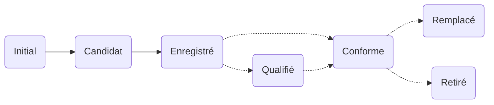

Les modalités de publication des métadonnées sur la plateforme d'interopérabilité I14Y sont fixées dans un processus. Celui-ci comprend deux ou trois étapes selon que les métadonnées sont publiques ou qu'elles sont accessibles uniquement au sein d'une organisation. Le flux de travail sert essentiellement à l'assurance qualité. La première étape consiste à saisir les métadonnées, qui sont ensuite vérifiées et validées par les _local data stewards_. Avant d'être publiées, elles sont le cas échéant identifiées par le service d'interopérabilité comme étant conformes à une norme.

Les métadonnées nouvellement saisies se voient attribuer le statut _Initial_. Une fois les opérations de saisie terminées, le statut _Candidat_ est proposé. La modification du statut ne peut être validée que par une personne interne à l'organisation disposant des droits de _local data steward_. Après avoir passé tous les contrôles avec succès, les métadonnées acquièrent le statut _Enregistré_. Les éléments saisis ne peuvent alors plus être modifiés, ceci afin d'assurer leur stabilité. Toute modification impose la création d'une nouvelle version. 

Pour les ensembles, services et concepts de données non standardisés et destinés à une utilisation interne uniquement, la phase de saisie s'arrête ici.

La conformité de l'offre de données par rapport à une norme peut le cas échéant être examinée dans un deuxième temps par les _local data stewards_. Les offres qui satisfont à une norme validée par un organisme reconnu comme [eCH](/handbook/de/7_glossar/#ech) ou [ISO](/handbook/de/7_glossar/#internationale-organisation-für-normung-iso) se voient attribuer le statut _Standard_, celles susceptibles de devenir une norme le statut _Qualifié_. La suite de la procédure est définie au sein de groupes spécialisés, en partenariat avec le service d'interopérabilité. Les offres de données fondées sur une norme dépassée ou supprimée reçoivent le statut _Remplacé_ ou _Supprimé_. Tant que les données ne sont consultables que par les utilisateurs de l'organisation, ces différents statuts peuvent être attribués par les _local data stewards_ sans qu'il soit nécessaire de faire intervenir le service d'interopérabilité. Celui-ci intervient à partir du moment où une entrée ayant le statut _Standard_ fait l'objet d'une publication publique. 

Le tableau ci-dessous fournit des informations complémentaires sur la gestion des statuts et les différentes compétences. Le concept de statuts utilisé par la plateforme d'interopérabilité est conforme à la [norme ISO 11179](https://www.iso.org/fr/standard/78914.html).  

| Statut FR | Statut EN | Description | Responsable de l'attribution 
| --- | ---- | ---- | ---- |
| Initial | _Initial_ | Statut attribué aux métadonnées nouvellement saisies. Il indique aux utilisateurs que les opérations concernant ces métadonnées ne sont pas terminées. | _Data producer_ |
| Candidat | _Candidate_ | Statut identifiant les éléments dont la saisie est achevée. Il est proposé par les personnes qui saisissent les données et attribué par les administrateurs des données. | _Local data steward_ | 
| Enregistré | _Recorded_ | Statut identifiant les métadonnées intégralement saisies et vérifiées. Il est proposé par les personnes qui ont saisi les données Le changement de statut est confirmé par le service local d'administration des données. Il s'agit du dernier statut possible pour les éléments de données non standardisés. | _Local data steward_ |
| Qualifié | _Qualified_ | Statut identifiant les offres susceptibles d'être considérées comme une norme. | _Local data steward_ ou service d'interopérabilité |
| Standard | _Standard_ | Statut attribué lorsque l'offre de données répond à une norme d'un organisme reconnu tel que eCH ou ISO. | _Local data steward_ ou service d'interopérabilité |
| Standard recommandé| _Preferred standard_ | Plusieurs normes peuvent entrer en ligne de compte selon le cas. Le statut _Standard recommandé_ est attribué à des concepts qui doivent être utilisés au sein de l'administration si aucun motif important ne s'y oppose. La définition d'une norme recommandée incombe au _swiss data steward_. | _Swiss data steward_ |
| Remplacé | _Superseded_ | Statut attribué à une offre fondée sur une norme qui a été remplacée par une autre. | _local data steward_ ou service d'interopérabilité |
| Retiré| _Retired_ | Il arrive qu'un organisme de normalisation révoque une norme. L'offre de données concernée se voit alors attribuer le statut _Retiré_. | _Local data steward_ ou service d'interopérabilité |
{.workflow}

## Canal de publication

Deux canaux de publication sont disponibles sur la plateforme d'interopérabilité I14Y: soit les métadonnées sont accessibles au sein de l'organisation considérée uniquement (inventaires de données) soit elles sont accessibles publiquement. Au départ, elles sont consultables uniquement au sein de l'organisation. Le canal de publication doit être modifié (_I14Y_) si elles doivent être rendues publiques. C'est fortement recommandé pour les structures et les concepts de données harmonisés et standardisés, qui se prêtent à une utilisation multiple.

En règle générale, la mise à disposition des métadonnées à un vaste public est proposée par une personne disposant des droits de _local data steward_. Le service d'interopérabilité (équipe I14Y) vérifie les métadonnées et valide leur publication à la date conjointement définie avec l'organisation. 

Selon leur statut dans le flux de travail et les droits d'accès des utilisateurs, il se peut que les métadonnées ne puissent pas être modifiées. C'est le cas par exemple si elles ont le statut Enregistré. Une nouvelle version doit dans ce cas être créée.
