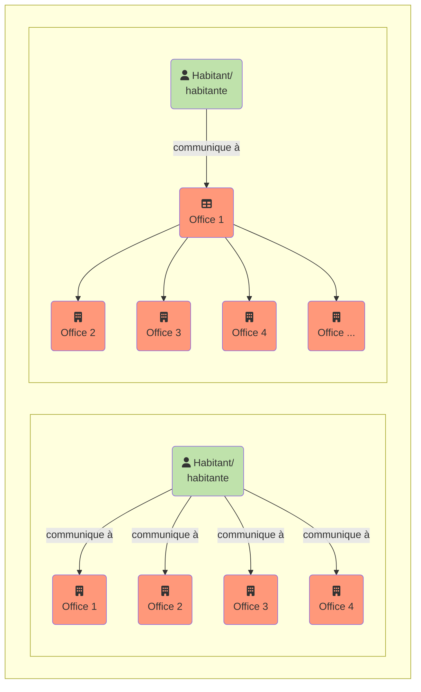

{}
La traduction est en cours : Nous vous remercions de l'intérêt que vous portez à la version française du manuel I14Y. Les premiers chapitres ont été traduits. Les autres parties sont encore en cours de traduction. N'hésitez pas à revenir plus tard. En attendant, vous pouvez consulter le [manuel en allemand](https://handbook.i14y.admin.ch) ou interroger notre [chatbot](https://www.i14y.admin.ch/de/labs/chatbot) en français. L'[équipe I14Y](mailto:i14y@bfs.admin.ch) se tient à votre disposition pour répondre à vos questions. 
{}

Quelles données sont mises à disposition? Comment les consulter? La plateforme d’interopérabilité I14Y (IOP I14Y) est le répertoire centralisé suisse des métadonnées, des interfaces électroniques et des prestations des autorités (services publics). Elle permet de rechercher des données et montre comment y accéder.  

La plateforme d’interopérabilité I14Y indique si les données recherchées sont disponibles en accès libre ou restreint, si elles correspondent à une norme (standard), qui en assume la responsabilité, à quelle fréquence elles sont actualisées et comment leur qualité est évaluée. Elle permet donc d’appréhender le contexte d’un jeu de données. Seules les métadonnées y sont accessibles; les données proprement dites demeurent auprès des services responsables. L’IOP I14Y contribue à l’efficacité du partage des données entre les administrations publiques, les autorités, les entreprises et les citoyens. 

Les autorités et les entreprises parapubliques peuvent notamment l’utiliser pour créer un inventaire de leurs jeux de données. L’IOP I14Y permet également d’harmoniser les données en vue de leur utilisation multiple, ce qui évite de les relever à plusieurs reprises, selon le principe _once-only_. 



Jusqu’ici, les citoyens et les entreprises devaient fournir certaines informations plusieurs fois aux pouvoirs publics. Avec le [programme Gestion nationale des données](https://www.bfs.admin.ch/bfs/fr/home/nadb/nadb.html), la Confédération s’est fixé pour objectif d’éviter les saisies répétées de données. Cela réduit la charge de travail des entreprises et des citoyens, et permet à l’État de fournir plus efficacement ses prestations. 

Pour que le principe _once-only_ devienne réalité, il faut que les unités administratives puissent échanger directement les données. Cela n’est possible que si une base légale adéquate existe et que le principe de protection des données est respecté. Il faut également clarifier si les données peuvent être enregistrées pour une éventuelle utilisation multiple et, si oui, pendant combien de temps. Certains cantons ont d’ores et déjà inscrit l’utilisation multiple des données dans leur législation.  



L’utilisation multiple des données administratives est possible à partir du moment où l’on sait qui dispose de quels jeux de données. Les données doivent par ailleurs être harmonisées: tous les offices doivent utiliser les mêmes catégories et les mêmes listes de code (comportant p. ex. les mêmes noms de communes ou les mêmes désignations de professions). Une bonne collaboration est ici nécessaire: pour chaque liste de codes, un service responsable doit être désigné qui mettra la liste à la disposition des autres services. 

C’est précisément ce que permet la plateforme d’interopérabilité I14Y. En plus des métadonnées mentionnées plus haut, elle intègre des métadonnées structurelles décrivant les différents éléments d’un jeu de données. Chaque élément se fonde sur un concept clairement défini, p. ex. une liste de codes. Une fois enregistrés par le service responsable, les concepts peuvent être utilisés par les autres services pour la description de leurs métadonnées structurelles. 

Les travaux réalisés par certaines autorités bénéficient ainsi aux autres. Il est également possible pour un institut d’études de marché d’utiliser les mêmes catégories ou les mêmes caractéristiques qu’un service public. Cela évite de devoir procéder à des harmonisations a posteriori et accroît dans bien des cas la qualité des données. 

L’IOP I14Y contribue ainsi à l’harmonisation sémantique de l’écosystème suisse de données. Les métadonnées -- en particulier les listes de codes -- peuvent être consultées automatiquement via des interfaces électroniques (API). Cela permet de relier la plateforme à n’importe quel système et n’importe quelle application. 



Les informaticiens n’aiment pas les saisies trop longues. C’est pourquoi ils recourent volontiers aux abréviations, surtout pour les termes ou expressions dont la saisie engendre souvent des coquilles. Par exemple _interoperability_. Dans le monde du développement de logiciels, ce mot anglais est souvent abrégé en _I14Y_. Le nombre 14 renvoie au nombre de lettres qui séparent le I initial et le Y final. Autres exemples de numéronymes (mots où des chiffres sont utilisés pour créer une abréviation): a11y (_accessibility_), i18n (_internationalization_) et o11y (_observability_).



L’IOP I14Y intègre également un répertoire des prestations électroniques des autorités (applications Web et mobiles, notamment) qui donne un aperçu de l’offre de l’administration publique. Ce répertoire facilite les échanges entre les exploitants des prestations et les utilisateurs.

L’IOP I14Y a été développée et est exploitée par le service d’interopérabilité (IOS) de la division Interopérabilité et registres (IOR) de l’[Office fédéral de la statistique](https://www.bfs.admin.ch). Son exploitation est régie par la loi fédérale sur l’utilisation des moyens électroniques pour l’exécution des tâches des autorités (LMETA).



1. L’Office fédéral de la statistique gère une plateforme publique en ligne sur laquelle sont facilement accessibles, par voie directe ou par un système de référencement électronique, notamment les informations suivantes:

    a. les métadonnées des fichiers structurés de données électroniques de l’administration fédérale, y compris les métadonnées des données ouvertes visées à l’art. 10;

    b. un répertoire des interfaces visées à l’art. 13 ainsi que les informations nécessaires à leur utilisation, à condition que celles-ci ne présentent pas un risque pour la sécurité de l’information;

    c. une vue d’ensemble des prestations administratives disponibles sous forme électronique.

2. Le Conseil fédéral détermine les métadonnées qui doivent être publiées. Il peut charger l’Office fédéral de la statistique d’en réglementer la forme en accord avec la Chancellerie fédérale.

 3. Les cantons peuvent publier sur la plateforme leurs métadonnées, interfaces et applications aux conditions prévues à l’art. 11, al. 3 et 4.



En service depuis l’été 2021, la plateforme d’interopérabilité I14Y continue d’être développée. Elle s’adresse en premier lieu à la Confédération, aux cantons et aux communes, ainsi qu’aux acteurs de la recherche. L’administration travaillant étroitement avec le secteur privé, la plateforme est également accessible aux entreprises. Les contenus publiés en libre accès peuvent être consultés et utilisés par les entreprises et les citoyens.



Vous souhaitez être informés des nouvelles fonctions et des offres de la plateforme d’interopérabilité I14Y? Abonnez-vous aux NewsMails. Un courriel résumant les derniers développements de la plateforme vous sera envoyé trois ou quatre fois par an. Pour vous abonner, il vous suffit de vous rendre sur la page du [service d’abonnement de l’Office fédéral de la statistique](https://www.bfs.admin.ch/bfs/fr/home/services/contact/abonnement-newsmail.html) et de cocher l’option «I14Y Plateforme d’interopérabilité». 


 
## À propos de ce manuel

Le présent manuel décrit les principales fonctions de la plateforme d’interopérabilité I14Y. Vous y trouverez des instructions pas à pas, ainsi que des données techniques et des informations de fond relatives à l’harmonisation et à la standardisation des données.

Le premier chapitre décrit les rôles et les processus](/handbook/de/2_rollen_prozesse) en lien avec l’administration des données. Le chapitre [Recherche de métadonnées](/handbook/de/3_metadaten_abrufen) indique comment rechercher des informations sur la plateforme. Le chapitre [Publication de métadonnées](/handbook/de/4_publikation) explique comment les descriptions des jeux de données, des interfaces électroniques et des éléments de données sont publiées sur la plateforme, et comment compléter le répertoire des prestations administratives. 

<!--Später ergänzen: Le manuel intègre également quelques tutoriels vidéo. --> 
Le manuel comprend par ailleurs un [glossaire](/handbook/de/7_glossar), une [liste de liens](/handbook/de/6_anhang/weblinks), une vue d’ensemble des [organisations partenaires](/handbook/de/8_partner) et un [journal (log)(/handbook/de/6_anhang/changelog) indiquant les principaux changements apportés à la plateforme.

Les fonctionnalités de la plateforme d’interopérabilité I14Y continuant d’être perfectionnées, ce manuel est régulièrement mis à jour. Si vous souhaitez proposer des améliorations ou partager votre expérience de l’utilisation de ce manuel ou de la plateforme, [écrivez-nous](mailto:i14y@bfs.admin.ch). Ce manuel est aussi hébergé sur la [plateforme de gestion de versions Github](https://github.com/I14Y-ch/handbook/). Vous pouvez y formuler une requête avec vos propositions de modifications..



Le manuel I14Y est rédigé dans un langage de balisage -- en anglais _markup language_ --. Les données de texte sont transformées en page Web par le logiciel [Hugo](https://gohugo.io). Les contenus du manuel sont hébergés sur la plateforme Github, sur laquelle vous pouvez formuler directement vos propositions de modifications. Pour ce faire, vous pouvez soit passer par le flux de travail Git soit utiliser votre navigateur Web.  

1. Créez un compte sur la plateforme Github et connectez-vous. 
2. Ouvrez le [référentiel du manuel](https://github.com/I14Y-ch/handbook/). Les contenus sont enregistrés dans le répertoire _content_, par langue, puis par chapitre et sous-chapitre. Les fichiers contenant les textes et les graphiques sont ceux avec l’extension _.md_. Recherchez le texte à modifier; affichez le texte brut. 
3. Cliquez sur le symbole du crayon, en haut à droite, pour l’éditer. Apportez les modifications souhaitées en veillant aux [règles syntaxiques](https://www.markdownguide.org/basic-syntax/).
4. Décrivez brièvement vos modifications dans le formulaire sous le texte. Transmettez vos propositions par un clic sur le bouton. Vos propositions seront examinées par l’équipe I14Y et, le cas échéant, intégrées dans le manuel.

