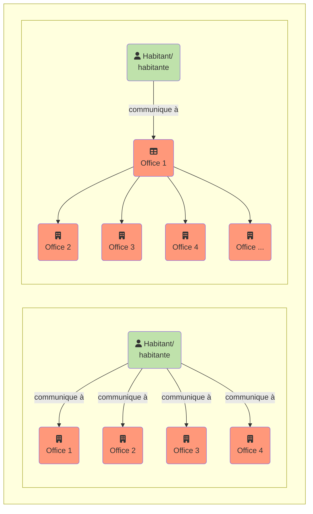

{}
La traduction est en cours : Nous vous remercions de l'intérêt que vous portez à la version française du manuel I14Y. Les premiers chapitres ont été traduits. Les autres parties sont encore en cours de traduction. N'hésitez pas à revenir plus tard. En attendant, vous pouvez consulter le [manuel en allemand](https://handbook.i14y.admin.ch). L'[équipe I14Y](mailto:i14y@bfs.admin.ch) se tient à votre disposition pour répondre à vos questions. 
{}

Quelles données sont mises à disposition? Comment les consulter? La plateforme d’interopérabilité I14Y (IOP I14Y) est le répertoire centralisé suisse des métadonnées, des interfaces électroniques et des prestations des autorités (services publics). Elle permet de rechercher des données et montre comment y accéder.  

La plateforme d’interopérabilité I14Y indique si les données recherchées sont disponibles en accès libre ou restreint, si elles correspondent à une norme (standard), qui en assume la responsabilité, à quelle fréquence elles sont actualisées et comment leur qualité est évaluée. Elle permet donc d’appréhender le contexte d’un jeu de données. Seules les métadonnées y sont accessibles; les données proprement dites demeurent auprès des services responsables. L’IOP I14Y contribue à l’efficacité du partage des données entre les administrations publiques, les autorités, les entreprises et les citoyens. 

Les autorités et les entreprises parapubliques peuvent notamment l’utiliser pour créer un inventaire de leurs jeux de données. L’IOP I14Y permet également d’harmoniser les données en vue de leur utilisation multiple, ce qui évite de les relever à plusieurs reprises, selon le principe _once-only_. 



Jusqu’ici, les citoyens et les entreprises devaient fournir certaines informations plusieurs fois aux pouvoirs publics. Avec le [programme Gestion nationale des données](https://www.bfs.admin.ch/bfs/fr/home/nadb/nadb.html), la Confédération s’est fixé pour objectif d’éviter les saisies répétées de données. Cela réduit la charge de travail des entreprises et des citoyens, et permet à l’État de fournir plus efficacement ses prestations. 

Pour que le principe _once-only_ devienne réalité, il faut que les unités administratives puissent échanger directement les données. Cela n’est possible que si une base légale adéquate existe et que le principe de protection des données est respecté. Il faut également clarifier si les données peuvent être enregistrées pour une éventuelle utilisation multiple et, si oui, pendant combien de temps. Certains cantons ont d’ores et déjà inscrit l’utilisation multiple des données dans leur législation.  


