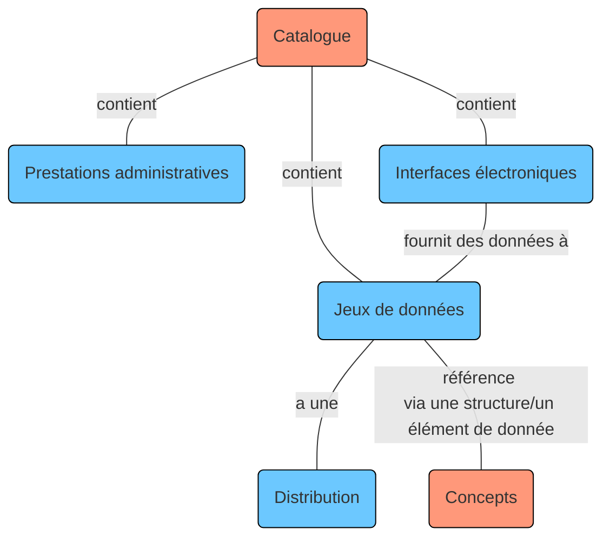
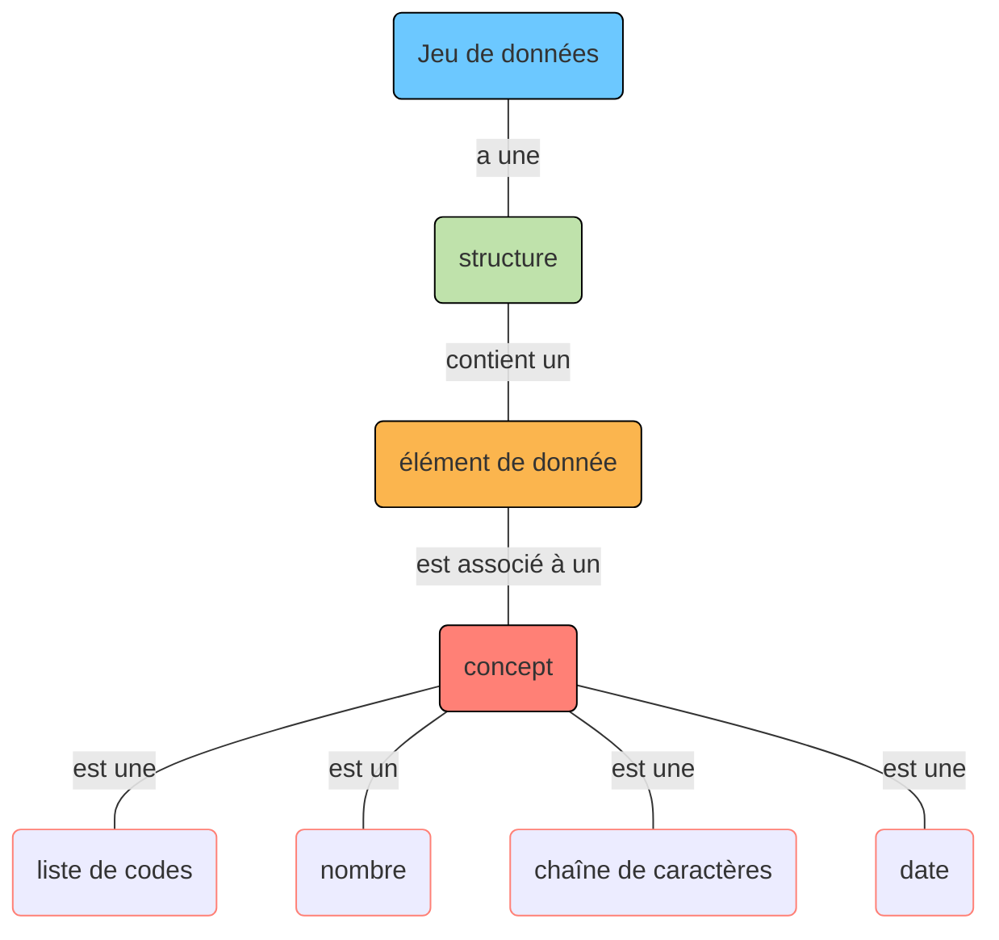
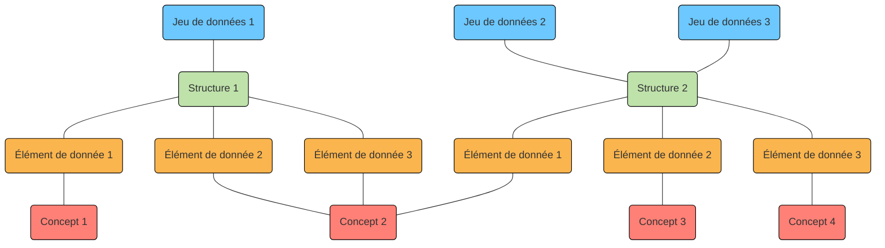
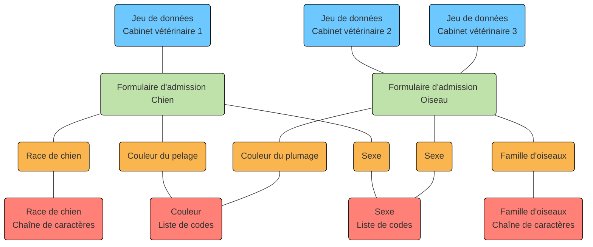

 
La plateforme d'interopérabilité I14Y recense des jeux de données, des interfaces électroniques (API), des éléments de données ainsi que les prestations des autorités. Il existe deux moyens de consulter les métadonnées: via le catalogue, qui donne accès aux jeux de données, aux interfaces électroniques (API) et aux prestations administratives; via les descriptions des concepts, sous «Concepts». 

Ce graphique présente schématiquement les différentes parties de la plateforme. Un descriptif complet est disponible dans le [modèle d'information de l'IOP I14Y](/img/i14y_informationsmodell.png).

La plateforme exploite différents modèles d'information pour la gestion des offres de données. Le _data catalog vocabulary (DCAT)_ (profil suisse) est ainsi utilisé pour les jeux de données et les API, le _core public service vocabulary (CPSV)_ pour les prestations administratives. 

## Jeux de données

On entend par jeu de données un groupe d'éléments de données au contenu connexe réunis dans une structure homogène. Les jeux de données se présentent sous différentes formes et différents formats: fichier CSV, base de données, partie d'un enregistrement dans un système décentralisé (blockchain), etc. 

Ils peuvent être exportés sous différents formats (_distributions_), qui ne contiennent pas nécessairement les données dans leur entier. Un jeu de données peut par ailleurs constituer la base d'une interface électronique (API) permettant d'accéder à des informations spécifiques. 

Les jeux de données peuvent être décrits en détail sur la plateforme d'interopérabilité I14Y: outre l'entrée du catalogue, qui contient les informations fondamentales telles que le titre, la description et l'organisation émettrice, des informations sur la structure peuvent y être enregistrées. Une structure contient généralement plusieurs éléments de données. Chacun d'entre eux est associé à un concept qui décrit le contenu. Un concept – ou variable (définie) ou attribut – désigne la plus petite unité d'un jeu de données. 

Plusieurs jeux de données différents peuvent avoir la même structure. Les concepts, eux, peuvent venir s'insérer dans différentes structures. 

Prenons l'exemple d'une clinique vétérinaire. Son jeu de données contient des informations sur les chiens ayant bénéficié d'un traitement (nom, date de naissance, race, numéro de la puce électronique, nom et adresse du propriétaire). Chacune de ces informations est un élément de donnée auquel est associé un concept (attribut): le concept associé au nom du chien est une chaîne de caractères, celui associé à sa date de naissance une date, celui associé à la race une liste de code. Tous ces attributs peuvent bien entendu être utilisés dans d'autres jeux de données: dans des jeux de données connexes, p. ex. la base de données d'un vétérinaire ayant son propre cabinet, mais aussi dans des jeux de données complètement différents (pour le cas des dates de naissance ou des adresses). 

Les jeux de données publiés sur la plateforme d'interopérabilité I14Y sont décrits au moyen du [vocabulaire de catalogage de données (DCAT)](/handbook/de/glossar). Le DCAT est un modèle standardisé permettant de décrire des catalogues de données. Il est géré par le [World Wide Web Consortium (W3C)](https://www.w3.org/), un organisme de standardisation à but non lucratif chargé de promouvoir la compatibilité des technologies Web. La plateforme utilise le profil d'application suisse du DCAT ([DCAT-AP CH 2](https://www.dcat-ap.ch/)). Le vocabulaire de catalogage DCAT indique les informations qui doivent impérativement être saisies. Il propose également d'autres possibilités de décrire le jeu de données.     

Enregistrer des informations sur un jeu de données sur la plateforme d'interopérabilité I14Y impose de remplir les exigences minimales prescrites par la norme DCAT. La plateforme I14Y propose quelques champs supplémentaires permettant d'aller au-delà de cette norme. Les informations à renseigner dans les différents champs lors de l'enregistrement d'un jeu de données sont présentées au chapitre [Publication](/handbook/de/publikation/katalog/datensammlung). 

### Structure

La structure décrit la façon dont s'organisent les contenus d'un jeu de données. Chaque structure se compose d'au moins un élément de donnée ([voir sous ](#datenelement)). Une même structure peut servir pour plusieurs jeux de données. Une structure identique est ainsi généralement utilisée pour la publication récurrente d'un registre (versionnement). 

Sur la plateforme I14Y, la description des structures se fonde en principe sur le profil suisse de la norme DCAT. 

### Élément de donnée

L'élément de donnée – également appelé attribut, variable (définie) ou «colonne» – est la plus petite unité descriptive d'un jeu de données. Il contient les valeurs à proprement dit (p. ex. numéros AVS, nombre de logements vacants, mesures de la température de l'eau). Chaque élément de donnée référence un concept. 

### Concept

Le concept décrit les informations contenues dans l'élément de donnée de façon claire et exhaustive. Il peut s'agir d'un nombre, d'une chaîne de caractères, d'une date ou d'une liste de codes avec des valeurs prédéfinies. 

Sur la plateforme d'interopérabilité I14Y, la description des concepts applique la norme [ISO 11179-1:2023](https://www.iso.org/standard/78914.html). Elle doit notamment spécifier le type du concept et doit contenir d'autres indications, p. ex. la longueur ou les valeurs minimales et maximales admissibles. Le chapitre [Publication](/handbook/de/publikation/konzepte) explique en détail comment décrire un concept. 

## Interface électronique (API)

Une interface électronique (en anglais _application programm interface (API)_) permet à des machines d'extraire certaines informations d'un jeu de données. Les API permettent à des systèmes isolés de partager des informations efficacement et de manière standardisée. Les développeurs doivent connaître ces interfaces pour concevoir des logiciels capables d'utiliser les ressources de systèmes tiers. La plateforme I14Y est un répertoire centralisé où les API peuvent être décrites. 

En plus du titre et de la description, il est nécessaire d'indiquer un point de terminaison auquel une requête peut être envoyée, ou un lien fournissant l'emplacement d'une ressource (URL). Dans la mesure du possible, on renverra également au jeu de données sur lequel l'API repose.

Les API sont décrites sur la plateforme d'interopérabilité au moyen du vocabulaire de catalogage DCAT. Certains champs, facultatifs dans la norme, sont contraignants sur la plateforme. La description est ainsi optionnelle pour le catalogage d'une API selon la norme DCAT, mais obligatoire sur la plateforme I14Y. Tous les champs obligatoires dans la norme le sont aussi sur la plateforme. 

Le chapitre 
[Publication](/handbook/de/publikation/katalog/api) explique en détail comment décrire les API. 

## Prestations électroniques des autorités

La plateforme d'interopérabilité permet également de décrire les prestations électroniques des autorités. Cela permet de savoir quelles applications mobiles ou Web peuvent être utilisées pour telle ou telle tâche, ou encore comment accéder à une application donnée et quelle organisation en assume la gestion. Le répertoire centralisé vise à faciliter la recherche de ces prestations. 

La description des prestations administratives électroniques repose sur l'utilisation du _core public service vocabulary_, un vocabulaire développé par l'Union européenne. Sa structure et ses spécificités sont décrites sur la plateforme d'interopérabilité [Joinup](https://joinup.ec.europa.eu/collection/semantic-interoperability-community-semic/solution/core-public-service-vocabulary/releases) de la Commission européenne. Ce modèle de données réutilisable et extensible comprend des champs qui doivent être impérativement renseignés. Chaque prestation administrative se voit ainsi affecter un certain nombre de canaux, une adresse Internet ou un numéro de téléphone.

Le chapitre [Publication](/handbook/de/publikation/katalog/publicservice/) décrit en détail comment saisir les informations sur les prestations administratives sur la plateforme d'interopérabilité I14Y.
