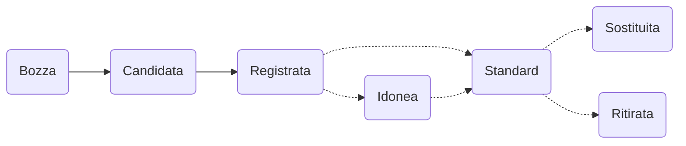

Un processo ben definito regola come si pubblicano i metadati sulla piattaforma di interoperabilità I14Y. A seconda del fatto che i metadati siano pubblicati per tutti o esclusivamente per le persone all'interno dell'ente cui si riferiscono, il processo di pubblicazione è costituito da due o tre tappe. Il workflow serve in particolare per garantire la qualità dei metadati. Durante la prima tappa vengono registrati i metadati. Nella seconda tappa i _Local Data Stewards_ li verificano e li attivano. In una terza tappa, se lo si desidera e lo si ritiene utile, in collaborazione con il servizio di interoperabilità i metadati sono verificati, se del caso contrassegnati come conformi agli standard e infine pubblicati sulla piattaforma.

Ai metadati appena inseriti viene assegnato lo stato di _Bozza_. Una volta completato il lavoro di registrazione, per la voce viene proposto lo stato di _Candidata_. Questo cambiamento di stato deve essere confermato da una persona del proprio ente che disponga dei diritti da _Local Data Steward_-. Se tutti i controlli hanno esito positivo, lo stato della voce può passare a _Registrata_. Per mantenere i metadati stabili e persistenti, le voci contrassegnate con questo stato non possono più essere modificate. Qualora un concetto dovesse essere modificato ulteriormente, occorre crearne una nuova versione. 

Per alcuni servizi, concetti e collezioni di dati che non sono standardizzati e che vengono utilizzati solo internamente, la registrazione termina qui. 

In un secondo tempo gli _amministratori dei dati a livello locale_ verificheranno se l'offerta di dati è conforme agli standard. Alle offerte che rispettano standard comunemente riconosciuti come [eCH](/handbook/de/7_glossar/#ech) o [ISO](/handbook/de/7_glossar/#internationale-organisation-für-normung-iso) viene attribuito lo stato _Standard_. A quelle che un giorno poterebbero diventare standard è assegnato lo stato _idonea_; Il modo in cui proseguire viene poi deciso nel quadro di scambi diretti con il servizio di interoperabilità e i gruppi di specialisti. Le offerte di dati basate su standard obsoleti o aboliti sono contrassegnate rispettivamente con gli stati _sostituita_ e _ritirata_. Fintanto che i dati sono visibili solo agli utenti del proprio ente, queste classificazioni possono essere effettuate dai _Local Data Stewards_ senza bisogno di consultare il servizio di interoperabilità. Qualora invece una voce con stato «Standard» debba essere pubblicata per tutti, è imperativo contattare il servizio di interoperabilità. 

Ulteriori informazioni sulla gestione dello stato e sulle responsabilità sono riportate nella tabella seguente. La classificazione utilizzata nella piattaforma di interoperabilità I14Y è conforme allo [standard ISO 11179] (https://www.iso.org/standard/78914.html).  

| Stato IT | Stato EN | Descrizione | Chi assegna lo stato? |
| --- | ---- | ---- | ---- |
| Bozza | _Initial_ | I metadati appena inseriti sono contrassegnati con lo stato _Bozza_. Ciò permette di segnalare agli utenti del proprio ente che il lavoro su questi metadati non è ancora stato completato. _Elaboratore dei dati_
| Candidata | _Candidate_ | Lo stato _Candidata_ è assegnato a tutte le voci di cui è stata portata a termine la registrazione. Lo stato viene proposto da chi registra i dati, mentre ad assegnarlo sono gli amministratori dei dati. | _Amministratore dei dati a livello locale_ | 
| Registrata | _Recorded_ | L'offerta di metadati contrassegnata con lo stato _Registrata_ è stata opportunatamente registrata e verificata. Lo stato viene proposto da chi ha registrato i metadati e la modifica viene confermata dal servizio di amministrazione dei dati a livello locale. Questo è l'ultimo stato che è possibile assegnare a elementi non standardizzati. | _Amministratore dei dati a livello locale_ |
| Idonea | _Qualified_ | Le offerte che un giorno potrebbero diventare standard sono contrassegnate con lo stato _Idonea_. | _Amministratore dei dati a livello locale_ oppure servizio di interoperabilità |
| Standard | _Standard_ | Questo stato viene assegnato nei casi in cui l'offerta è conforme a uno standard riconosciuto da un'istanza specialistica, come eCH o ISO. | _Amministratore dei dati a livello locale_ oppure servizio di interoperabilità |
| Standard raccomandato | _Preferred Standard_ | In alcuni casi possono esistere più standard per uno stesso argomento. I concetti contrassegnati come _standard raccomandato_ sono quelli che devono essere utilizzati presso le amministrazioni pubbliche, a condizione che non ci siano punti che lo rendano impossibile. Spetta all'_amministratore svizzero dei dati_ definire uno standard raccomandato. | _Amministratore svizzero dei dati_ |
| Sostituita | _Superseded_ | Se l'offerta si basa su uno standard che nel frattempo è stato sostituito da un altro, lo stato viene impostato su _Sostituita_. | _Amministratore dei dati a livello locale_ oppure servizio di interoperabilità |
| Ritirata | _Retired_ | In alcuni casi può succedere che l'ente di standardizzazione revochi uno standard. In tal caso lo stato dell'offerta in questione viene impostato su _Ritirata_. | _Amministratore dei dati a livello locale_ oppure servizio di interoperabilità |
{.workflow}

## Canale di pubblicazione

Per inserire dati sulla piattaforma di interoperabilità esistono due canali di pubblicazione: I metadati possono essere resi accessibili all'interno del proprio ente, ad esempio per inventariare il proprio patrimonio di dati. Oppure possono essere pubblicati per tutti. All'inizio i metadati registrati sono disponibili solo all'interno dell'ente che li ha registrati. Qualora si voglia renderli visibili al pubblico, occorre impostare il canale di pubblicazione su _I14Y_. Tale dovrebbe essere l'obiettivo per tutte le strutture e i concetti di dati armonizzati e standardizzati, poiché sono quelli più adatti a essere utilizzati più volte.

Di norma la messa a disposizione del pubblico viene proposta da una persona che ricopre il ruolo di _Local Data Steward_. Il servizio di interoperabilità, ovvero il team I14Y, verifica poi i metadati e, alla data di pubblicazione concordata, attiva la voce rendendola visibile a tutti. 

A seconda dello stato nel workflow di pubblicazione e del proprio ruolo può succedere che non sia possibile modificare i metadati. Ad esempio, le voci contrassegnate come «Registrata» non possono più essere modificate senza che lo stato venga riportato a una tappa precedente. Per farlo solitamente viene inserita una nuova versione.