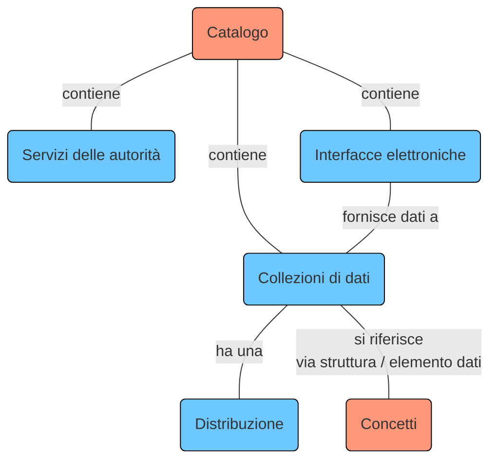
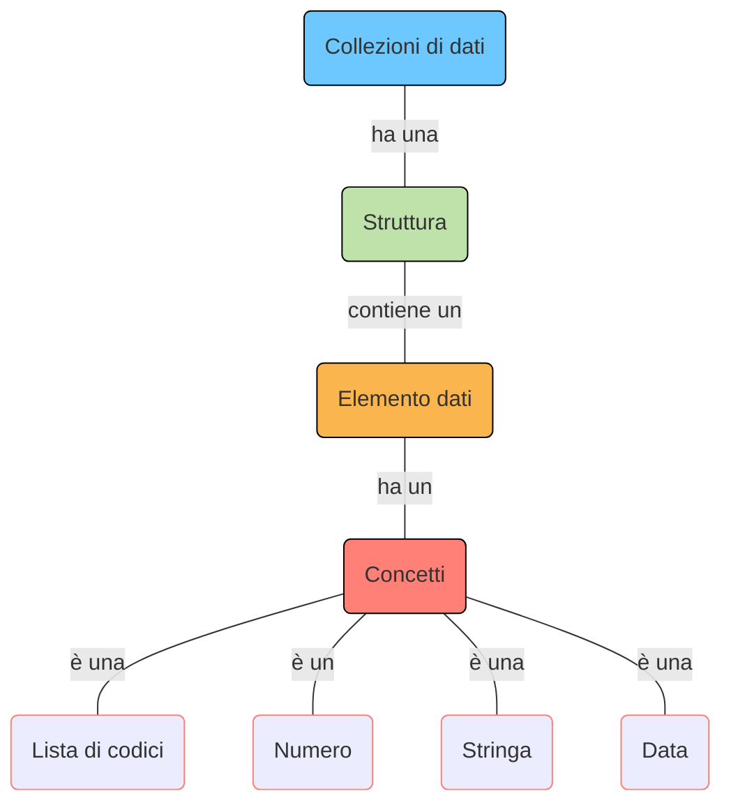
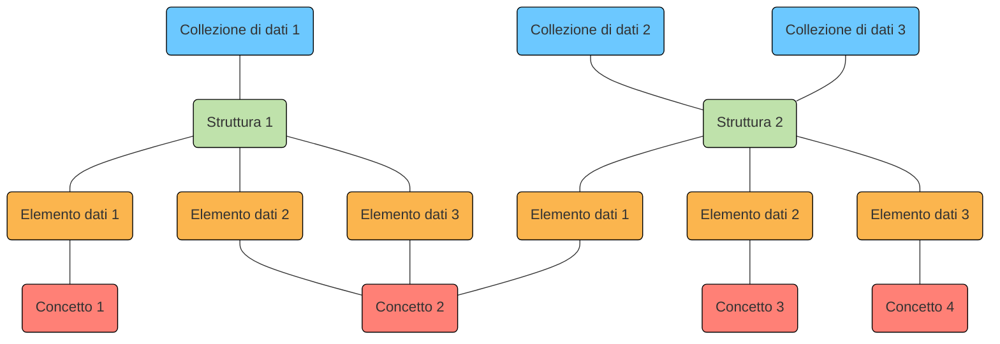
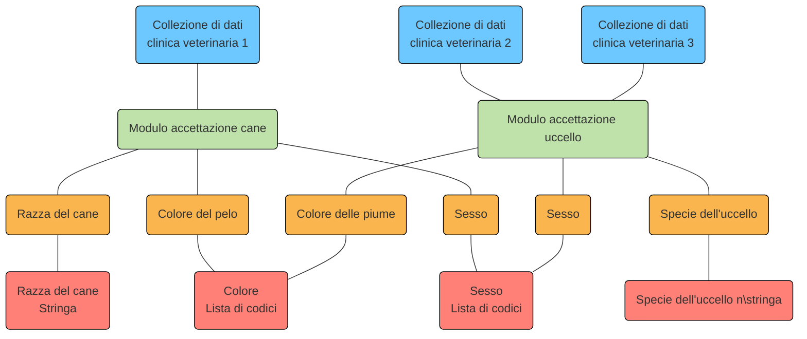

 
Sulla piattaforma di interoperabilità I14Y possono essere descritti sia le collezioni di dati, le interfacce elettroniche (API) e gli elementi di dati sia i servizi offerti dalle autorità. Tali informazioni sono accessibili da due schede diverse: alla scheda "Catalogo / Ricerca" si trovano le collezioni di dati, le interfacce elettroniche (API) e i servizi offerti dalle autorità, mentre alla scheda "Concetti" sono disponibili le definizioni dei singoli concetti. 

Il presente grafico offre una rappresentazione semplificata delle diverse parti che compongono la piattaforma I14Y. Una versione dettagliata è disponibile nel [modello di informazioni dell'IOP I14Y](/handbook/img/i14y_informationsmodell.png).

Per rendere giustizia alle diverse offerte, la piattaforma si avvale di diversi modelli di informazioni. Per le collezioni di dati e le API viene ad esempio utilizzato il _Data Catalog Vocabulary (DCAT)_ con il profilo applicativo svizzero. Per l'ambito dei servizi offerti dalle autorità viene invece impiegato il _Core Public Service Vocabulary (CPSV)_. 

## Collezioni di dati

Le collezioni di dati sono gruppi di elementi di dati con contenuti correlati organizzati in una struttura uniforme. Possono avere un'ampia gamma di forme e formati: possono ad esempio presentarsi come file CSV, banche dati o essere stati salvati in un sistema distribuito (ad es. una blockchain). 

Le collezioni di dati possono essere esportate in diversi formati, ovvero contenere le cosiddette _distribuzioni_. Le distribuzioni non devono necessariamente contenere i dati completi. Le collezioni di dati possono anche costituire la base per un'interfaccia elettronica (API) attraverso la quale è possibile lanciare la ricerca di informazioni individuali mirate.

Le collezioni di dati sono descritte in dettaglio nella piattaforma di interoperabilità I14Y: oltre alla voce inscritta nel catalogo, che contiene informazioni di base come titolo, descrizione ed ente emittente, è possibile registrare anche informazioni sulla struttura. Una struttura contiene solitamente diversi elementi di dati. E ad ogni elemento dati corrisponde un concetto che descrive il tipo di contenuto. Un concetto è quindi la più piccola unità di una collezione di dati, spesso chiamata anche variabile (definita) o attributo. 

È possibile che più collezioni di dati abbiano la stessa struttura. Così come spesso un singolo concetto è inserito in più strutture. 

Di seguito ecco un esempio di collezione di dati. La collezione di dati di una clinica veterinaria contiene informazioni sui cani: nome, data di nascita, razza, numero di chip nonché nome e indirizzo della persona proprietaria. Ognuna di queste informazioni è un elemento dati con un concetto. Il tipo di concetto «nome del cane» è una stringa, quello della data di nascita è una data e quello della razza è una lista di codici. Questi concetti possono essere utilizzati anche in altre collezioni di dati, siano esse relative ad argomenti strettamente correlati, come la banca dati dei clienti di una veterinaria, oppure, nel caso delle date di nascita o degli indirizzi, anche in collezioni di dati completamente diverse. 

Nella piattaforma di interoperabilità I14Y le collezioni di dati sono descritte utilizzando il [vocabolario di catalogazione dei dati (DCAT)](/handbook/de/7_glossar) . DCAT è un modello standardizzato per la descrizione di cataloghi di dati gestito dall'organismo di standardizzazione del web [W3C](https://www.w3.org/). Sulla piattaforma è ampiamente utilizzato il profilo applicativo per la Svizzera ([DCAT-AP CH 2](https://www.dcat-ap.ch/)). Il DCAT specifica quali informazioni devono imperativamente essere registrate. Il vocabolario propone inoltre possibilità alternative per la descrizione delle collezioni di dati.     

Per poter salvare sulla piattaforma di interoperabilità I14Y le informazioni su una collezione di dati devono essere soddisfatti i requisiti minimi previsti dallo standard DCAT. L'IOP I14Y offre alcuni campi aggiuntivi rispetto all'attuale standard DCAT. Al capitolo [Pubblicare metadati](/handbook/de/4_publikation/1_katalog/1_datensammlung) viene illustrato quali campi riempire con informazioni per la registrazione e con quali.. 

### Struttura

La struttura descrive come sono organizzati i contenuti di una collezione di dati. Ogni struttura è composta da almeno un elemento dati ([v. più in basso](#elemento-dati)). Le singole strutture possono essere utilizzate per più collezioni di dati. Ad esempio, nel caso della pubblicazione ricorrente di un registro (versioning), di solito si utilizza la stessa struttura. 

Sull'IOP I14Y, per la descrizione della struttura si fa largo uso dello standard DCAT con il profilo applicativo svizzero. 

### Elemento dati

L'elemento dati è la più piccola unità di descrizione di una collezione di dati. Spesso l'elemento dati viene chiamato anche attributo, variabile (definita) o «colonna». L'elemento dati contiene i singoli valori, ad esempio i numeri AVS, il numero di abitazioni libere o i valori misurati per la temperatura dell'acqua. Ogni elemento dati fa riferimento a un concetto. 

### Concetto

Il concetto descrive le informazioni contenute nell'elemento dati in modo chiaro e completo. Un concetto può essere un numero, una stringa, una data o una lista di codici con valori predefiniti. 

Sulla piattaforma di interoperabilità I14Y, per la descrizione dei concetti viene utilizzato lo standard [ISO 11179-1:2023](https://www.iso.org/standard/78914.html). Vi si registra il tipo di concetto, a seconda del quale sono eventualmente necessarie ulteriori specifiche, come la lunghezza o i possibili valori minimi e massimi. Al capitolo [Pubblicare metadati] sono disponibili le istruzioni per la registrazione di un concetto.(/handbook/de/4_publikation/2_konzepte) zu finden. 

## Interfaccia elettronica (API)

Un'interfaccia elettronica, in inglese _Application Programm Interface (API)_, permette alle macchine, tra le altre cose, di ricercare in modo mirato singole informazioni in una collezione di dati. Grazie alle API, sistemi isolati possono scambiarsi informazioni in modo efficiente e standardizzato. Affinché possano programmare il loro software in modo che possa ottenere informazioni da sistemi esterni, gli sviluppatori devono conoscere queste interfacce. L'IOP I14Y offre la possibilità di descrivere le interfacce in modo centralizzato. 

Sull'IOP I14Y, oltre al titolo e alla descrizione deve essere indicato un cosiddetto «endpoint» dal quale è possibile ottenere dati oppure un link verso la documentazione. Se possibile, si fa riferimento anche alla collezione di dati su cui si basa l'API.

Sulla piattaforma di interoperabilità, anche le API sono ampiamente descritte utilizzando il vocabolario di catalogazione dei dati DCAT. Alcuni campi, che nello standard normale sono facoltativi, sull'IOP I14Y devono imperativamente essere compilati. In effetti, lo standard DCAT si limita a raccomandare di inserire una descrizione quando si cataloga un'API. Sull'IOP I14Y la descrizione è invece obbligatoria. Tutti i campi previsti nello standard devono essere compilati anche sulla piattaforma. 

Le istruzioni passo per passo su come registrare le interfacce elettroniche sono disponibili nel capitolo 
[Pubblicare metadati](/handbook/de/4_publikation/1_katalog/5_api). 

## Servizi elettronici offerti dalle autorità

Anche i servizi elettronici offerti dalle autorità possono essere descritti sulla piattaforma di interoperabilità I14Y. È così possibile documentare quali sono le applicazioni web o per smartphone che semplificano determinati compiti. Vengono inoltre registrate informazioni sulle modalità di accesso alle app in questione e sulle organizzazioni che ne sono responsabili. Grazie al registro centralizzato, i servizi elettronici offerti dalle autorità dovrebbero risultare più facili da reperire. 

La descrizione dei servizi offerti dalle autorità è redatta sulla base del _Core Public Service Vocabulary_, definito dall'Unione europea. La creazione e l'intero vocabolario è documentato sulla piattaforma di interoperabilità [Joinup](https://joinup.ec.europa.eu/collection/semantic-interoperability-community-semic/solution/core-public-service-vocabulary/releases)della Commissione europea. Il vocabolario, riutilizzabile e ampliabile, prevede alcuni campi che devono essere compilati obbligatoriamente. Ad ogni servizio offerto dalle autorità possono essere assegnati canali, come un indirizzo Internet o un numero di telefono.

Nel capitolo[Pubblicare metadati](/handbook/de/4_publikation/1_katalog/3_publicservice/) è descritto nel dettaglio come registrare un servizio delle autorità sulla piattaforma di interoperabilità I14Y.
