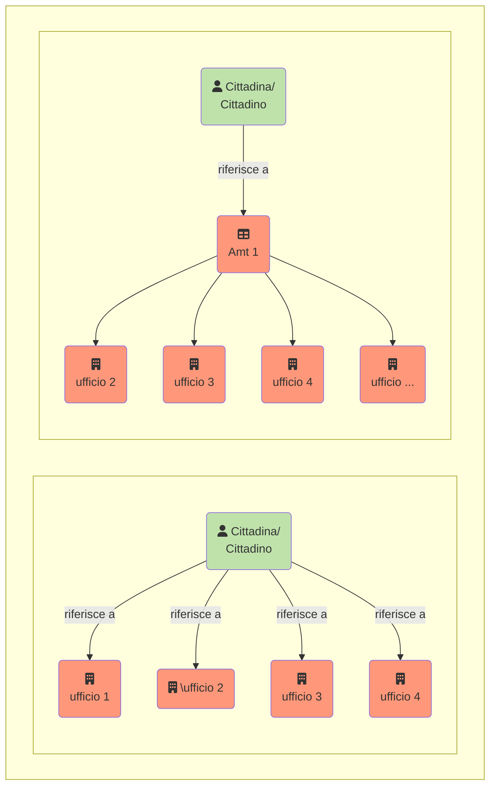

{}
La traduzione è in corso: Grazie per il vostro interesse nella versione italiana del manuale I14Y. Attualmente sono in corso di traduzione. Si prega di consultare il sito più tardi. In alternativa, leggere il [manuale in tedesco](https://handbook.i14y.admin.ch), potete chiedere al nostro [robot di testo sperimentale](https://www.i14y.admin.ch/de/labs/chatbot) in italiano. Oppure potete [contattare il team di I14Y](mailto:i14y@bfs.admin.ch). 
{}

Quali dati sono disponibili? E come fare per reperirli? La piattaforma di interoperabilità I14Y (IOP I14Y) è il registro centrale di dati, interfacce elettroniche e servizi offerti dalle autorità delle amministrazioni pubbliche in Svizzera. La piattaforma rende i dati reperibili e mostra come si fa ad accedervi.  

L'IOP I14Y riporta se i dati in questione sono accessibili liberamente o con restrizioni, se sono conformi a uno standard, chi è responsabile della collezione di dati, quanto spesso vengono aggiornati e come viene valutata la loro qualità. La piattaforma aiuta quindi a capire il contesto di una collezione di dati. L'IOP I14Y contiene esclusivamente metadati; i dati effettivi restano presso le autorità competenti. L'IOP I14Y promuove lo scambio efficiente dei dati all'interno delle amministrazioni pubbliche e tra le autorità, le imprese e la popolazione. 

Le autorità e le imprese parastatali possono utilizzare la piattaforma come strumento per realizzare un inventario delle loro collezioni di dati. Al contempo, l'IOP I14Y funge da strumento di armonizzazione dei dati, in modo che possano essere utilizzati più volte. Ciò permette di evitare la raccolta di dati ridondanti, in linea con il _principio «once-only»_ promosso dalla Confederazione. 



Finora la popolazione e le imprese erano spesso obbligate a comunicare più volte le loro informazioni allo Stato. Con il [programma Gestione dei dati a livello nazionale](https://www.bfs.admin.ch/bfs/it/home/nadb/nadb.html), la Confederazione si è posta l'obiettivo di evitare doppie rilevazioni. Ciò permetter di alleggerire l'onere delle imprese e della popolazione. E lo Stato può fornire le sue prestazioni in modo più efficiente. 

Affinché il _principio «once-only»_ diventi realtà, le diverse unità amministrative devono essere in grado di scambiarsi i dati direttamente. Perché ciò avvenga i presupposti sono che esista una base giuridica e che lo scambio sia consentito, in particolare dal punto di vista della protezione dei dati. Inoltre, occorre chiarire se e per quanto tempo i dati possono essere conservati per un eventuale utilizzo multiplo. Alcuni Cantoni hanno già sancito per legge l'utilizzo multiplo dei dati.  


