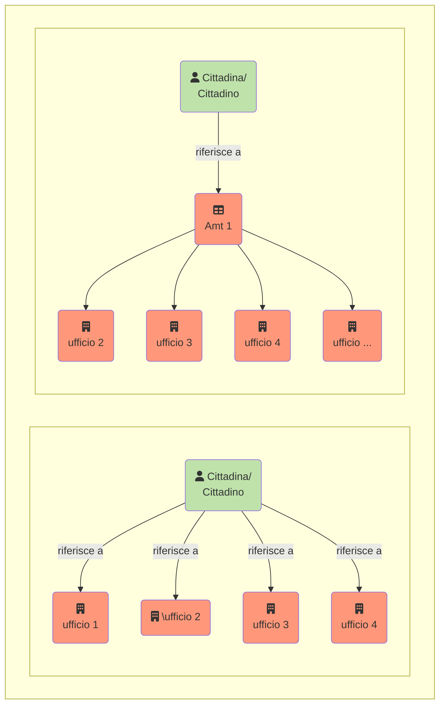

{}
La traduzione è in corso: Grazie per il vostro interesse nella versione italiana del manuale I14Y. Attualmente sono in corso di traduzione. Si prega di consultare il sito più tardi. In alternativa, leggere il [manuale in tedesco](https://handbook.i14y.admin.ch), potete chiedere al nostro [robot di testo sperimentale](https://www.i14y.admin.ch/de/labs/chatbot) in italiano. Oppure potete [contattare il team di I14Y](mailto:i14y@bfs.admin.ch). 
{}

Quali dati sono disponibili? E come fare per reperirli? La piattaforma di interoperabilità I14Y (IOP I14Y) è il registro centrale di dati, interfacce elettroniche e servizi offerti dalle autorità delle amministrazioni pubbliche in Svizzera. La piattaforma rende i dati reperibili e mostra come si fa ad accedervi.  

L'IOP I14Y riporta se i dati in questione sono accessibili liberamente o con restrizioni, se sono conformi a uno standard, chi è responsabile della collezione di dati, quanto spesso vengono aggiornati e come viene valutata la loro qualità. La piattaforma aiuta quindi a capire il contesto di una collezione di dati. L'IOP I14Y contiene esclusivamente metadati; i dati effettivi restano presso le autorità competenti. L'IOP I14Y promuove lo scambio efficiente dei dati all'interno delle amministrazioni pubbliche e tra le autorità, le imprese e la popolazione. 

Le autorità e le imprese parastatali possono utilizzare la piattaforma come strumento per realizzare un inventario delle loro collezioni di dati. Al contempo, l'IOP I14Y funge da strumento di armonizzazione dei dati, in modo che possano essere utilizzati più volte. Ciò permette di evitare la raccolta di dati ridondanti, in linea con il _principio «once-only»_ promosso dalla Confederazione. 



Finora la popolazione e le imprese erano spesso obbligate a comunicare più volte le loro informazioni allo Stato. Con il [programma Gestione dei dati a livello nazionale](https://www.bfs.admin.ch/bfs/it/home/nadb/nadb.html), la Confederazione si è posta l'obiettivo di evitare doppie rilevazioni. Ciò permetter di alleggerire l'onere delle imprese e della popolazione. E lo Stato può fornire le sue prestazioni in modo più efficiente. 

Affinché il _principio «once-only»_ diventi realtà, le diverse unità amministrative devono essere in grado di scambiarsi i dati direttamente. Perché ciò avvenga i presupposti sono che esista una base giuridica e che lo scambio sia consentito, in particolare dal punto di vista della protezione dei dati. Inoltre, occorre chiarire se e per quanto tempo i dati possono essere conservati per un eventuale utilizzo multiplo. Alcuni Cantoni hanno già sancito per legge l'utilizzo multiplo dei dati.  



L'utilizzo multiplo dei dati amministrativi pubblici è tuttavia possibile solo se si sa chi dispone di quali collezioni di dati. Per di più, i dati devono essere armonizzati: tutti gli uffici dovrebbero utilizzare le stesse categorie e liste di codici, ad esempio le stesse liste di nomi di Comuni o di denominazioni delle professioni. Affinché l'armonizzazione avvenga con successo è indispensabile che ci sia una buona collaborazione tra le parti interessate: deve essere ad esempio definito quale ente è responsabile per una determinata lista di codici. A quel punto tutti gli altri enti non si occupano di gestire la lista in questione, ma lo lasciano fare all'ufficio competente, dal quale la recepiranno. 

Qui di seguito è riportato tutto quello che è possibile fare con la piattaforma di interoperabilità I14Y. Oltre ai metadati descrittivi, la piattaforma include metadati strutturali, che descrivono i singoli elementi di una collezione di dati. Ogni elemento si basa su un concetto chiaramente definito, ad esempio una lista di codici. I concetti devono essere registrati una sola volta dall'ufficio competente e poi gli altri enti li possono riutilizzare per descrivere i loro metadati strutturali. 

In questo modo le singole autorità beneficiano del lavoro di tutte le altre secondo una logica di reciprocità. Diventa quindi anche possibile ad esempio che un istituto di indagine privato utilizzi le stesse categorie o la stessa forma impiegata dagli enti statali. In tal modo i lavori di armonizzazione a posteriori diventano superflui, in molti casi a fronte di una migliore qualità dei dati. 

In questo modo, la piattaforma di interoperabilità I14Y contribuisce ad armonizzare semanticamente l'ecosistema svizzero dei dati. I metadati, in particolare le liste di codici, possono essere reperiti automaticamente tramite interfacce elettroniche (API), fatto che permette di collegare la piattaforma a qualsiasi sistema e applicazione. 



Premere tasti inutili è l'incubo di ogni informatico. Ecco perché molti di loro prediligono le abbreviazioni. Soprattutto per espressioni lunghe e complicate che spesso tendono ad essere scritte in modo errato come nel caso della parola inglese _interoperability_. Nel settore dello sviluppo di software, è infatti spesso abbreviata con _I14Y_. Il numero 14 indica il numero di lettere della parola in questione che si è deciso di omettere e che separano la I dalla Y finale. Altri esempi di cosiddetti numeronimi sono: a11y (_accessibility_), i18n (_internationalization_) e o11y (_observability_).



Sulla piattaforma di interoperabilità I14Y si sta attualmente implementando un registro dei servizi elettronici forniti dalle autorità, come app e web app. Tale registro fornisce una panoramica dell'offerta di servizi delle amministrazioni pubbliche e facilita il dialogo tra i gestori dei singoli servizi e gli utenti di questi ultimi.

<!--  -->

La piattaforma viene sviluppata e gestita dal servizio di interoperabilità (IOS) della divisione Interoperabilità e registri (IOR) dell'[Ufficio federale di statistica](https://www.bfs.admin.ch). Il funzionamento della piattaforma è disciplinato dalla legge federale concernente l'impiego di mezzi elettronici per l'adempimento dei compiti delle autorità (LMeCA).



1. L'Ufficio federale di statistica gestisce in Internet una piattaforma pubblica su cui sono facilmente accessibili in forma elettronica, direttamente o attraverso l'indicazione di riferimenti, in particolare le seguenti informazioni:

    a. i metadati di raccolte strutturate di dati elettronici dell'Amministrazione federale, compresi i metadati degli Open Government Data di cui all'articolo 10;

    b. un elenco delle interfacce di cui all' 13 e delle informazioni necessarie al loro utilizzo, sempre che la sicurezza delle informazioni non sia messa in pericolo;

    c. una panoramica delle prestazioni delle autorità disponibili in forma elettronica.

2. Il Consiglio federale stabilisce quali metadati devono essere pubblicati. Può autorizzare l'Ufficio federale di statistica a disciplinare la forma dei metadati d'intesa con la Cancelleria federale.

 3. I Cantoni possono rendere accessibili sulla piattaforma i propri metadati, le proprie interfacce e applicazioni alle condizioni previste dall'articolo 11 capoversi 3 e 4.



La piattaforma di interoperabilità I14Y è disponibile dall'estate 2021 ed è in costante sviluppo. Si rivolge principalmente alla Confederazione, ai Cantoni e ai Comuni, nonché alla comunità del settore della ricerca. Dato che le amministrazioni pubbliche e le imprese lavorano a stretto contatto, è aperta anche a queste ultime. I contenuti pubblicati possono essere visualizzati e utilizzati anche da imprese e popolazione.



Desiderate essere informati sulle nuove funzionalità e offerte della piattaforma di interoperabilità I14Y? Allora abbonatevi subito alla Newsmail! Facendolo, tre o quattro volte all'anno riceverete via mail un riepilogo degli ultimi sviluppi riguardanti l'IOP I14Y. Per abbonarvi gratuitamente alla Newsmail, andate sul sito del [servizio di abbonamento Newsmail dell'Ufficio federale di statistica](https://www.bfs.admin.ch/bfs/de/home/dienstleistungen/kontakt/newsmail-abonnement.html) e selezionate Piattaforma di interoperabilità I14Y. 


 
## Informazioni su questo manuale

Il presente manuale illustra le funzioni principali della piattaforma di interoperabilità I14Y. Contiene numerose istruzioni passo per passo e fornisce inoltre indicazioni su particolari tecnici come informazioni di fondo sull'armonizzazione e sulla standardizzazione di dati.

Il primo capitolo si concentra su [ruoli e processi](/handbook/de/2_rollen_prozesse) propri della gestione dei dati. Nella parte intitolata [Cercare metadati](/handbook/de/3_metadaten_abrufen) sono mostrati i diversi modi per reperire informazioni nella piattaforma I14Y. Nel capitolo successivo, [Pubblicare metadati],(/handbook/de/4_publikation) viene spiegato come pubblicare sulla piattaforma descrizioni di collezioni di dati, interfacce elettroniche ed elementi dati. Infine vi è illustrato come si compila il registro dei servizi offerti dalla autorità. 

<!--Später ergänzen: Nebst den schriftlichen Anleitungen enthält dieses Handbuch auch einige Videotutorials.--> 
Il manuale contiene inoltre un [glossario](/handbook/de/7_glossar) con termini tecnici, un [elenco di link verso pagine web](/handbook/de/6_anhang/weblinks), una panoramica degli [enti partner] (/handbook/de/8_partner) nonché un [registro](/handbook/de/6_anhang/changelog) contenente le modifiche più importanti apportate alla piattaforma.

Le funzionalità della piattaforma di interoperabilità I14Y vengono costantemente ampliate. E lo stesso vale per il presente manuale, che viene regolarmente aggiornato. Avete qualche proposta di miglioramento? Oppure volete condividere con noi le vostre esperienze di utilizzo del manuale o della piattaforma? [Scriveteci!](mailto:i14y@bfs.admin.ch). Questo manuale è gestito attraverso la [piattaforma di gestione dei codici GitHub](https://github.com/I14Y-ch/handbook/) . Se lo desiderate, siete invitati a inoltrarci una pull request con le vostre proposte di miglioramento.



Il manuale I14Y è scritto in linguaggio di formattazione, detto anche di marcatura o in inglese _Markup Language_. Il software [Hugo](https://gohugo.io) converte i dati di testo in una pagina web. I contenuti di questo manuale sono gestiti sulla piattaforma di gestione di codici GitHub. Le proposte di modifica possono essere inserite e inoltrate attraverso questo canale, ovvero seguendo l'usuale workflow di GitHub. In alternativa possono essere segnalate direttamente nel browser web.  

1. Creare un account sulla piattaforma di gestione di codici GitHub. Effettuare il login. 
2. Aprire il [repository con il manuale](https://github.com/I14Y-ch/handbook/). I contenuti di testo si trovano nel registro _content_, suddivisi per lingua, capitolo e sottocapitolo. I file con estensione _.md_ contengono il testo vero e proprio e i grafici. Cercare la parte di testo da modificare. Visualizzare il testo grezzo. 
3. Per modificare il testo, cliccare sull'icona a forma di matita nell'angolo in alto a destra. Apportare le modifiche necessarie tenendo conto delle [regole di sintassi della formattazione](https://www.markdownguide.org/basic-syntax/).
4. Inserire nel modulo sottostante una breve descrizione della modifica apportata. Quindi inviare la proposta facendo clic sull'apposito pulsante. La vostra proposta sarà esaminata appena possibile dal team I14Y e, se del caso, integrata nel manuale.


