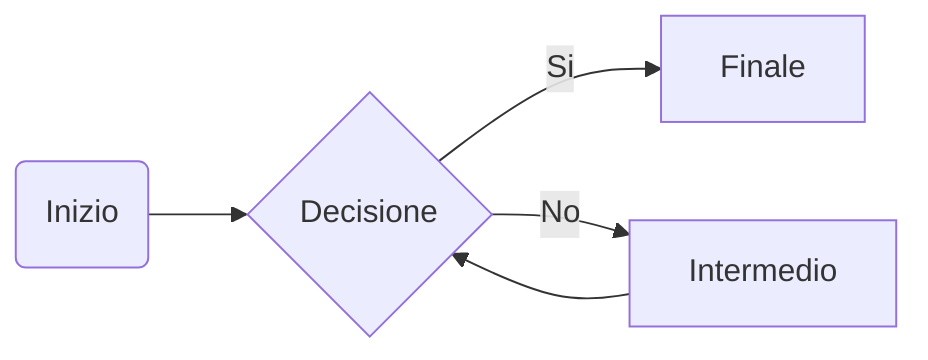

Questo è un testo di esempio in lingua italiana. Non ha alcun contenuto significativo, ma è utile come riempitivo per le presentazioni o per i layout dei siti web.
Questo è un testo di esempio in lingua italiana. Non ha alcun contenuto significativo, ma è utile come riempitivo per le presentazioni o per i layout dei siti web.

Questo è un testo di esempio in lingua italiana. Non ha alcun contenuto significativo, ma è utile come riempitivo per le presentazioni o per i layout dei siti web.
Questo è un testo di esempio in lingua italiana. Non ha alcun contenuto significativo, ma è utile come riempitivo per le presentazioni o per i layout dei siti web.
Questo è un testo di esempio in lingua italiana. Non ha alcun contenuto significativo, ma è utile come riempitivo per le presentazioni o per i layout dei siti web.

## Sottotitolo

Lorem ipsum dolor sit amet, consectetur adipiscing elit. Nullam quis tincidunt urna. Aliquam erat volutpat. Suspendisse ultrices enim non sapien tristique ultrices. Integer sollicitudin semper sapien, sit amet fermentum urna bibendum eu.

## Altri sottotitoli

Fusce in libero vel nunc interdum faucibus. Nulla rutrum suscipit magna a ultricies. Etiam non diam non augue pellentesque bibendum. Sed lobortis justo vel quam dictum luctus.

| N° | Cognome | Nome | Età |
| --- | ---- | --- | --- |
| 1 | Rossi | Mario | 32 |
| 2 | Bianchi | Luca | 25 |
| 3 | Verdi | Anna | 42 |

Lorem ipsum dolor sit amet, consectetur adipiscing elit. Nullam quis tincidunt urna. Aliquam erat volutpat. Suspendisse ultrices enim non sapien tristique ultrices. Integer sollicitudin semper sapien, sit amet fermentum urna bibendum eu. Diagramma di flusso.

Questo è solo un esempio di testo in lingua italiana, ma può essere facilmente modificato e personalizzato in base alle esigenze.

