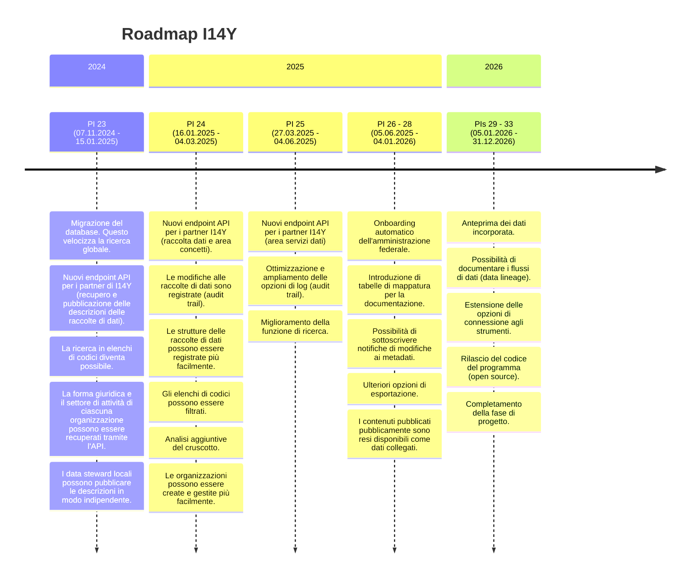

La piattaforma di interoperabilità I14Y viene sviluppata su mandato della Confederazione dal servizio di interoperabilità, in collaborazione con l'Ufficio federale dell'informatica. La gamma di funzionalità della piattaforma viene costantemente ampliata. 

Nei mesi a venire, il servizio di interoperabilità darà la priorità alle funzionalità seguenti. Le priorità possono tuttavia cambiare con breve preavviso. Per informazioni più dettagliate sull'ulteriore sviluppo della piattaforma o per richiedere funzionalità specifiche, rivolgersi al servizio di interoperabilità.


Il team di sviluppo sarà molto grato della segnalazione di chiunque dovesse scoprire una possibilità di miglioramento o un errore della piattaforma di interoperabilità I14Y. Il miglior modo per contattarci è scriverci un'[e-mail](mailto:i14y@bfs.admin.ch). Prossimamente saranno offerti anche altri canali di contatto. 



## Interfacce elettroniche (API)
Già oggi l'IOP I14Y mette a disposizione interfacce elettroniche (API) per la consultazione, la registrazione e la modifica di metadati sulla piattaforma. Tuttavia esse possono ancora essere soggette a modifiche, motivo per cui non sono ancora state annunciate pubblicamente. Inoltre, molte delle interfacce sono raggiungibili solo connettendosi alla piattaforma dalla rete della Confederazione. Chi avesse già bisogno di utilizzare delle interfacce, è pregato di rivolgersi al servizio di interoperabilità](mailto:i14y@bfs.admin.ch).  

Nei prossimi mesi saranno rese disponibili interfacce elettroniche stabili, e vi si potrà accedere da [api.i14y.admin.ch](https://api.i14y.admin.ch). Allo stesso link sarà inoltre disponibile una documentazione dettagliata al riguardo. L'offerta viene gradualmente ampliata. 

I metadati resi pubblici sono accessibili tramite queste interfacce. È anche possibile ottenere i metadati interni al proprio ente senza bisogno di intervenire manualmente. A questo scopo, al sistema è collegato un cosiddetto gateway API. 

### Aggiungere altri campi
L'IOP I14Y prevede di introdurre altri campi nella sezione relativa al catalogo, in modo da poter descrivere in modo ancora più dettagliato le collezioni di dati e le interfacce elettroniche. Questo dovrebbe inoltre assicurare l'interoperabilità con altri portali di dati. Alcuni campi saranno disponibili esclusivamente nell'area riservata, altri integreranno invece l'offerta pubblica. 

In un secondo tempo, ai singoli enti verrà data la possibilità di definire i propri campi per poter descrivere in modo più accurato le loro collezioni di dati e le interfacce ad uso interno nonché la connessione ad applicazioni specialistiche.

### Informazioni sulla qualità
L'IOP I14Y raccoglie valutazioni sulla qualità delle singole collezioni di dati. In futuro, dovrebbe essere possibile ottenere queste informazioni automaticamente tramite un'interfaccia elettronica. 

In seguito, sarà poi possibile salvare informazioni sulla qualità anche a livello dei singoli elementi di dati, in modo da poter ad esempio documentare il livello di riempimento di un elemento di dati. Un giorno anche queste informazioni saranno presumibilmente accessibili tramite un'API. 

### Open source
Il codice di programma della piattaforma di interoperabilità I14Y sarà pubblicato con [licenza non esclusiva (free licence)](https://www.gnu.org/licenses). E questo avverrà nel pieno rispetto della futura legge federale concernente l'impiego di mezzi elettronici per l'adempimento dei compiti delle autorità (LMeCA) Secondo l'articolo 9, per quanto possibile, le autorità federali dovranno pubblicare il codice sorgente dei software che esse sviluppano o fanno sviluppare per l'adempimento dei propri compiti. 



Per quanto possibile e opportuno e se sono tutelati i diritti di terzi, le autorità federali assoggettate alla presente legge pubblicano il codice sorgente dei software che esse sviluppano o fanno sviluppare per l'adempimento dei propri compiti. Autorizzano ogni persona a utilizzare, sviluppare e trasmettere i software senza richiedere il pagamento di licenze.



L'IOP I14Y pubblica i codici sorgente e gli script sulla [piattaforma GitHub](https://github.com/i14y-ch) sotto il nome di i14y-ch. Vi sono già stati caricati questo manuale e il prototipo di API sviluppato in occasione del GovTech Hackathon 2023. Sulla piattaforma saranno pubblicati anche esempi di script per l'acquisizione di dati. I primi moduli dell'IOP I14Y saranno probabilmente disponibili nel quarto trimestre del 2023. In quel momento saranno anche aggiunte al manuale informazioni dettagliate sulle possibilità di utilizzo e sul proseguimento dei lavori.
